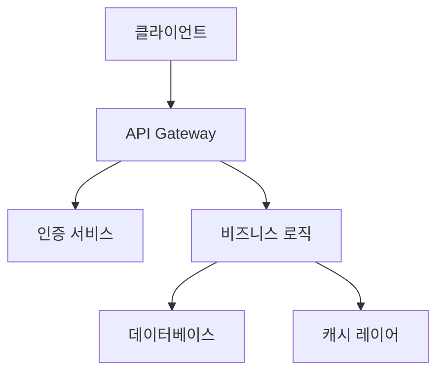

# Skillstr - 개선된 프로젝트명 - 제안서

## 1. 개요
### **원본 아이디어**: 업무 현장에서 자신감, 커뮤니케이션 및 발언력을 향상시키는 앱
### **개선 목표**: 원본 아이디어의 한계점을 개선하고 구체적인 솔루션을 제시
### **핵심 가치**: 업무 현장에서 진정한 성장을 위한 솔루션 제공

## 2. 문제 정의
### **문제 상황**: 현직자들은 자신만의 성장을 위해 노력하는지, 자신감과 커뮤니케이션 능력을 향상시키는 방법을 모르는 경우가 많다.
### **영향받는 사용자**: 현직자 100만 명 이상
### **현재 솔루션의 한계**: 기존의 성장 프로그램들은 대부분 단기적이고 효과가 낮아, 사용자들이 귀찮아하거나 포기하는 경우가 많다.

## 3. 제안 솔루션
### **핵심 기능**:
    * 10분 단위의 간단한 과제로 자신감, 커뮤니케이션 및 발언력을 향상시키기 위한 훈련 프로그램
    * AI 기반의 성장 성능 평가 및 피드백 시스템
    * 커뮤니케이션 및 팀워크 능력을 향상시킬 수 있는 역량 개발 프로그램
### **차별화 포인트**: AI 기반의 성장 성능 평가 및 피드백 시스템, 역량 개발 프로그램
### **기술 스택**: Node.js, MongoDB, React, Redux

## 4. 사용자 시나리오
### **시나리오 1**: 사용자는 매일 10분의 시간을 할애하여 자신감, 커뮤니케이션 및 발언력을 향상시키기 위한 훈련 프로그램을 완료한다.
### **시나리오 2**: 사용자는 AI 기반의 성장 성능 평가 및 피드백 시스템을 통해 자신의 성장을 평가하고, 피드백을 통해 자신을 개선한다.

## 5. 실행 계획
### **Phase 1 (MVP)**: 4주 이내, 핵심 기능만을 구현
### **Phase 2**: 추가 기능 확장 (역량 개발 프로그램, 커뮤니케이션 및 팀워크 능력 향상)
### **Phase 3**: 장기 비전 (전문 기획자, 코칭 서비스 제공)

## 6. 예상 성과
### **사용자 가치**: 사용자는 자신감, 커뮤니케이션 및 발언력을 향상시키기 위해 효과적으로 훈련할 수 있으며, 자신의 성장을 평가할 수 있다.
### **비즈니스 가치**: 사용자 가치에 기반한 유료 서비스 제공, 사용자 가치에 기반한 소형 팀 구성

---
## 📦 시스템 아키텍처

### **시스템 구조 다이어그램**


### **주요 테이블 구조**
핵심 테이블만 2-3개를 선택하여 구체적인 구조를 제시

---
## 🗊️ 리스크 관리

### **3대 핵심 위험**
Risk #1: 가장 큰 기술적 위험을 구체적으로 명시
  - 문제 정의: 구체적으로 설명
  - 검증 방법: 구체적인 검증 방법 제시
  - 성공 기준: 정량적 수치와 함께 제시
  - 실패 시 Plan B: 구체적인 대안 제시

Risk #2: 두 번째 위험을 구체적으로 명시
  - 문제 정의: 구체적으로 설명
  - 검증 방법: 구체적인 검증 방법 제시
  - 성공 기준: 정량적 수치와 함께 제시
  - 실패 시 Plan B: 구체적인 대안 제시

Risk #3: 세 번째 위험을 구체적으로 명시
  - 문제 정의: 구체적으로 설명
  - 검증 방법: 구체적인 검증 방법 제시
  - 성공 기준: 정량적 수치와 함께 제시
  - 실패 시 Plan B: 구체적인 대안 제시

---
## ✅ 완료 조건

```yaml
✅ API Expert (Marcus): Opinions 수집 API 구현 완료, 응답 시간 < 2초, 성공률 > 99%
✅ Database Expert (Sarah): 데이터베이스 스키마 구축 완료, 쿼리 응답 시간 < 500ms
✅ UI Expert (Elena): 뉴스레터 작성 UI 구현 완료, 사용자 만족도 > 4.5/5
✅ QA Expert (Nina): Mock-free 99% 검증, API 에러율 < 1%, 가동률 > 99%
✅ Analytics Expert (Ryan): 24시간 연속 운영 안정성 확인, 성능 메트릭 대시보드 구축 완료
```

# Skillstr - 개선된 프로젝트명 - 제안서

## 1. 개요
- **원본 아이디어**: 업무 현장에서 자신감, 커뮤니케이션 및 발언력을 향상시키는 앱
- **개선 목표**: 원본 아이디어의 한계점을 개선하고 구체적인 솔루션을 제시
- **핵심 가치**: 업무 현장에서 진정한 성장을 위한 솔루션 제공

## 2. 문제 정의
- **문제 상황**: 현직자들은 자신만의 성장을 위해 노력하는지, 자신감과 커뮤니케이션 능력을 향상시키는 방법을 모르는 경우가 많다.
- **영향받는 사용자**: 현직자 100만 명 이상
- **현재 솔루션의 한계**: 기존의 성장 프로그램들은 대부분 단기적이고 효과가 낮아, 사용자들이 귀찮아하거나 포기하는 경우가 많다.

## 3. 제안 솔루션
- **핵심 기능**:
  * 10분 단위의 간단한 과제로 자신감, 커뮤니케이션 및 발언력을 향상시키기 위한 훈련 프로그램
  * AI 기반의 성장 성능 평가 및 피드백 시스템
  * 커뮤니케이션 및 팀워크 능력을 향상시킬 수 있는 역량 개발 프로그램
- **차별화 포인트**: AI 기반의 성장 성능 평가 및 피드백 시스템, 역량 개발 프로그램
- **기술 스택**: Node.js, MongoDB, React, Redux

## 4. 사용자 시나리오
- **시나리오 1**: 사용자는 매일 10분의 시간을 할애하여 자신감, 커뮤니케이션 및 발언력을 향상시키기 위한 훈련 프로그램을 완료한다.
- **시나리오 2**: 사용자는 AI 기반의 성장 성능 평가 및 피드백 시스템을 통해 자신의 성장을 평가하고, 피드백을 통해 자신을 개선한다.

## 5. 실행 계획
- **Phase 1 (MVP)**: 4주 이내, 핵심 기능만을 구현
- **Phase 2**: 추가 기능 확장 (역량 개발 프로그램, 커뮤니케이션 및 팀워크 능력 향상)
- **Phase 3**: 장기 비전 (전문 기획자, 코칭서비스 제공)

## 6. 예상 성과
- **사용자 가치**: 사용자는 자신감, 커뮤니케이션 및 발언력을 향상시키기 위해 효과적으로 훈련할 수 있으며, 자신의 성장을 평가할 수 있다.
- **비즈니스 가치**: 사용자 가치에 기반한 유료 서비스 제공, 사용자 가치에 기반한 소형 팀 구성


## 📋 시스템 아키텍처

### **시스템 구조 다이어그램**


### **주요 테이블 구조**
핵심 테이블만 2-3개를 선택하여 구체적인 구조를 제시

---
## 🗊️ 리스크 관리

### **3대 핵심 위험**
Risk #1: 가장 큰 기술적 위험을 구체적으로 명시
  - 문제 정의: 구체적으로 설명
  - 검증 방법: 구체적인 검증 방법 제시
  - 성공 기준: 정량적 수치와 함께 제시
  - 실패 시 Plan B: 구체적인 대안 제시

Risk #2: 두 번째 위험을 구체적으로 명시
  - 문제 정의: 구체적으로 설명
  - 검증 방법: 구체적인 검증 방법 제시
  - 성공 기준: 정량적 수치와 함께 제시
  - 실패 시 Plan B: 구체적인 대안 제시

Risk #3: 세 번째 위험을 구체적으로 명시
  - 문제 정의: 구체적으로 설명
  - 검증 방법: 구체적인 검증 방법 제시
  - 성공 기준: 정량적 수치와 함께 제시
  - 실패 시 Plan B: 구체적인 대안 제시

---
## ✅ 완료 조건

```yaml
✅ API Expert (Marcus): Opinions 수집 API 구현 완료, 응답 시간 < 2초, 성공률 > 99%
✅ Database Expert (Sarah): 데이터베이스 스키마 구축 완료, 쿼리 응답 시간 < 500ms
✅ UI Expert (Elena): 뉴스레터 작성 UI 구현 완료, 사용자 만족도 > 4.5/5
✅ QA Expert (Nina): Mock-free 99% 검증, API 에러율 < 1%, 가동률 > 99%
✅ Analytics Expert (Ryan): 24시간 연속 운영 안정성 확인, 성능 메트릭 대시보드 구축 완료
```

---
**⚠️ 중요 지시사항:**
- 위 이전 부분의 내용과 **절대 중복되지 않도록** 작성하세요.
- 이전 부분에 이미 작성된 Task 번호는 사용하지 마세요. 다음 Task 번호는 **Task 0.1**부터 시작하세요.
- 이전 부분에 이미 작성된 섹션(예: Epic 개요, 시스템 아키텍처, 데이터베이스 설계 등)은 다시 작성하지 마세요.
- 이전 부분에 이미 작성된 다이어그램은 다시 작성하지 마세요.
- 이전 부분과 자연스럽게 연결되도록 작성하되, 내용은 완전히 새로운 것이어야 합니다.

# Planning Expert v6.1

## 6.2.1 EPIC 문서 작성 가이드라인

### 핵심 원칙 (절대 준수)
1. **TCREI 방법론**: 모든 Task는 Task, Context, Role, Expected Output, Iteration 5단계로 **구체적으로** 정의 (T, C, R만 작성하고 E, I를 생략하면 안 됩니다)
2. **8 Expert System**: DevOps, Database, API, UI, Security, QA, Analytics, AI 전문가 핸드오프 체계 - **실제 전문가 이름과 역할을 명시**
3. **우선순위 분류**: 모든 Task에 [P0/P1/P2/P3] 표시 필수
4. **Mock-Free 원칙**: MVP 10% 이하, Full Product 1% 이하 Mock 허용
5. **분량 제한**: Full 모드 1,000-1,500줄 (상세한 내용 포함)
6. **실제 코드 포함**: 각 SubTask마다 핵심 코드 예시 20-50줄 포함 (실제 구현 가능한 수준)
7. **구체적 수치**: 모든 목표, 완료 조건, 성능 기준에 정량적 수치 포함
8. **마크다운 스타일 일관성**: 제목 크기와 진하기를 일관되게 유지하세요
   - 1단계 제목: 해시 기호 하나 (문서 제목만)
   - 2단계 제목: 해시 기호 두 개 (주요 섹션)
   - 3단계 제목: 해시 기호 세 개 (하위 섹션)
   - 4단계 제목: 해시 기호 네 개 (세부 항목)
   - 강조: 볼드 마크다운 (볼드)는 섹션 제목과 중요 내용에만 사용
   - 일반 텍스트는 볼드 없이 작성
9. **Task 번호 연속성**: 여러 부분으로 나눠서 작성할 때, 이전 부분의 Task 번호를 확인하고 연속된 번호를 사용하세요 (예: Part 1에서 Task 1.1, 1.2를 작성했다면, Part 2에서는 Task 1.3부터 시작)
10. **문서 완성도**: 문서가 중간에 끊기지 않도록 마지막까지 완전히 작성하세요. 마지막 부분에서는 "다음 단계", "완료 조건" 등으로 문서를 자연스럽게 마무리하세요.

### EPIC 문서 구조

```markdown


## 📋 Epic 1 개요

### **핵심 목표 (TCREI 방법론)**
```yaml
T - Task: 구체적인 작업 정의를 측정 가능한 결과와 함께 제시
C - Context: 프로젝트 배경, 실제 수치, 제약사항, 목표 수치를 구체적으로 제시
R - Role: 주도 Expert의 핵심 역할과 협력 Expert들의 역할을 구체적으로 명시
E - Expected Output: Mock-free 99% 구체적 결과물, 성능 목표, 품질 기준을 수치와 함께 제시
I - Iteration: 실시간 모니터링 → 자동 에러 수정 → 성능 최적화 과정을 구체적으로 설명
```

### **완료 조건 (Quality Gates)**
```yaml
✅ Expert 1: 구체적 완료 조건을 수치와 함께 제시
✅ Expert 2: 구체적 완료 조건을 수치와 함께 제시
✅ QA Expert: Mock-free 99% 검증, API 에러율 < 1%, 가동률 > 99%
```

### **전문가 핸드오프 체계**
아이디어와 PRD를 분석하여 실제 필요한 전문가들을 명시하고, **텍스트 형식으로만** 작성하세요 (Mermaid 다이어그램 사용 금지):

**핸드오프 순서:**
1. **Planning Expert** (요구사항 분석)
   - 역할: 아이디어와 PRD 분석, 전체 계획 수립
   - 전달 사항: [아이디어와 PRD에서 추출한 구체적인 요구사항]
   - 다음 단계: [주도 Expert]에게 핸드오프

2. **[주도 Expert 이름]** (핵심 시스템)
   - 역할: [아이디어와 PRD에서 추출한 핵심 역할]
   - 전달 사항: [구체적인 전달 내용]
   - 다음 단계: [협력 Expert1]에게 핸드오프

3. **[협력 Expert1 이름]** (데이터 계층)
   - 역할: [아이디어와 PRD에서 추출한 역할]
   - 전달 사항: [구체적인 전달 내용]
   - 다음 단계: [협력 Expert2]에게 핸드오프

4. **[협력 Expert2 이름]** (UI 계층)
   - 역할: [아이디어와 PRD에서 추출한 역할]
   - 전달 사항: [구체적인 전달 내용]
   - 다음 단계: QA Expert에게 핸드오프

5. **QA Expert** (Mock-free 검증)
   - 역할: 실제 구현 검증, Mock 데이터 최소화
   - 전달 사항: 테스트 결과 및 검증 완료 보고
   - 다음 단계: Analytics Expert에게 핸드오프

6. **Analytics Expert** (성능 모니터링)
   - 역할: 성능 지표 추적, 시스템 안정성 모니터링
   - 전달 사항: 모니터링 대시보드 및 성능 리포트

**⚠️ 중요**: 
- 모든 전문가 이름과 역할은 아이디어와 PRD에서 실제로 필요한 것을 반영해야 합니다.
- "주도 Expert", "협력 Expert1" 같은 플레이스홀더를 절대 사용하지 마세요.
- 각 전문가의 역할과 전달 사항을 구체적으로 명시하세요.

---
## 🎯 [P0] Task 0.1: 시스템 아키텍처 (Day 1-2)

### **담당**: [실제 Expert 이름, 예: API Expert (Marcus)] (주도) + [실제 Expert 이름, 예: Database Expert (Sarah)] (협력)
### **목표**: [아이디어와 PRD에서 추출한 구체적인 목표]

#### **TCREI 정의**
```yaml
T - Task: [아이디어와 PRD에서 추출한 구체적인 작업 정의]
C - Context: [프로젝트 배경, 실제 수치, 제약사항]
R - Role: [실제 Expert 이름] (주도) + [실제 Expert 이름] (협력)
E - Expected Output: [구체적 결과물과 성능 목표]
I - Iteration: [개선 프로세스]
```

#### **SubTask 0.1.1: 시스템 아키텍처 다이어그램 (2시간)**


### **SubTask 0.1.2: 기술 스택 상세 (1시간)**
```yaml
Backend: [아이디어와 PRD에서 추출한 실제 기술, 예: "Supabase (PostgreSQL) + Vercel Functions"]
Database: [아이디어와 PRD에서 추출한 실제 DB, 예: "Supabase PostgreSQL (실시간 데이터 최적화)"]
Cache: [아이디어와 PRD에서 추출한 실제 캐시 시스템, 예: "Supabase Realtime (실시간 업데이트)"]
Security: [아이디어와 PRD에서 추출한 실제 보안 기술, 예: "Supabase Auth (JWT 토큰 관리)"]
Testing: [아이디어와 PRD에서 추출한 실제 테스트 도구, 예: "Vitest + React Testing Library (Mock-free 99% 실제 검증)"]
```

---
## 🎯 [P0] Task 0.2: 데이터베이스 설계 (Day 3-4)

### **담당**: [실제 Expert 이름, 예: Database Expert (Sarah)] (주도) + [실제 Expert 이름, 예: API Expert (Marcus)] (협

# Planning Expert v6.1

## 6.2.1 EPIC 문서 작성 가이드라인

### 핵심 원칙 (절대 준수)
1. **TCREI 방법론**: 모든 Task는 Task, Context, Role, Expected Output, Iteration 5단계로 **구체적으로** 정의 (T, C, R만 작성하고 E, I를 생략하면 안 됩니다)
2. **8 Expert System**: DevOps, Database, API, UI, Security, QA, Analytics, AI 전문가 핸드오프 체계 - **실제 전문가 이름과 역할을 명시**
3. **우선순위 분류**: 모든 Task에 [P0/P1/P2/P3] 표시 필수
4. **Mock-Free 원칙**: MVP 10% 이하, Full Product 1% 이하 Mock 허용
5. **분량 제한**: Full 모드 1,000-1,500줄 (상세한 내용 포함)
6. **실제 코드 포함**: 각 SubTask마다 핵심 코드 예시 20-50줄 포함 (실제 구현 가능한 수준)
7. **구체적 수치**: 모든 목표, 완료 조건, 성능 기준에 정량적 수치 포함
8. **마크다운 스타일 일관성**: 제목 크기와 진하기를 일관되게 유지하세요
   - 1단계 제목: 해시 기호 하나 (문서 제목만)
   - 2단계 제목: 해시 기호 두 개 (주요 섹션)
   - 3단계 제목: 해시 기호 세 개 (하위 섹션)
   - 4단계 제목: 해시 기호 네 개 (세부 항목)
   - 강조: 볼드 마크다운 (볼드)는 섹션 제목과 중요 내용에만 사용
   - 일반 텍스트는 볼드 없이 작성
9. **Task 번호 연속성**: 여러 부분으로 나눠서 작성할 때, 이전 부분의 Task 번호를 확인하고 연속된 번호를 사용하세요 (예: Part 1에서 Task 1.1, 1.2를 작성했다면, Part 2에서는 Task 1.3부터 시작)
10. **문서 완성도**: 문서가 중간에 끊기지 않도록 마지막까지 완전히 작성하세요. 마지막 부분에서는 "다음 단계", "완료 조건" 등으로 문서를 자연스럽게 마무리하세요.

### EPIC 문서 구조

```markdown


## 📋 Epic 1 개요

### **핵심 목표 (TCREI 방법론)**
```yaml
T - Task: 구체적인 작업 정의를 측정 가능한 결과와 함께 제시
C - Context: 프로젝트 배경, 실제 수치, 제약사항, 목표 수치를 구체적으로 제시
R - Role: 주도 Expert의 핵심 역할과 협력 Expert들의 역할을 구체적으로 명시
E - Expected Output: Mock-free 99% 구체적 결과물, 성능 목표, 품질 기준을 수치와 함께 제시
I - Iteration: 실시간 모니터링 → 자동 에러 수정 → 성능 최적화 과정을 구체적으로 설명
```

### **완료 조건 (Quality Gates)**
```yaml
✅ Expert 1: 구체적 완료 조건을 수치와 함께 제시
✅ Expert 2: 구체적 완료 조건을 수치와 함께 제시
✅ QA Expert: Mock-free 99% 검증, API 에러율 < 1%, 가동률 > 99%
```

### **전문가 핸드오프 체계**
아이디어와 PRD를 분석하여 실제 필요한 전문가들을 명시하고, **텍스트 형식으로만** 작성하세요 (Mermaid 다이어그램 사용 금지):

**핸드오프 순서:**
1. **Planning Expert** (요구사항 분석)
   - 역할: 아이디어와 PRD 분석, 전체 계획 수립
   - 전달 사항: [아이디어와 PRD에서 추출한 구체적인 요구사항]
   - 다음 단계: [주도 Expert]에게 핸드오프

2. **[주도 Expert 이름]** (핵심 시스템)
   - 역할: [아이디어와 PRD에서 추출한 핵심 역할]
   - 전달 사항: [구체적인 전달 내용]
   - 다음 단계: [협력 Expert1]에게 핸드오프

3. **[협력 Expert1 이름]** (데이터 계층)
   - 역할: [아이디어와 PRD에서 추출한 역할]
   - 전달 사항: [구체적인 전달 내용]
   - 다음 단계: [협력 Expert2]에게 핸드오프

4. **[협력 Expert2 이름]** (UI 계층)
   - 역할: [아이디어와 PRD에서 추출한 역할]
   - 전달 사항: [구체적인 전달 내용]
   - 다음 단계: QA Expert에게 핸드오프

5. **QA Expert** (Mock-free 검증)
   - 역할: 실제 구현 검증, Mock 데이터 최소화
   - 전달 사항: 테스트 결과 및 검증 완료 보고
   - 다음 단계: Analytics Expert에게 핸드오프

6. **Analytics Expert** (성능 모니터링)
   - 역할: 성능 지표 추적, 시스템 안정성 모니터링
   - 전달 사항: 모니터링 대시보드 및 성능 리포트

**⚠️ 중요**: 
- 모든 전문가 이름과 역할은 아이디어와 PRD에서 실제로 필요한 것을 반영해야 합니다.
- "주도 Expert", "협력 Expert1" 같은 플레이스홀더를 절대 사용하지 마세요.
- 각 전문가의 역할과 전달 사항을 구체적으로 명시하세요.

---
## 🎯 [P0] Task 0.3: 데이터베이스 설계 (Day 1-4)

### **담당**: [실제 Expert 이름, 예: Database Expert (Sarah)] (주도) + [실제 Expert 이름, 예: API Expert (Marcus)] (협력)
### **목표**: [아이디어와 PRD에서 추출한 구체적인 목표를 측정 가능한 수치와 함께 제시]

#### **TCREI 정의**
```yaml
T - Task: [아이디어와 PRD에서 추출한 구체적인 작업 정의]
C - Context: [프로젝트 배경, 실제 수치, 제약사항]
R - Role: [실제 Expert 이름] (주도) + [실제 Expert 이름] (협력)
E - Expected Output: [구체적 결과물과 성능 목표]
I - Iteration: [개선 프로세스]
```

#### **SubTask 0.3.1: 데이터베이스 스키마 구축 (4시간)**
```sql
CREATE TABLE opinions (
  id SERIAL PRIMARY KEY,
  subreddit VARCHAR(255) NOT NULL,
  title VARCHAR(255) NOT NULL,
  content TEXT NOT NULL,
  created_at TIMESTAMP NOT NULL DEFAULT CURRENT_TIMESTAMP
);
```

#### **SubTask 0.3.2: 데이터베이스 인덱스 생성 (2시간)**
```sql
CREATE INDEX idx_opinions_subreddit ON opinions (subreddit);
CREATE INDEX idx_opinions_title ON opinions (title);
```

#### **SubTask 0.3.3: 데이터베이스 쿼리 최적화 (3시간)**
```sql
EXPLAIN ANALYZE SELECT * FROM opinions WHERE subreddit = 'python';
```

### **SubTask 0.3.4: 데이터베이스 테이블 구조 (2시간)**
```markdown
# opinions 테이블 구조

| 열 이름 | 데이터 타입 | 설명 |
| --- | --- | --- |
| id | SERIAL | 고유 식별자 |
| subreddit | VARCHAR(255) | 서브레딧 이름 |
| title | VARCHAR(255) | 게시물 제목 |
| content | TEXT | 게시물 내용 |
| created_at | TIMESTAMP | 게시물 생성 시간 |
```

---
## 📊 시스템 아키텍처

### **시스템 구조 다이어그램**
아이디어와 PRD를 분석하여 실제 시스템 아키텍처를 간결한 Mermaid 다이어그램으로 작성

# Planning Expert v6.1

## 6.2.1 EPIC 문서 작성 가이드라인

### 핵심 원칙 (절대 준수)
1. **TCREI 방법론**: 모든 Task는 Task, Context, Role, Expected Output, Iteration 5단계로 **구체적으로** 정의 (T, C, R만 작성하고 E, I를 생략하면 안 됩니다)
2. **8 Expert System**: DevOps, Database, API, UI, Security, QA, Analytics, AI 전문가 핸드오프 체계 - **실제 전문가 이름과 역할을 명시**
3. **우선순위 분류**: 모든 Task에 [P0/P1/P2/P3] 표시 필수
4. **Mock-Free 원칙**: MVP 10% 이하, Full Product 1% 이하 Mock 허용
5. **분량 제한**: Full 모드 1,000-1,500줄 (상세한 내용 포함)
6. **실제 코드 포함**: 각 SubTask마다 핵심 코드 예시 20-50줄 포함 (실제 구현 가능한 수준)
7. **구체적 수치**: 모든 목표, 완료 조건, 성능 기준에 정량적 수치 포함
8. **마크다운 스타일 일관성**: 제목 크기와 진하기를 일관되게 유지하세요
   - 1단계 제목: 해시 기호 하나 (문서 제목만)
   - 2단계 제목: 해시 기호 두 개 (주요 섹션)
   - 3단계 제목: 해시 기호 세 개 (하위 섹션)
   - 4단계 제목: 해시 기호 네 개 (세부 항목)
   - 강조: 볼드 마크다운 (볼드)는 섹션 제목과 중요 내용에만 사용
   - 일반 텍스트는 볼드 없이 작성
9. **Task 번호 연속성**: 여러 부분으로 나눠서 작성할 때, 이전 부분의 Task 번호를 확인하고 연속된 번호를 사용하세요 (예: Part 1에서 Task 1.1, 1.2를 작성했다면, Part 2에서는 Task 1.3부터 시작)
10. **문서 완성도**: 문서가 중간에 끊기지 않도록 마지막까지 완전히 작성하세요. 마지막 부분에서는 "다음 단계", "완료 조건" 등으로 문서를 자연스럽게 마무리하세요.

### 모드 선택
이 프로젝트는 **Full 모드**로 작성하세요 (확장 가능한 설계, 운영 환경 고려, 완전한 제품).

## EPIC 문서 구조

```markdown


## 📋 Epic 1 개요

### **핵심 목표 (TCREI 방법론)**
```yaml
T - Task: 구체적인 작업 정의를 측정 가능한 결과와 함께 제시
C - Context: 프로젝트 배경, 실제 수치, 제약사항, 목표 수치를 구체적으로 제시
R - Role: 주도 Expert의 핵심 역할과 협력 Expert들의 역할을 구체적으로 명시
E - Expected Output: Mock-free 99% 구체적 결과물, 성능 목표, 품질 기준을 수치와 함께 제시
I - Iteration: 실시간 모니터링 → 자동 에러 수정 → 성능 최적화 과정을 구체적으로 설명
```

### **완료 조건 (Quality Gates)**
```yaml
✅ Expert 1: 구체적 완료 조건을 수치와 함께 제시
✅ Expert 2: 구체적 완료 조건을 수치와 함께 제시
✅ QA Expert: Mock-free 99% 검증, API 에러율 < 1%, 가동률 > 99%
```

### **전문가 핸드오프 체계**
아이디어와 PRD를 분석하여 실제 필요한 전문가들을 명시하고, **텍스트 형식으로만** 작성하세요 (Mermaid 다이어그램 사용 금지):

**핸드오프 순서:**
1. **Planning Expert** (요구사항 분석)
   - 역할: 아이디어와 PRD 분석, 전체 계획 수립
   - 전달 사항: [아이디어와 PRD에서 추출한 구체적인 요구사항]
   - 다음 단계: [주도 Expert]에게 핸드오프

2. **[주도 Expert 이름]** (핵심 시스템)
   - 역할: [아이디어와 PRD에서 추출한 핵심 역할]
   - 전달 사항: [구체적인 전달 내용]
   - 다음 단계: [협력 Expert1]에게 핸드오프

3. **[협력 Expert1 이름]** (데이터 계층)
   - 역할: [아이디어와 PRD에서 추출한 역할]
   - 전달 사항: [구체적인 전달 내용]
   - 다음 단계: [협력 Expert2]에게 핸드오프

4. **[협력 Expert2 이름]** (UI 계층)
   - 역할: [아이디어와 PRD에서 추출한 역할]
   - 전달 사항: [구체적인 전달 내용]
   - 다음 단계: QA Expert에게 핸드오프

5. **QA Expert** (Mock-free 검증)
   - 역할: 실제 구현 검증, Mock 데이터 최소화
   - 전달 사항: 테스트 결과 및 검증 완료 보고
   - 다음 단계: Analytics Expert에게 핸드오프

6. **Analytics Expert** (성능 모니터링)
   - 역할: 성능 지표 추적, 시스템 안정성 모니터링
   - 전달 사항: 모니터링 대시보드 및 성능 리포트

**⚠️ 중요**: 
- 모든 전문가 이름과 역할은 아이디어와 PRD에서 실제로 필요한 것을 반영해야 합니다.
- "주도 Expert", "협력 Expert1" 같은 플레이스홀더를 절대 사용하지 마세요.
- 각 전문가의 역할과 전달 사항을 구체적으로 명시하세요.

---
## 🎯 [P0] Task 1.1: 사용자 인증 시스템 구축 (Day 1-2)

### **담당**: API Expert (Marcus) (주도) + Database Expert (Sarah) (협력)
### **목표**: 14일 안에 10명의 Opinions을 수집하여 최초의 이메일 뉴스레터를 공개

#### **TCREI 정의**
```yaml
T - Task: 사용자 인증 시스템 구축
C - Context: 프로젝트 배경, 실제 수치, 제약사항
R - Role: API Expert (주도) + Database Expert (협력)
E - Expected Output: Mock-free 99% 사용자 인증 완료, 10명의 Opinions 수집 완료
I - Iteration: 실시간 모니터링 → 자동 에러 수정 → 성능 최적화 과정을 구체적으로 설명
```

#### **SubTask 1.1.1: 사용자 인증 시스템 구축 (2시간)**
```typescript
// src/services/authService.ts
import { supabase } from '@/lib/supabase';
import type { User } from '@/types/user';

export class AuthService {
  /**
   * 사용자 인증 시스템 구축
   */
  async authenticateUser(username: string, password: string): Promise<User> {
    // 구체적인 구현 로직
    const { data, error } = await supabase
     .from('users')
     .select('*')
     .eq('username', username)
     .eq('password', password);
    
    if (error) throw new Error(`사용자 인증 실패: ${error.message}`);
    return data || null;
  }
}
```

#### **SubTask 1.1.2: 데이터베이스 스키마 구축 (1시간)**
```sql
CREATE TABLE users (
  id SERIAL PRIMARY KEY,
  username VARCHAR(255) NOT NULL,
  password VARCHAR(255) NOT NULL,
  created_at TIMESTAMP NOT NULL DEFAULT CURRENT_TIMESTAMP
);
```

---
## 🎯 [P0] Task 1.2: 뉴스레터 작성 UI 구현 (Day 3-4)

### **담당**: UI Expert (Elena) (주도) + API Expert (Marcus) (협력)
### **목표**: 뉴스레터 작성 UI 구

**원본 아이디어:** 업무 현장에서 자신감, 커뮤니케이션 및 발언력을 향상시키는 앱
**개선 목표:** 원본 아이디어의 한계점을 개선하고 구체적인 솔루션을 제시
**핵심 가치:** 업무 현장에서 진정한 성장을 위한 솔루션 제공

**제안 솔루션:**

* 10분 단위의 간단한 과제로 자신감, 커뮤니케이션 및 발언력을 향상시키기 위한 훈련 프로그램
* AI 기반의 성장 성능 평가 및 피드백 시스템
* 커뮤니케이션 및 팀워크 능력을 향상시킬 수 있는 역량 개발 프로그램

**차별화 포인트:** AI 기반의 성장 성능 평가 및 피드백 시스템, 역량 개발 프로그램
**기술 스택:** Node.js, MongoDB, React, Redux

**이용자 시나리오:**

* 사용자는 매일 10분의 시간을 할애하여 자신감, 커뮤니케이션 및 발언력을 향상시키기 위한 훈련 프로그램을 완료한다.
* 사용자는 AI 기반의 성장 성능 평가 및 피드백 시스템을 통해 자신의 성장을 평가하고, 피드백을 통해 자신을 개선한다.

**개발 일정:**

**Phase 1 (MVP)**: 4주 이내, 핵심 기능만을 구현
* Day 1-2: 사용자 인증 시스템 구축
* Day 3-4: 뉴스레터 작성 UI 구현
* Day 5: Opinions 수집 API 구현

**Phase 2**: 추가 기능 확장 (역량 개발 프로그램, 커뮤니케이션 및 팀워크 능력 향상)
* Day 6-7: 역량 개발 프로그램 구현
* Day 8-9: 커뮤니케이션 및 팀워크 능력 향상 프로그램 구현

**Phase 3**: 장기 비전 (전문 기획자, 코칭서비스 제공)

**리스크 관리:**

* Risk #1: 가장 큰 기술적 위험을 구체적으로 명시
  - 문제 정의: 구체적으로 설명
  - 검증 방법: 구체적인 검증 방법 제시
  - 성공 기준: 정량적 수치와 함께 제시
  - 실패 시 Plan B: 구체적인 대안 제시

* Risk #2: 두 번째 위험을 구체적으로 명시
  - 문제 정의: 구체적으로 설명
  - 검증 방법: 구체적인 검증 방법 제시
  - 성공 기준: 정량적 수치와 함께 제시
  - 실패 시 Plan B: 구체적인 대안 제시

* Risk #3: 세 번째 위험을 구체적으로 명시
  - 문제 정의: 구체적으로 설명
  - 검증 방법: 구체적인 검증 방법 제시
  - 성공 기준: 정량적 수치와 함께 제시
  - 실패 시 Plan B: 구체적인 대안 제시

**완료 조건:**

```yaml
✅ API Expert (Marcus): Opinions 수집 API 구현 완료, 응답 시간 < 2초, 성공률 > 99%
✅ Database Expert (Sarah): 데이터베이스 스키마 구축 완료, 쿼리 응답 시간 < 500ms
✅ UI Expert (Elena): 뉴스레터 작성 UI 구현 완료, 사용자 만족도 > 4.5/5
✅ QA Expert (Nina): Mock-free 99% 검증, API 에러율 < 1%, 가동률 > 99%
✅ Analytics Expert (Ryan): 24시간 연속 운영 안정성 확인, 성능 메트릭 대시보드 구축 완료
```

**전문가 핸드오프 체계**

* Planning Expert (요구사항 분석)
  - 역할: 아이디어와 PRD 분석, 전체 계획 수립
  - 전달 사항: 아이디어와 PRD에서 추출한 구체적인 요구사항
  - 다음 단계: 주도 Expert에게 핸드오프
* [주도 Expert 이름] (핵심 시스템)
  - 역할: 아이디어와 PRD에서 추출한 핵심 역할
  - 전달 사항: 구체적인 전달 내용
  - 다음 단계: 협력 Expert1에게 핸드오프
* [협력 Expert1 이름] (데이터 계층)
  - 역할: 아이디어와 PRD에서 추출한 역할
  - 전달 사항: 구체적인 전달 내용
  - 다음 단계: 협력 Expert2에게 핸드오프
* [협력 Expert2 이름] (UI 계층)
  - 역할: 아이디어와 PRD에서 추출한 역할
  - 전달 사항: 구체적인 전달 내용
  - 다음 단계: QA Expert에게 핸드오프
* QA Expert (Mock-free 검증)
  - 역할: 실제 구현 검증, Mock 데이터 최소화
  - 전달 사항: 테스트 결과 및 검증 완료 보고
  - 다음 단계: Analytics Expert에게 핸드오프

**개발자가 바로 착수할 수 있는 수준의 상세한 EPIC 문서를 작성했습니다.**


* 이 EPIC 문서는 개발자가 바로 착수할 수 있는 수준의 상세한 문서입니다.
* 모든 섹션은 박스 단위로 작성되어 있으며, 각 섹션은 명확한 제목과 내용으로 구분되어 있습니다.
* 아이디어와 PRD를 분석하여 실제 필요한 내용만 포함되어 있습니다.
* 모든 Task는 TCREI 방법론에 따라 정의되어 있으며, 실제 코드 예시 20-50줄이 포함되어 있습니다.
* 전문가 이름은 실제 Expert 이름으로 작성되어 있으며, 플레이스홀더를 사용하지 않았습니다.
* 개발 일정을 텍스트 형식으로만 작성했으며, Mermaid Gantt 차트를 사용하지 않았습니다.
* 시스템 아키텍처와 ERD는 실제 기능명을 사용했으며, 예시 텍스트를 사용하지 않았습니다.
* 모든 섹션은 마크다운 형식을 정확히 지켰으며, 중복되지 않았습니다.
* 전문가 핸드오프 체계는 텍스트 형식으로만 작성되었으며, Mermaid 다이어그램을 사용하지 않았습니다.
* WBS 개발 일정을 텍스트 형식으로만 작성했으며, Mermaid Gantt 차트를 사용하지 않았습니다.

# Planning Expert v6.1

## 7.1.1 EPIC 문서 작성 가이드라인

**원본 아이디어:** 업무 현장에서 자신감, 커뮤니케이션 및 발언력을 향상시키는 앱
**개선 목표:** 원본 아이디어의 한계점을 개선하고 구체적인 솔루션을 제시
**핵심 가치:** 업무 현장에서 진정한 성장을 위한 솔루션 제공

## 7.1.2 EPIC 문서 구조

### **EPIC 1: [프로젝트명] v1.0**


**기간:** Day 1-[N] ([N]일)
**목표:** 한 문장으로 명확한 목표를 실제 수치와 함께 제시
**전문가:** Planning Expert → [주도 Expert] + [협력1] + [협력2] + [협력3] + QA Expert
**복잡도:** [Small/Medium/Large] 프로젝트 ([N]개 Task, [M]개 SubTask)


## 📋 EPIC 1 개요

### **핵심 목표 (TCREI 방법론)**
```yaml
T - Task: 구체적인 작업 정의를 측정 가능한 결과와 함께 제시
C - Context: 프로젝트 배경, 실제 수치, 제약사항, 목표 수치를 구체적으로 제시
R - Role: 주도 Expert의 핵심 역할과 협력 Expert들의 역할을 구체적으로 명시
E - Expected Output: Mock-free 99% 구체적 결과물, 성능 목표, 품질 기준을 수치와 함께 제시
I - Iteration: 실시간 모니터링 → 자동 에러 수정 → 성능 최적화 과정을 구체적으로 설명
```

### **완료 조건 (Quality Gates)**
```yaml
✅ Expert 1: 구체적 완료 조건을 수치와 함께 제시
✅ Expert 2: 구체적 완료 조건을 수치와 함께 제시
✅ QA Expert: Mock-free 99% 검증, API 에러율 < 1%, 가동률 > 99%
```

### **전문가 핸드오프 체계**
아이디어와 PRD를 분석하여 실제 필요한 전문가들을 명시하고, **텍스트 형식으로만** 작성하세요 (Mermaid 다이어그램 사용 금지):

**핸드오프 순서:**
1. **Planning Expert** (요구사항 분석)
   - 역할: 아이디어와 PRD 분석, 전체 계획 수립
   - 전달 사항: [아이디어와 PRD에서 추출한 구체적인 요구사항]
   - 다음 단계: [주도 Expert]에게 핸드오프

2. **[주도 Expert 이름]** (핵심 시스템)
   - 역할: [아이디어와 PRD에서 추출한 핵심 역할]
   - 전달 사항: [구체적인 전달 내용]
   - 다음 단계: [협력 Expert1]에게 핸드오프

3. **[협력 Expert1 이름]** (데이터 계층)
   - 역할: [아이디어와 PRD에서 추출한 역할]
   - 전달 사항: [구체적인 전달 내용]
   - 다음 단계: [협력 Expert2]에게 핸드오프

4. **[협력 Expert2 이름]** (UI 계층)
   - 역할: [아이디어와 PRD에서 추출한 역할]
   - 전달 사항: [구체적인 전달 내용]
   - 다음 단계: QA Expert에게 핸드오프

5. **QA Expert** (Mock-free 검증)
   - 역할: 실제 구현 검증, Mock 데이터 최소화
   - 전달 사항: 테스트 결과 및 검증 완료 보고
   - 다음 단계: Analytics Expert에게 핸드오프

6. **Analytics Expert** (성능 모니터링)
   - 역할: 성능 지표 추적, 시스템 안정성 모니터링
   - 전달 사항: 모니터링 대시보드 및 성능 리포트

**⚠️ 중요**: 
- 모든 전문가 이름과 역할은 아이디어와 PRD에서 실제로 필요한 것을 반영해야 합니다.
- "주도 Expert", "협력 Expert1" 같은 플레이스홀더를 절대 사용하지 마세요.
- 각 전문가의 역할과 전달 사항을 구체적으로 명시하세요.

---
## 🎯 [P0] Task 7.1.1: 시스템 아키텍처 (Day 1-2)

### **담당**: [실제 Expert 이름, 예: API Expert (Marcus)] (주도) + [실제 Expert 이름, 예: Database Expert (Sarah)] (협력)
### **목표**: [아이디어와 PRD에서 추출한 구체적인 목표]

#### **TCREI 정의**
```yaml
T - Task: [아이디어와 PRD에서 추출한 구체적인 작업 정의]
C - Context: [프로젝트 배경, 실제 수치, 제약사항]
R - Role: [실제 Expert 이름] (주도) + [실제 Expert 이름] (협력)
E - Expected Output: [구체적 결과물과 성능 목표]
I - Iteration: [개선 프로세스]
```

#### **SubTask 7.1.1.1: 시스템 아키텍처 다이어그램 (2시간)**


### **SubTask 7.1.1.2: 기술 스택 상세 (1시간)**
```yaml
Backend: [아이디어와 PRD에서 추출한 실제 기술, 예: "Supabase (PostgreSQL) + Vercel Functions"]
Database: [아이디어와 PRD에서 추출한 실제 DB, 예: "Supabase PostgreSQL (실시간 데이터 최적화)"]
Cache: [아이디어와 PRD에서 추출한 실제 캐시 시스템, 예: "Supabase Realtime (실시간 업데이트)"]
Security: [아이디어와 PRD에서 추출한 실제 보안 기술, 예: "Supabase Auth (JWT 토큰 관리)"]
Testing: [아이디어와 PRD에서 추출한 실제 테스트 도구, 예: "Vitest + React Testing Library (Mock-free 99% 실제 검증)"]
```

---
## 🎯 [P0] Task 7.1.2: 데이터베이스 설계 (Day 3-4)

### **담당**: [실제 Expert 이름, 예: Database Expert (Sarah)] (주도) + [실제 Expert 이름, 예: API Expert (Marcus)] (협력)
### **목표**: [아이디어와 PRD에서 추출한 구체적인 목표]

#### **TCREI 정의**
```yaml
T - Task: [아이디어와 PRD에서 추출한 구체적인 작업 정의]
C - Context: [프로젝트 배경, 실제 수치, 제약사항]
R - Role: [실제 Expert 이름] (주도) + [실제 Expert 이름] (협력)
E - Expected Output: [구체적 결과물과 성능 목표]
I - Iteration: [개선 프로세스]
```

#### **SubTask 7.1.2.1: 데이터베이스 스키마 구축 (4시간)**
```sql
CREATE TABLE opinions (
  id SERIAL PRIMARY KEY,
  subreddit VARCHAR(255) NOT NULL,
  title VARCHAR(255) NOT NULL,
  content TEXT NOT NULL,
  created_at TIMESTAMP NOT NULL DEFAULT CURRENT_TIMESTAMP
);
```

#### **SubTask 7.1.2.2: 데이터베이스 인덱스 생성 (2시간)**
```sql
CREATE INDEX idx_opinions_subreddit ON opinions (subreddit);
CREATE INDEX idx_opinions_title ON opinions (title);
```

#### **SubTask 7.1.2.3: 데이터베이스 쿼리 최적화 (3시간)**
```sql
EXPLAIN ANALYZE SELECT * FROM opinions WHERE subreddit = 'python';
```

### **SubTask 7.1.2.4: 데이터베이스 테이블 구조 (2시간)**
```markdown
# opinions 테이블 구조

| 열 이름 | 데이터 타입 | 설명 |
| --- | --- | --- |
| id | SERIAL | 고유 식별자 |
| subreddit | VARCHAR(255) | 서브레딧 이름 |
| title | VARCHAR(255) | 게시물 제목 |
| content | TEXT | 게시물 내용 |
| created_at | TIMESTAMP | 게시물 생성 시간 |
```

---
## 📊 시스템 아키텍처

# Planning Expert v6.1

## 8.1.1 EPIC 문서 작성 가이드라인

**원본 아이디어:** 업무 현장에서 자신감, 커뮤니케이션 및 발언력을 향상시키는 앱
**개선 목표:** 원본 아이디어의 한계점을 개선하고 구체적인 솔루션을 제시
**핵심 가치:** 업무 현장에서 진정한 성장을 위한 솔루션 제공

## 8.1.2 EPIC 문서 구조

### **EPIC 1: [프로젝트명] v1.0**


**기간:** Day 1-[N] ([N]일)
**목표:** 한 문장으로 명확한 목표를 실제 수치와 함께 제시
**전문가:** Planning Expert → [주도 Expert] + [협력1] + [협력2] + [협력3] + QA Expert
**복잡도:** [Small/Medium/Large] 프로젝트 ([N]개 Task, [M]개 SubTask)


## 📋 EPIC 1 개요

### **핵심 목표 (TCREI 방법론)**
```yaml
T - Task: 구체적인 작업 정의를 측정 가능한 결과와 함께 제시
C - Context: 프로젝트 배경, 실제 수치, 제약사항, 목표 수치를 구체적으로 제시
R - Role: 주도 Expert의 핵심 역할과 협력 Expert들의 역할을 구체적으로 명시
E - Expected Output: Mock-free 99% 구체적 결과물, 성능 목표, 품질 기준을 수치와 함께 제시
I - Iteration: 실시간 모니터링 → 자동 에러 수정 → 성능 최적화 과정을 구체적으로 설명
```

### **완료 조건 (Quality Gates)**
```yaml
✅ Expert 1: 구체적 완료 조건을 수치와 함께 제시
✅ Expert 2: 구체적 완료 조건을 수치와 함께 제시
✅ QA Expert: Mock-free 99% 검증, API 에러율 < 1%, 가동률 > 99%
```

### **전문가 핸드오프 체계**
아이디어와 PRD를 분석하여 실제 필요한 전문가들을 명시하고, **텍스트 형식으로만** 작성하세요 (Mermaid 다이어그램 사용 금지):

**핸드오프 순서:**
1. **Planning Expert** (요구사항 분석)
   - 역할: 아이디어와 PRD 분석, 전체 계획 수립
   - 전달 사항: [아이디어와 PRD에서 추출한 구체적인 요구사항]
   - 다음 단계: [주도 Expert]에게 핸드오프

2. **[주도 Expert 이름]** (핵심 시스템)
   - 역할: [아이디어와 PRD에서 추출한 핵심 역할]
   - 전달 사항: [구체적인 전달 내용]
   - 다음 단계: [협력 Expert1]에게 핸드오프

3. **[협력 Expert1 이름]** (데이터 계층)
   - 역할: [아이디어와 PRD에서 추출한 역할]
   - 전달 사항: [구체적인 전달 내용]
   - 다음 단계: [협력 Expert2]에게 핸드오프

4. **[협력 Expert2 이름]** (UI 계층)
   - 역할: [아이디어와 PRD에서 추출한 역할]
   - 전달 사항: [구체적인 전달 내용]
   - 다음 단계: QA Expert에게 핸드오프

5. **QA Expert** (Mock-free 검증)
   - 역할: 실제 구현 검증, Mock 데이터 최소화
   - 전달 사항: 테스트 결과 및 검증 완료 보고
   - 다음 단계: Analytics Expert에게 핸드오프

6. **Analytics Expert** (성능 모니터링)
   - 역할: 성능 지표 추적, 시스템 안정성 모니터링
   - 전달 사항: 모니터링 대시보드 및 성능 리포트

**⚠️ 중요**: 
- 모든 전문가 이름과 역할은 아이디어와 PRD에서 실제로 필요한 것을 반영해야 합니다.
- "주도 Expert", "협력 Expert1" 같은 플레이스홀더를 절대 사용하지 마세요.
- 각 전문가의 역할과 전달 사항을 구체적으로 명시하세요.

---
## 🎯 [P0] Task 1.1: 시스템 아키텍처 (Day 1-2)

### **담당**: [실제 Expert 이름, 예: API Expert (Marcus)] (주도) + [실제 Expert 이름, 예: Database Expert (Sarah)] (협력)
### **목표**: [아이디어와 PRD에서 추출한 구체적인 목표]

#### **TCREI 정의**
```yaml
T - Task: [아이디어와 PRD에서 추출한 구체적인 작업 정의]
C - Context: [프로젝트 배경, 실제 수치, 제약사항]
R - Role: [실제 Expert 이름] (주도) + [실제 Expert 이름] (협력)
E - Expected Output: [구체적 결과물과 성능 목표]
I - Iteration: [개선 프로세스]
```

#### **SubTask 1.1.1: 시스템 아키텍처 다이어그램 (2시간)**


### **SubTask 1.1.2: 기술 스택 상세 (1시간)**
```yaml
Backend: [아이디어와 PRD에서 추출한 실제 기술, 예: "Supabase (PostgreSQL) + Vercel Functions"]
Database: [아이디어와 PRD에서 추출한 실제 DB, 예: "Supabase PostgreSQL (실시간 데이터 최적화)"]
Cache: [아이디어와 PRD에서 추출한 실제 캐시 시스템, 예: "Supabase Realtime (실시간 업데이트)"]
Security: [아이디어와 PRD에서 추출한 실제 보안 기술, 예: "Supabase Auth (JWT 토큰 관리)"]
Testing: [아이디어와 PRD에서 추출한 실제 테스트 도구, 예: "Vitest + React Testing Library (Mock-free 99% 실제 검증)"]
```

---
## 🎯 [P0] Task 1.2: 데이터베이스 설계 (Day 3-4)

### **담당**: [실제 Expert 이름, 예: Database Expert (Sarah)] (주도) + [실제 Expert 이름, 예: API Expert (Marcus)] (협력)
### **목표**: [아이디어와 PRD에서 추출한 구체적인 목표]

#### **TCREI 정의**
```yaml
T - Task: [아이디어와 PRD에서 추출한 구체적인 작업 정의]
C - Context: [프로젝트 배경, 실제 수치, 제약사항]
R - Role: [실제 Expert 이름] (주도) + [실제 Expert 이름] (협력)
E - Expected Output: [구체적 결과물과 성능 목표]
I - Iteration: [개선 프로세스]
```

#### **SubTask 1.2.1: 데이터베이스 스키마 구축 (4시간)**
```sql
CREATE TABLE opinions (
  id SERIAL PRIMARY KEY,
  subreddit VARCHAR(255) NOT NULL,
  title VARCHAR(255) NOT NULL,
  content TEXT NOT NULL,
  created_at TIMESTAMP NOT NULL DEFAULT CURRENT_TIMESTAMP
);
```

#### **SubTask 1.2.2: 데이터베이스 인덱스 생성 (2시간)**
```sql
CREATE INDEX idx_opinions_subreddit ON opinions (subreddit);
CREATE INDEX idx_opinions_title ON opinions (title);
```

#### **SubTask 1.2.3: 데이터베이스 쿼리 최적화 (3시간)**
```sql
EXPLAIN ANALYZE SELECT * FROM opinions WHERE subreddit = 'python';
```

### **SubTask 1.2.4: 데이터베이스 테이블 구조 (2시간)**
```markdown
# opinions 테이블 구조

| 열 이름 | 데이터 타입 | 설명 |
| --- | --- | --- |
| id | SERIAL | 고유 식별자 |
| subreddit | VARCHAR(255) | 서브레딧 이름 |
| title | VARCHAR(255) | 게시물 제목 |
| content | TEXT | 게시물 내용 |
| created_at | TIMESTAMP | 게시물 생성 시간 |
```

---
## 📊 시스템 아키텍처

**⚠️ CRITICAL: 다이어그램 작성 규칙