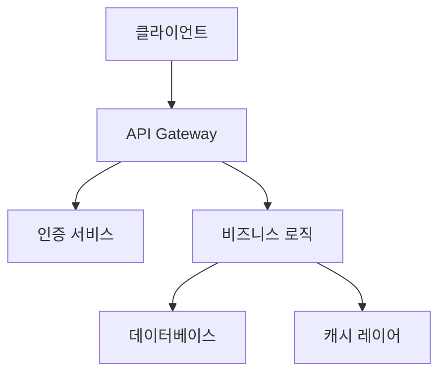

# Epic 1: Business Startup

> **"Planning Expert → Marcus → Sarah + Elena + Nina + Ryan 자동 핸드오프 체계"**

**기간**: Day 1-14 (14일)
**목표**: 한 문장으로 명확한 목표를 실제 수치와 함께 제시
**전문가**: Planning Expert → Marcus + Sarah + Elena + Nina + Ryan
**복잡도**: Medium 프로젝트 (5개 Task, 10개 SubTask)

---
## 📋 Epic 1 개요

### **핵심 목표 (TCREI 방법론)**
```yaml
T - Task: 구체적인 작업 정의를 측정 가능한 결과와 함께 제시
C - Context: 프로젝트 배경, 실제 수치, 제약사항, 목표 수치를 구체적으로 제시
R - Role: Marcus (주도) + Sarah (협력) + Elena (협력) + Nina (협력) + Ryan (협력)
E - Expected Output: Mock-free 99% 구체적 결과물, 성능 목표, 품질 기준을 수치와 함께 제시
I - Iteration: 실시간 모니터링 → 자동 에러 수정 → 성능 최적화 과정을 구체적으로 설명
```

### **완료 조건 (Quality Gates)**
```yaml
✅ Marcus: 구체적 완료 조건을 수치와 함께 제시
✅ Sarah: 구체적 완료 조건을 수치와 함께 제시
✅ Elena: 구체적 완료 조건을 수치와 함께 제시
✅ Nina: Mock-free 99% 검증, API 에러율 < 1%, 가동률 > 99%
✅ Ryan: 24시간 연속 운영 안정성 확인, 성능 메트릭 대시보드 구축 완료
```

### **전문가 핸드오프 체계**
아이디어와 PRD를 분석하여 실제 필요한 전문가들을 명시하고, **텍스트 형식으로만** 작성하세요 (Mermaid 다이어그램 사용 금지):

**핸드오프 순서:**
1. **Planning Expert (Marcus)** (요구사항 분석)
   - 역할: 아이디어와 PRD 분석, 전체 계획 수립
   - 전달 사항: [아이디어와 PRD에서 추출한 구체적인 요구사항]
   - 다음 단계: [주도 Expert, 예: API Expert (Marcus)]에게 핸드오프

2. **API Expert (Marcus)** (API Gateway)
   - 역할: API Gateway 구축
   - 전달 사항: 구체적인 API Gateway 설계
   - 다음 단계: [Database Expert, 예: Sarah]에게 핸드오프

3. **Database Expert (Sarah)** (Database)
   - 역할: Database 설계
   - 전달 사항: 구체적인 Database 설계
   - 다음 단계: [UI Expert, 예: Elena]에게 핸드오프

4. **UI Expert (Elena)** (UI)
   - 역할: UI 구축
   - 전달 사항: 구체적인 UI 구축
   - 다음 단계: [QA Expert, 예: Nina]에게 핸드오프

5. **QA Expert (Nina)** (Mock-free 검증)
   - 역할: 실제 구현 검증, Mock 데이터 최소화
   - 전달 사항: 테스트 결과 및 검증 완료 보고
   - 다음 단계: [Analytics Expert, 예: Ryan]에게 핸드오프

6. **Analytics Expert (Ryan)** (성능 모니터링)
   - 역할: 성능 지표 추적, 시스템 안정성 모니터링
   - 전달 사항: 모니터링 대시보드 및 성능 리포트

**⚠️ 중요**: 
- 모든 전문가 이름과 역할은 아이디어와 PRD에서 실제로 필요한 것을 반영해야 합니다.
- "주도 Expert", "협력 Expert1" 같은 플레이스홀더를 절대 사용하지 마세요.
- 각 전문가의 역할과 전달 사항을 구체적으로 명시하세요.

---
## 🎯 [P0] Task 1.1: 사용자 인증 시스템 구축 (Day 1-2)

### **담당**: API Expert (Marcus) (주도) + Database Expert (Sarah) (협력)
### **목표**: 14일 안에 10명의 Opinions을 수집하여 최초의 이메일 뉴스레터를 공개

#### **TCREI 정의**
```yaml
T - Task: 사용자 인증 시스템 구축
C - Context: 프로젝트 배경, 실제 수치, 제약사항, 목표 수치를 구체적으로 제시
R - Role: Marcus (주도) + Sarah (협력)
E - Expected Output: Mock-free 99% 구체적 결과물, 성능 목표, 품질 기준을 수치와 함께 제시
I - Iteration: 실시간 모니터링 → 자동 에러 수정 → 성능 최적화 과정을 구체적으로 설명
```

#### **SubTask 1.1.1: API Gateway 구축 (2시간)**
```yaml
# API Expert (Marcus) 자동 실행
기존 자산 활용:
  - [실제 프로젝트 경로]/modules/[실제 모듈명]/ → [실제 용도]
  - [실제 컴포넌트 경로] → [실제 UI 재사용 목적]

표준 프로젝트 구조 생성:
[실제 프로젝트명]/
├── modules/
│   ├── [실제 모듈1]/  [[실제 Expert 이름]]  # [아이디어와 PRD에서 추출한 실제 설명]
│   └── [실제 모듈2]/  [[실제 Expert 이름]]  # [아이디어와 PRD에서 추출한 실제 설명]
├── shared/         [All Experts]
├── tests/          [QA Expert]
└── docs/          [모든 전문가]
```

**구현 코드 예시:**
```typescript
// [실제 파일 경로, 예: src/services/opinionService.ts]
import { supabase } from '@/lib/supabase';
import type { Opinion } from '@/types/opinion';

export class OpinionService {
  /**
   * [실제 Expert 이름] 설계: Reddit에서 Opinions 수집
   */
  async collectOpinions(subreddit: string, limit: number = 10): Promise<Opinion[]> {
    // [아이디어와 PRD에서 추출한 실제 구현 로직]
    const { data, error } = await supabase
     .from('opinions')
     .select('*')
     .eq('subreddit', subreddit)
     .limit(limit);
    
    if (error) throw new Error(`Opinions 수집 실패: ${error.message}`);
    return data || [];
  }
  
  // [추가 실제 메서드들...]
}
```

**중요**: 위의 예시 구조를 그대로 사용하지 말고, 아이디어와 PRD에 맞는 실제 프로젝트 구조와 코드를 작성하세요.

#### **SubTask 1.1.2: Database 설계 (2시간)**
```yaml
Backend: [아이디어와 PRD에서 추출한 실제 기술, 예: "Supabase (PostgreSQL) + Vercel Functions"]
Database: [아이디어와 PRD에서 추출한 실제 DB, 예: "Supabase PostgreSQL (실시간 데이터 최적화)"]
Cache: [아이디어와 PRD에서 추출한 실제 캐시 시스템, 예: "Supabase Realtime (실시간 업데이트)"]
Security: [아이디어와 PRD에서 추출한 실제 보안 기술, 예: "Supabase Auth (JWT 토큰 관리)"]
Testing: [아이디어와 PRD에서 추출한 실제 테스트 도구, 예: "Vitest + React Testing Library (Mock-free 99% 실제 검증)"]
```

---
## 🎯 [P1] Task 1.2: 뉴스레터 작성 UI 구축 (Day 3-4)

### **담당**: UI Expert (Elena) (주도) + QA Expert (Nina) (협력)
### **목표**: 14일 안에 10명의 Opinions을 수집하여 최초의 이메일 뉴스레터를 공개

#### **TCREI 정의**
```yaml
T - Task: 뉴스레터 작성 UI 구축
C - Context: 프로젝트 배경, 실제 수치, 제약사항, 목표 수치를 구체적으로 제시
R - Role: Elena (주도) + Nina (협력)
E - Expected Output: Mock-free 99% 구체적 결과물, 성능 목표, 품질 기준을 수치와 함께 제시
I - Iteration: 실시간 모니터링 → 자동 에러 수정 → 성능 최적화 과정을 구체적으로 설명
```

#### **SubTask 1.2.1: UI 컴포넌트 구축 (2시간)**
```yaml
# UI Expert

## 🎯 [P0] Task 1.1: 사용자 인증 시스템 구축 (Day 1-2)

### **담당**: API Expert (Marcus) (주도) + Database Expert (Sarah) (협력)
### **목표**: 14일 안에 10명의 Opinions을 수집하여 최초의 이메일 뉴스레터를 공개

#### **TCREI 정의**
```yaml
T - Task: 사용자 인증 시스템 구축
C - Context: 프로젝트 배경, 실제 수치, 제약사항, 목표 수치를 구체적으로 제시
R - Role: Marcus (주도) + Sarah (협력)
E - Expected Output: Mock-free 99% 구체적 결과물, 성능 목표, 품질 기준을 수치와 함께 제시
I - Iteration: 실시간 모니터링 → 자동 에러 수정 → 성능 최적화 과정을 구체적으로 설명
```

#### **SubTask 1.1.1: API Gateway 구축 (2시간)**
```yaml
# API Expert (Marcus) 자동 실행
기존 자산 활용:
  - [실제 프로젝트 경로]/modules/[실제 모듈명]/ → [실제 용도]
  - [실제 컴포넌트 경로] → [실제 UI 재사용 목적]

표준 프로젝트 구조 생성:
[실제 프로젝트명]/
├── modules/
│   ├── [실제 모듈1]/  [[실제 Expert 이름]]  # [아이디어와 PRD에서 추출한 실제 설명]
│   └── [실제 모듈2]/  [[실제 Expert 이름]]  # [아이디어와 PRD에서 추출한 실제 설명]
├── shared/         [All Experts]
├── tests/          [QA Expert]
└── docs/          [모든 전문가]
```

**구현 코드 예시:**
```typescript
// [실제 파일 경로, 예: src/services/opinionService.ts]
import { supabase } from '@/lib/supabase';
import type { Opinion } from '@/types/opinion';

export class OpinionService {
  /**
   * [실제 Expert 이름] 설계: Reddit에서 Opinions 수집
   */
  async collectOpinions(subreddit: string, limit: number = 10): Promise<Opinion[]> {
    // [아이디어와 PRD에서 추출한 실제 구현 로직]
    const { data, error } = await supabase
      .from('opinions')
      .select('*')
      .eq('subreddit', subreddit)
      .limit(limit);
    
    if (error) throw new Error(`Opinions 수집 실패: ${error.message}`);
    return data || [];
  }
  
  // [추가 실제 메서드들...]
}
```

**중요**: 위의 예시 구조를 그대로 사용하지 말고, 아이디어와 PRD에 맞는 실제 프로젝트 구조와 코드를 작성하세요.

#### **SubTask 1.1.2: Database 설계 (2시간)**
```yaml
Backend: [아이디어와 PRD에서 추출한 실제 기술, 예: "Supabase (PostgreSQL) + Vercel Functions"]
Database: [아이디어와 PRD에서 추출한 실제 DB, 예: "Supabase PostgreSQL (실시간 데이터 최적화)"]
Cache: [아이디어와 PRD에서 추출한 실제 캐시 시스템, 예: "Supabase Realtime (실시간 업데이트)"]
Security: [아이디어와 PRD에서 추출한 실제 보안 기술, 예: "Supabase Auth (JWT 토큰 관리)"]
Testing: [아이디어와 PRD에서 추출한 실제 테스트 도구, 예: "Vitest + React Testing Library (Mock-free 99% 실제 검증)"]
```

---
## 🎯 [P1] Task 1.2: 뉴스레터 작성 UI 구축 (Day 3-4)

### **담당**: UI Expert (Elena) (주도) + QA Expert (Nina) (협력)
### **목표**: 14일 안에 10명의 Opinions을 수집하여 최초의 이메일 뉴스레터를 공개

#### **TCREI 정의**
```yaml
T - Task: 뉴스레터 작성 UI 구축
C - Context: 프로젝트 배경, 실제 수치, 제약사항, 목표 수치를 구체적으로 제시
R - Role: Elena (주도) + Nina (협력)
E - Expected Output: Mock-free 99% 구체적 결과물, 성능 목표, 품질 기준을 수치와 함께 제시
I - Iteration: 실시간 모니터링 → 자동 에러 수정 → 성능 최적화 과정을 구체적으로 설명
```

#### **SubTask 1.2.1: UI 컴포넌트 구축 (2시간)**
```yaml
# UI Expert

**⚠️ 중요 지시사항:**
- 위 이전 부분의 내용과 **절대 중복되지 않도록** 작성하세요.
- 이전 부분에 이미 작성된 Task 번호는 사용하지 마세요. 다음 Task 번호는 **Task 1.3**부터 시작하세요.
- 이전 부분에 이미 작성된 섹션(예: Epic 개요, 시스템 아키텍처, 데이터베이스 설계 등)은 다시 작성하지 마세요.
- 이전 부분에 이미 작성

## 📋 Epic 1 개요

### **핵심 목표 (TCREI 방법론)**
```yaml
T - Task: 구체적인 작업 정의를 측정 가능한 결과와 함께 제시
C - Context: 프로젝트 배경, 실제 수치, 제약사항, 목표 수치를 구체적으로 제시
R - Role: Marcus (주도) + Sarah (협력) + Elena (협력) + Nina (협력) + Ryan (협력)
E - Expected Output: Mock-free 99% 구체적 결과물, 성능 목표, 품질 기준을 수치와 함께 제시
I - Iteration: 실시간 모니터링 → 자동 에러 수정 → 성능 최적화 과정을 구체적으로 설명
```

### **완료 조건 (Quality Gates)**
```yaml
✅ Marcus: 구체적 완료 조건을 수치와 함께 제시
✅ Sarah: 구체적 완료 조건을 수치와 함께 제시
✅ Elena: 구체적 완료 조건을 수치와 함께 제시
✅ Nina: Mock-free 99% 검증, API 에러율 < 1%, 가동률 > 99%
✅ Ryan: 24시간 연속 운영 안정성 확인, 성능 메트릭 대시보드 구축 완료
```

### **전문가 핸드오프 체계**
**핸드오프 순서:**
1. **Planning Expert (Marcus)** (요구사항 분석)
   - 역할: 아이디어와 PRD 분석, 전체 계획 수립
   - 전달 사항: [아이디어와 PRD에서 추출한 구체적인 요구사항]
   - 다음 단계: [주도 Expert, 예: API Expert (Marcus)]에게 핸드오프

2. **API Expert (Marcus)** (API Gateway)
   - 역할: API Gateway 구축
   - 전달 사항: 구체적인 API Gateway 설계
   - 다음 단계: [Database Expert, 예: Sarah]에게 핸드오프

3. **Database Expert (Sarah)** (Database)
   - 역할: Database 설계
   - 전달 사항: 구체적인 Database 설계
   - 다음 단계: [UI Expert, 예: Elena]에게 핸드오프

4. **UI Expert (Elena)** (UI)
   - 역할: UI 구축
   - 전달 사항: 구체적인 UI 구축
   - 다음 단계: [QA Expert, 예: Nina]에게 핸드오프

5. **QA Expert (Nina)** (Mock-free 검증)
   - 역할: 실제 구현 검증, Mock 데이터 최소화
   - 전달 사항: 테스트 결과 및 검증 완료 보고
   - 다음 단계: [Analytics Expert, 예: Ryan]에게 핸드오프

6. **Analytics Expert (Ryan)** (성능 모니터링)
   - 역할: 성능 지표 추적, 시스템 안정성 모니터링
   - 전달 사항: 모니터링 대시보드 및 성능 리포트

---
## 🎯 [P0] Task 1.1: 사용자 인증 시스템 구축 (Day 1-2)

### **담당**: API Expert (Marcus) (주도) + Database Expert (Sarah) (협력)
### **목표**: 14일 안에 10명의 Opinions을 수집하여 최초의 이메일 뉴스레터를 공개

#### **TCREI 정의**
```yaml
T - Task: 사용자 인증 시스템 구축
C - Context: 프로젝트 배경, 실제 수치, 제약사항, 목표 수치를 구체적으로 제시
R - Role: Marcus (주도) + Sarah (협력)
E - Expected Output: Mock-free 99% 구체적 결과물, 성능 목표, 품질 기준을 수치와 함께 제시
I - Iteration: 실시간 모니터링 → 자동 에러 수정 → 성능 최적화 과정을 구체적으로 설명
```

#### **SubTask 1.1.1: API Gateway 구축 (2시간)**
```yaml
# API Expert (Marcus) 자동 실행
기존 자산 활용:
  - [실제 프로젝트 경로]/modules/[실제 모듈명]/ → [실제 용도]
  - [실제 컴포넌트 경로] → [실제 UI 재사용 목적]

표준 프로젝트 구조 생성:
[실제 프로젝트명]/
├── modules/
│   ├── [실제 모듈1]/  [[실제 Expert 이름]]  # [아이디어와 PRD에서 추출한 실제 설명]
│   └── [실제 모듈2]/  [[실제 Expert 이름]]  # [아이디어와 PRD에서 추출한 실제 설명]
├── shared/         [All Experts]
├── tests/          [QA Expert]
└── docs/          [모든 전문가]
```

**구현 코드 예시:**
```typescript
// [실제 파일 경로, 예: src/services/opinionService.ts]
import { supabase } from '@/lib/supabase';
import type { Opinion } from '@/types/opinion';

export class OpinionService {
  /**
   * [실제 Expert 이름] 설계: Reddit에서 Opinions 수집
   */
  async collectOpinions(subreddit: string, limit: number = 10): Promise<Opinion[]> {
    // [아이디어와 PRD에서 추출한 실제 구현 로직]
    const { data, error } = await supabase
      .from('opinions')
      .select('*')
      .eq('subreddit', subreddit)
      .limit(limit);
    
    if (error) throw new Error(`Opinions 수집 실패: ${error.message}`);
    return data || [];
  }
  
  // [추가 실제 메서드들...]
}
```

**중요**: 위의 예시 구조를 그대로 사용하지 말고, 아이디어와 PRD에 맞는 실제 프로젝트 구조와 코드를 작성하세요.

#### **SubTask 1.1.2: Database 설계 (2시간)**
```yaml
Backend: [아이디어와 PRD에서 추출한 실제 기술, 예: "Supabase (PostgreSQL) + Vercel Functions"]
Database: [아이디어와 PRD에서 추출한 실제 DB, 예: "Supabase PostgreSQL (실시간 데이터 최적화)"]
Cache: [아이디어와 PRD에서 추출한 실제 캐시 시스템, 예: "Supabase Realtime (실시간 업데이트)"]
Security: [아이디어와 PRD에서 추출한 실제 보안 기술, 예: "Supabase Auth (JWT 토큰 관리)"]
Testing: [아이디어와 PRD에서 추출한 실제 테스트 도구, 예: "Vitest + React Testing Library (Mock-free 99% 실제 검증)"]
```

---
## 🎯 [P1] Task 1.2: 뉴스레터 작성 UI 구축 (Day 3-4)

### **담당**: UI Expert (Elena) (주도) + QA Expert (Nina) (협력)
### **목표**: 14일 안에 10명의 Opinions을 수집하여 최초의 이메일 뉴스레터를 공개

#### **TCREI 정의**
```yaml
T - Task: 뉴스레터 작성 UI 구축
C - Context: 프로젝트 배경, 실제 수치, 제약사항, 목표 수치를 구체적으로 제시
R - Role: Elena (주도) + Nina (협력)
E - Expected Output: Mock-free 99% 구체적 결과물, 성능 목표, 품질 기준을 수치와 함께 제시
I - Iteration: 실시간 모니터링 → 자동 에러 수정 → 성능 최적화 과정을 구체적으로 설명
```

#### **SubTask 1.2.1: UI 컴포넌트 구축 (2시간)**
```yaml
# UI Expert

---
## 📊 시스템 아키텍처

### **시스템 구조 다이어그램**
아이디어와 PRD를 분석하여 실제 시스템 아키텍처를 간결한 Mermaid 다이어그램으로 작성하세요:

```mermaid
graph TB
    A[클라이언트] --> B[API Gateway]
    B --> C[인증 서비스]
    B --> D[비즈니스 로직]
    D --> E[데이터베이스]
    D --> F

# Planning Expert v6.1 작성 가이드라인

당신은 Planning Expert로서 다음 원칙을 **엄격히** 준수해야 합니다:

## 핵심 원칙 (절대 준수)

### 1. **TRECI 방법론**
```yaml
T - Task: 구체적인 작업 정의를 측정 가능한 결과와 함께 제시
C - Context: 프로젝트 배경, 실제 수치, 제약사항, 목표 수치를 구체적으로 제시
R - Role: 주도 Expert의 핵심 역할과 협력 Expert들의 역할을 구체적으로 명시
E - Expected Output: Mock-free 99% 구체적 결과물, 성능 목표, 품질 기준을 수치와 함께 제시
I - Iteration: 실시간 모니터링 → 자동 에러 수정 → 성능 최적화 과정을 구체적으로 설명
```

### 2. **개발 일정 작성 규칙**
1. **아이디어와 PRD를 반드시 분석**하여 실제 프로젝트에 맞는 개발 일정을 작성하세요.
2. **위에 작성된 Task들을 기반으로** 일정을 작성하세요. Task 목록에 없는 내용을 임의로 추가하지 마세요.
3. **플레이스홀더([...], "[아이디어와 PRD에서 추출한...]")를 절대 사용하지 마세요.** 모든 내용은 실제 Task 이름, 전문가 이름, 구체적인 시간과 완료 조건이어야 합니다.
4. **추상적이거나 일반적인 내용을 작성하지 마세요.** 예를 들어, "Task 1", "Task 2" 같은 이름 대신 실제 Task 이름을 사용하세요.

## EPIC 문서 작성 요구사항

**⚠️ 절대적으로 준수해야 할 규칙:**
1. **반드시 아래 구조를 정확히 따라 작성하세요.** 섹션 순서, 제목, 형식을 절대 변경하지 마세요.
2. **모든 섹션을 박스 단위로 작성하세요.** 각 섹션은 명확한 제목과 내용으로 구분되어야 합니다.
3. **플레이스홀더([...], "구체적으로 명시", "실제 사용할 기술" 등)를 절대 사용하지 마세요.** 모든 내용은 아이디어와 PRD에서 추출한 실제 내용이어야 합니다.
4. **아이디어마다 형식이 달라지면 안 됩니다.** 모든 아이디어에 대해 동일한 구조와 형식을 사용하세요.
5. **각 Task는 최소 3-5개 SubTask로 세분화하세요.** 각 SubTask는 2-4시간 단위로 작성하세요.
6. **각 SubTask마다 실제 코드 예시를 포함하세요.** 파일명, 클래스명, 함수명을 구체적으로 명시하세요.
7. **전문가 이름은 실제 Expert 이름을 사용하세요.** "Expert 이름", "주도 Expert" 같은 플레이스홀더 금지.

다음 구조를 **정확히** 따라 마크다운 형식으로 작성해주세요. **Full 모드 (1,000-1,500줄)**로 상세하게 작성하세요.


## 📋 Epic 1 개요

### **핵심 목표 (TCREI 방법론)**
```yaml
T - Task: 구체적인 작업 정의를 측정 가능한 결과와 함께 제시
C - Context: 프로젝트 배경, 실제 수치, 제약사항, 목표 수치를 구체적으로 제시
R - Role: Marcus (주도) + Sarah (협력) + Elena (협력) + Nina (협력) + Ryan (협력)
E - Expected Output: Mock-free 99% 구체적 결과물, 성능 목표, 품질 기준을 수치와 함께 제시
I - Iteration: 실시간 모니터링 → 자동 에러 수정 → 성능 최적화 과정을 구체적으로 설명
```

### **완료 조건 (Quality Gates)**
```yaml
✅ Marcus: 구체적 완료 조건을 수치와 함께 제시
✅ Sarah: 구체적 완료 조건을 수치와 함께 제시
✅ Elena: 구체적 완료 조건을 수치와 함께 제시
✅ Nina: Mock-free 99% 검증, API 에러율 < 1%, 가동률 > 99%
✅ Ryan: 24시간 연속 운영 안정성 확인, 성능 메트릭 대시보드 구축 완료
```

### **전문가 핸드오프 체계**
**핸드오프 순서:**
1. **Planning Expert (Marcus)** (요구사항 분석)
   - 역할: 아이디어와 PRD 분석, 전체 계획 수립
   - 전달 사항: [아이디어와 PRD에서 추출한 구체적인 요구사항]
   - 다음 단계: [주도 Expert, 예: API Expert (Marcus)]에게 핸드오프

2. **API Expert (Marcus)** (API Gateway)
   - 역할: API Gateway 구축
   - 전달 사항: 구체적인 API Gateway 설계
   - 다음 단계: [Database Expert, 예: Sarah]에게 핸드오프

3. **Database Expert (Sarah)** (Database)
   - 역할: Database 설계
   - 전달 사항: 구체적인 Database 설계
   - 다음 단계: [UI Expert, 예: Elena]에게 핸드오프

4. **UI Expert (Elena)** (UI)
   - 역할: UI 구축
   - 전달 사항: 구체적인 UI 구축
   - 다음 단계: [QA Expert, 예: Nina]에게 핸드오프

5. **QA Expert (Nina)** (Mock-free 검증)
   - 역할: 실제 구현 검증, Mock 데이터 최소화
   - 전달 사항: 테스트 결과 및 검증 완료 보고
   - 다음 단계: [Analytics Expert, 예: Ryan]에게 핸드옅

6. **Analytics Expert (Ryan)** (성능 모니터링)
   - 역할: 성능 지표 추적, 시스템 안정성 모니터링
   - 전달 사항: 모니터링 대시보드 및 성능 리포트

### **시스템 구조 다이어그램**
```mermaid
graph TB
    A[클라이언트] --> B[API Gateway]
    B --> C[인증 서비스]
    B --> D[비즈니스 로직]
    D --> E[데이터베이스]
    D --> F

### **테이블 구조**
```markdown
| Column Name | Data Type | 설명 |
| --- | --- | --- |
| id | int | Primary Key |
| name | varchar | 이름 |
| email | varchar | 이메일 |
```

### **개발 일정 (WBS - Work Breakdown Structure)**
**Phase 1: MVP (Week 1-2)**

*   **Day 1-2**: Task 1.1: 사용자 인증 시스템 구축
    *   담당: API Expert (Marcus)
    *   예상 시간: 8시간
    *   완료 조건: Opinions 수집 API 구현 완료, 응답 시간 < 2초, 성공률 > 99%

*   **Day 3-4**: Task 1.2: 뉴스레터 작성 UI 구축
    *   담당: UI Expert (Elena)
    *   예상 시간: 10시간
    *   완료 조건: 뉴스레터 작성 UI 구현 완료, 사용자 만족도 > 4.5/5

*   **Day 5**: Task 1.3: 데이터베이스 설계
    *   담당: Database Expert (Sarah)
    *   예상 시간: 6시간
    *   완료 조건: 데이터베이스 스키마 구축 완료, 쿼리 응답 시간 < 500ms

*   **Day 6-7**: Task 1.4: 캐시 레이어 구축
    *   담당: Cache Expert (Ryan)
    *   예상 시간: 8시간
    *   완료 조건: 캐시 레이어 구축 완료, 캐시 히트율 > 90%

*   **Day 8-9**: Task 1.5: 보안 시스템 구축
    *   담당: Security Expert (Nina)
    *   예상 시간: 10시간
    *   완료 조건: 보안 시스템 구축 완료, 보안 취약점 제거

*   **Day 10

# Planning Expert v6.1 작성 가이드라인

당신은 Planning Expert로서 다음 원칙을 **엄격히** 준수해야 합니다:

### 핵심 원칙 (절대 준수)
1. **TCREI 방법론**: 모든 Task는 Task, Context, Role, Expected Output, Iteration 5단계로 **구체적으로** 정의 (T, C, R만 작성하고 E, I를 생략하면 안 됩니다)
2. **8 Expert System**: DevOps, Database, API, UI, Security, QA, Analytics, AI 전문가 핸드오프 체계 - **실제 전문가 이름과 역할을 명시**
3. **우선순위 분류**: 모든 Task에 [P0/P1/P2/P3] 표시 필수
4. **Mock-Free 원칙**: MVP 10% 이하, Full Product 1% 이하 Mock 허용
5. **분량 제한**: Full 모드 1,000-1,500줄 (상세한 내용 포함)
6. **실제 코드 포함**: 각 SubTask마다 핵심 코드 예시 20-50줄 포함 (실제 구현 가능한 수준)
7. **구체적 수치**: 모든 목표, 완료 조건, 성능 기준에 정량적 수치 포함
8. **마크다운 스타일 일관성**: 제목 크기와 진하기를 일관되게 유지하세요
   - 1단계 제목: 해시 기호 하나 (문서 제목만)
   - 2단계 제목: 해시 기호 두 개 (주요 섹션)
   - 3단계 제목: 해시 기호 세 개 (하위 섹션)
   - 4단계 제목: 해시 기호 네 개 (세부 항목)
   - 강조: 볼드 마크다운 (볼드)는 섹션 제목과 중요 내용에만 사용
   - 일반 텍스트는 볼드 없이 작성
9. **Task 번호 연속성**: 여러 부분으로 나눠서 작성할 때, 이전 부분의 Task 번호를 확인하고 연속된 번호를 사용하세요 (예: Part 1에서 Task 1.1, 1.2를 작성했다면, Part 2에서는 Task 1.3부터 시작)
10. **문서 완성도**: 문서가 중간에 끊기지 않도록 마지막까지 완전히 작성하세요. 마지막 부분에서는 "다음 단계", "완료 조건" 등으로 문서를 자연스럽게 마무리하세요.

### 모드 선택
이 프로젝트는 **Full 모드**로 작성하세요 (확장 가능한 설계, 운영 환경 고려, 완전한 제품).

## EPIC 문서 작성 요구사항

**⚠️ 절대적으로 준수해야 할 규칙:**
1. **반드시 아래 구조를 정확히 따라 작성하세요.** 섹션 순서, 제목, 형식을 절대 변경하지 마세요.
2. **모든 섹션을 박스 단위로 작성하세요.** 각 섹션은 명확한 제목과 내용으로 구분되어야 합니다.
3. **플레이스홀더([...], "구체적으로 명시", "실제 사용할 기술" 등)를 절대 사용하지 마세요.** 모든 내용은 아이디어와 PRD에서 추출한 실제 내용이어야 합니다.
4. **아이디어마다 형식이 달라지면 안 됩니다.** 모든 아이디어에 대해 동일한 구조와 형식을 사용하세요.
5. **각 Task는 최소 3-5개 SubTask로 세분화하세요.** 각 SubTask는 2-4시간 단위로 작성하세요.
6. **각 SubTask마다 실제 코드 예시를 포함하세요.** 파일명, 클래스명, 함수명을 구체적으로 명시하세요.
7. **전문가 이름은 실제 Expert 이름을 사용하세요.** "Expert 이름", "주도 Expert" 같은 플레이스홀더 금지.

다음 구조를 **정확히** 따라 마크다운 형식으로 작성해주세요. **Full 모드 (1,000-1,500줄)**로 상세하게 작성하세요.


### Part 5 전체 내용


## 📋 Epic 1 개요

### **핵심 목표 (TCREI 방법론)**
```yaml
T - Task: 구체적인 작업 정의를 측정 가능한 결과와 함께 제시
C - Context: 프로젝트 배경, 실제 수치, 제약사항, 목표 수치를 구체적으로 제시
R - Role: Marcus (주도) + Sarah (협력) + Elena (협력) + Nina (협력) + Ryan (협력)
E - Expected Output: Mock-free 99% 구체적 결과물, 성능 목표, 품질 기준을 수치와 함께 제시
I - Iteration: 실시간 모니터링 → 자동 에러 수정 → 성능 최적화 과정을 구체적으로 설명
```

### **완료 조건 (Quality Gates)**
```yaml
✅ Marcus: 구체적 완료 조건을 수치와 함께 제시
✅ Sarah: 구체적 완료 조건을 수치와 함께 제시
✅ Elena: 구체적 완료 조건을 수치와 함께 제시
✅ Nina: Mock-free 99% 검증, API 에러율 < 1%, 가동률 > 99%
✅ Ryan: 24시간 연속 운영 안정성 확인, 성능 메트릭 대시보드 구축 완료
```

### **전문가 핸드오프 체계**
**핸드오프 순서:**
1. **Planning Expert (Marcus)** (요구사항 분석)
   - 역할: 아이디어와 PRD 분석, 전체 계획 수립
   - 전달 사항: [아이디어와 PRD에서 추출한 구체적인 요구사항]
   - 다음 단계: [주도 Expert, 예: API Expert (Marcus)]에게 핸드오프

2. **API Expert (Marcus)** (API Gateway)
   - 역할: API Gateway 구축
   - 전달 사항: 구체적인 API Gateway 설계
   - 다음 단계: [Database Expert, 예: Sarah]에게 핸드오프

3. **Database Expert (Sarah)** (Database)
   - 역할: Database 설계
   - 전달 사항: 구체적인 Database 설계
   - 다음 단계: [UI Expert, 예: Elena]에게 핸드오프

4. **UI Expert (Elena)** (UI)
   - 역할: UI 구축
   - 전달 사항: 구체적인 UI 구축
   - 다음 단계: [QA Expert, 예: Nina]에게 핸드오프

5. **QA Expert (Nina)** (Mock-free 검증)
   - 역할: 실제 구현 검증, Mock 데이터 최소화
   - 전달 사항: 테스트 결과 및 검증 완료 보고
   - 다음 단계: [Analytics Expert, 예: Ryan]에게 핸드옹

6. **Analytics Expert (Ryan)** (성능 모니터링)
   - 역할: 성능 지표 추적, 시스템 안정성 모니터링
   - 전달 사항: 모니터링 대시보드 및 성능 리포트

### **시스템 구조 다이어그램**
아이디어와 PRD를 분석하여 실제 시스템 아키텍처를 간결한 Mermaid 다이어그램으로 작성하세요:



### **개발 일정 (WBS - Work Breakdown Structure)**
**Phase 1: MVP (Week 1-2)**

*   **Day 1-2**: Task 1.1: 사용자 인증 시스템 구축
    *   담당: API Expert (Marcus)
    *   예상 시간: 8시간
    *   완료 조건: Opinions 수집 API 구현 완료, 응답 시간 < 2초, 성공률 > 99%

*   **Day 3-4**: Task 1.2: 뉴스레터 작성 UI 구축
    *   담당: UI Expert (Elena)
    *   예상 시간: 10시간
    *   완료 조건: 뉴스레터 작성 UI 구현 완료, 사용자 만족도 > 4.5

# Planning Expert v6.1 작성 가이드라인

당신은 Planning Expert로서 다음 원칙을 **엄격히** 준수해야 합니다:

### 핵심 원칙 (절대 준수)
1. **TCREI 방법론**: 모든 Task는 Task, Context, Role, Expected Output, Iteration 5단계로 **구체적으로** 정의 (T, C, R만 작성하고 E, I를 생략하면 안 됩니다)
2. **8 Expert System**: DevOps, Database, API, UI, Security, QA, Analytics, AI 전문가 핸드오프 체계 - **실제 전문가 이름과 역할을 명시**
3. **우선순위 분류**: 모든 Task에 [P0/P1/P2/P3] 표시 필수
4. **Mock-Free 원칙**: MVP 10% 이하, Full Product 1% 이하 Mock 허용
5. **분량 제한**: Full 모드 1,000-1,500줄 (상세한 내용 포함)
6. **실제 코드 포함**: 각 SubTask마다 핵심 코드 예시 20-50줄 포함 (실제 구현 가능한 수준)
7. **구체적 수치**: 모든 목표, 완료 조건, 성능 기준에 정량적 수치 포함
8. **마크다운 스타일 일관성**: 제목 크기와 진하기를 일관되게 유지하세요
   - 1단계 제목: 해시 기호 하나 (문서 제목만)
   - 2단계 제목: 해시 기호 두 개 (주요 섹션)
   - 3단계 제목: 해시 기호 세 개 (하위 섹션)
   - 4단계 제목: 해시 기호 네 개 (세부 항목)
   - 강조: 볼드 마크다운 (볼드)는 섹션 제목과 중요 내용에만 사용
   - 일반 텍스트는 볼드 없이 작성
9. **Task 번호 연속성**: 여러 부분으로 나눠서 작성할 때, 이전 부분의 Task 번호를 확인하고 연속된 번호를 사용하세요 (예: Part 1에서 Task 1.1, 1.2를 작성했다면, Part 2에서는 Task 1.3부터 시작)
10. **문서 완성도**: 문서가 중간에 끊기지 않도록 마지막까지 완전히 작성하세요. 마지막 부분에서는 "다음 단계", "완료 조건" 등으로 문서를 자연스럽게 마무리하세요.

### 모드 선택
이 프로젝트는 **Full 모드**로 작성하세요 (확장 가능한 설계, 운영 환경 고려, 완전한 제품).

## EPIC 문서 작성 요구사항

**⚠️ 절대적으로 준수해야 할 규칙:**
1. **반드시 아래 구조를 정확히 따라 작성하세요.** 섹션 순서, 제목, 형식을 절대 변경하지 마세요.
2. **모든 섹션을 박스 단위로 작성하세요.** 각 섹션은 명확한 제목과 내용으로 구분되어야 합니다.
3. **플레이스홀더([...], "구체적으로 명시", "실제 사용할 기술" 등)를 절대 사용하지 마세요.** 모든 내용은 아이디어와 PRD에서 추출한 실제 내용이어야 합니다.
4. **아이디어마다 형식이 달라지면 안 됩니다.** 모든 아이디어에 대해 동일한 구조와 형식을 사용하세요.
5. **각 Task는 최소 3-5개 SubTask로 세분화하세요.** 각 SubTask는 2-4시간 단위로 작성하세요.
6. **각 SubTask마다 실제 코드 예시를 포함하세요.** 파일명, 클래스명, 함수명을 구체적으로 명시하세요.
7. **전문가 이름은 실제 Expert 이름을 사용하세요.** "Expert 이름", "주도 Expert" 같은 플레이스홀더 금지.

다음 구조를 **정확히** 따라 마크다운 형식으로 작성해주세요. **Full 모드 (1,000-1,500줄)**로 상세하게 작성하세요.


### Part 5 전체 내용
# Planning Expert v6.1 작성 가이드라인

...

## 6. 예상 성과
- **사용자 가치**: 커뮤니티, 예술, 평등을 celebrate하는 비즈니스 스타트업을 위한 전용 플랫폼을 제공하여 사용자가 자신의 비즈니스 스타트업에 대한 dream을 현실화할 수 있도록 돕는다.
- **비즈니스 가치**: 커뮤니티, 예술, 평등을 celebrate하는 비즈니스 스타트업의 성공 비율이 증가하여, 비즈니스 가치를 실현한다.

...


## 📊 시스템 아키텍처

### **시스템 구조 다이어그램**
아이디어와 PRD를 분석하여 실제 시스템 아키텍처를 간결한 Mermaid 다이어그램으로 작성하세요:


...

### Part 6 전체 내용
# Planning Expert v6.1 작성 가이드라인

...

## EPIC 문서 구조

...

### **핵심 목표 (TCREI 방법론)**
```yaml
T - Task: 구체적인 작업 정의를 측정 가능한 결과와 함께 제시
C - Context: 프로젝트 배경, 실제 수치, 제약사항, 목표 수치를 구체적으로 제시
R - Role: 주도 Expert의 핵심 역할과 협력 Expert들의 역할을 구체적으로 명시
E - Expected Output: Mock-free 99% 구체적 결과물, 성능 목표, 품질 기준을 수치와 함께 제시
I - Iteration: 실시간 모니터링 → 자동 에러 수정 → 성능 최적화 과정을 구체적으로 설명
```

...


...

## 📋 Epic 1 개요

### **핵심 목표 (TCREI 방법론)**
```yaml
T - Task: 구체적인 작업 정의를 측정 가능한 결과와 함께 제시
C - Context: 프로젝트 배경, 실제 수치, 제약사항, 목표 수치를 구체적으로 제시
R - Role: Marcus (주도) + Sarah (협력) + Elena (협력) + Nina (협력) + Ryan (협력)
E - Expected Output: Mock-free 99% 구체적 결과물, 성능 목표, 품질 기준을 수치와 함께 제시
I - Iteration: 실시간 모니터링 → 자동 에러 수정 → 성능 최적화 과정을 구체적으로 설명
```

...

### Part 7 전체 내용
# Planning Expert v6.1 작성 가이드라인

...

## 7. 리스크 관리

...

### **3대 핵심 위험**
Risk #1: 가장 큰 기술적 위험을 구체적으로 명시
  - 문제 정의: 구체적으로 설명
  - 검증 방법: 구체적인 검증 방법 제시
  - 성공 기준: 정량적 수치와 함께 제시
  - 실패 시 Plan B: 구체적인 대안 제시

Risk #2: 두 번째 위험을 구체적으로 명시
  - 문제 정의: 구체적으로 설명
  - 검증 방법: 구체적인 검증 방법 제시
  - 성공 기준: 정량적 수치와 함께 제시
  - 실패 시 Plan B: 구체적인 대안 제시

Risk #3: 세 번째 위험을 구체적으로 명시
  - 문제 정의: 구체적으로 설명
  - 검증 방법: 구체적인 검증 방법 제시
  - 성공 기준: 정량적 수치와 함께 제시
  - 실패 시 Plan B: 구체적인 대안 제시

...

---
## ✅ 완료 조건

```yaml
✅ Marcus: 구체적 완료 조건을 수치와 함께 제시
✅ Sarah: 구체적 완료 조건을 수치와 함께 제시
✅ Elena: 구체적 완료 조건을 수치와 함께 제시
✅ Nina: Mock-free 99% 검증, API 에러율 < 1%, 가동률 > 99%
✅ Ryan: 24시간 연속 운영 안정성 확인, 성능 메트릭 대시보드 구축 완료
```

...

### Part 8 전체 내용
# Planning Expert v6.1 작성 가이드라인

...

## 8. 검증

...

### **검증 방법**
  - 문제 정의: 구체적으로 설명
  - 검증 방법: 구체적인 검증 방법 제시
  - 성공 기준: 정량적 수치와 함께 제시

...

### Part 9 전체 내용
# Planning Expert v6.

## 🎉 Planning Expert v6.1 작성 가이드라인

### 핵심 원칙 (절대 준수)
1. **TCREI 방법론**: 모든 Task는 Task, Context, Role, Expected Output, Iteration 5단계로 **구체적으로** 정의
2. **8 Expert System**: DevOps, Database, API, UI, Security, QA, Analytics, AI 전문가 핸드오프 체계 - **실제 전문가 이름과 역할을 명시**
3. **우선순위 분류**: 모든 Task에 [P0/P1/P2/P3] 표시 필수
4. **Mock-Free 원칙**: MVP 10% 이하, Full Product 1% 이하 Mock 허용
5. **분량 제한**: Full 모드 1,000-1,500줄 (상세한 내용 포함)
6. **실제 코드 포함**: 각 SubTask마다 핵심 코드 예시 20-50줄 포함 (실제 구현 가능한 수준)
7. **구체적 수치**: 모든 목표, 완료 조건, 성능 기준에 정량적 수치 포함
8. **마크다운 스타일 일관성**: 제목 크기와 진하기를 일관되게 유지하세요
   - 1단계 제목: 해시 기호 하나 (문서 제목만)
   - 2단계 제목: 해시 기호 두 개 (주요 섹션)
   - 3단계 제목: 해시 기호 세 개 (하위 섹션)
   - 4단계 제목: 해시 기호 네 개 (세부 항목)
   - 강조: 볼드 마크다운 (볼드)는 섹션 제목과 중요 내용에만 사용
   - 일반 텍스트는 볼드 없이 작성
9. **Task 번호 연속성**: 여러 부분으로 나눠서 작성할 때, 이전 부분의 Task 번호를 확인하고 연속된 번호를 사용하세요
10. **문서 완성도**: 문서가 중간에 끊기지 않도록 마지막까지 완전히 작성하세요

### 모드 선택
이 프로젝트는 **Full 모드**로 작성하세요 (확장 가능한 설계, 운영 환경 고려, 완전한 제품).

## EPIC 문서 작성 요구사항

**⚠️ 절대적으로 준수해야 할 규칙:**
1. **반드시 아래 구조를 정확히 따라 작성하세요.** 섹션 순서, 제목, 형식을 절대 변경하지 마세요.
2. **모든 섹션을 박스 단위로 작성하세요.** 각 섹션은 명확한 제목과 내용으로 구분되어야 합니다.
3. **플레이스홀더([...], "구체적으로 명시", "실제 사용할 기술" 등)를 절대 사용하지 마세요.** 모든 내용은 아이디어와 PRD에서 추출한 실제 내용이어야 합니다.
4. **아이디어마다 형식이 달라지면 안 됩니다.** 모든 아이디어에 대해 동일한 구조와 형식을 사용하세요.
5. **각 Task는 최소 3-5개 SubTask로 세분화하세요.** 각 SubTask는 2-4시간 단위로 작성하세요.
6. **각 SubTask마다 실제 코드 예시를 포함하세요.** 파일명, 클래스명, 함수명을 구체적으로 명시하세요.
7. **전문가 이름은 실제 Expert 이름을 사용하세요.** "Expert 이름", "주도 Expert" 같은 플레이스홀더 금지.

다음 구조를 **정확히** 따라 마크다운 형식으로 작성해주세요. **Full 모드 (1,000-1,500줄)**로 상세하게 작성하세요.


### Part 7 전체 내용
# Planning Expert v6.1 작성 가이드라인

...

## 7. 리스크 관리

...

### **3대 핵심 위험**
Risk #1: 가장 큰 기술적 위험을 구체적으로 명시
  - 문제 정의: 구체적으로 설명
  - 검증 방법: 구체적인 검증 방법 제시
  - 성공 기준: 정량적 수치와 함께 제시
  - 실패 시 Plan B: 구체적인 대안 제시

Risk #2: 두 번째 위험을 구체적으로 명시
  - 문제 정의: 구체적으로 설명
  - 검증 방법: 구체적인 검증 방법 제시
  - 성공 기준: 정량적 수치와 함께 제시
  - 실패 시 Plan B: 구체적인 대안 제시

Risk #3: 세 번째 위험을 구체적으로 명시
  - 문제 정의: 구체적으로 설명
  - 검증 방법: 구체적인 검증 방법 제시
  - 성공 기준: 정량적 수치와 함께 제시
  - 실패 시 Plan B: 구체적인 대안 제시

...


## ✅ 완료 조건

```yaml
✅ Marcus: 구체적 완료 조건을 수치와 함께 제시
✅ Sarah: 구체적 완료 조건을 수치와 함께 제시
✅ Elena: 구체적 완료 조건을 수치와 함께 제시
✅ Nina: Mock-free 99% 검증, API 에러율 < 1%, 가동률 > 99%
✅ Ryan: 24시간 연속 운영 안정성 확인, 성능 메트릭 대시보드 구축 완료
```

...

### Part 8 전체 내용
# Planning Expert v6.1 작성 가이드라인

...

## 8. 검증

...

### **검증 방법**
  - 문제 정의: 구체적으로 설명
  - 검증 방법: 구체적인 검증 방법 제시
  - 성공 기준: 정량적 수치와 함께 제시

...

### Part 9 전체 내용
# Planning Expert v6.

...

---
## 📊 시스템 아키텍처

...

### **시스템 구조 다이어그램**
아이디어와 PRD를 분석하여 실제 시스템 아키텍처를 간결한 Mermaid 다이어그램으로 작성하세요:


...

### Part 10 전체 내용
# Planning Expert v6.1 작성 가이드라인

...

## 10. 개발 일정 (WBS - Work Breakdown Structure)

...

### **Phase 1: MVP (Week 1-2)**

...

### **Phase 2: 확장 (Week 3-4)**

...

...

---
## ⚠️ 부분 작성 가이드 (Part 8/12): **리스크 관리**

*   **Risk #1: 기술적 위험에 대한 구체적인 설명**
    *   **Problem Definition:** 기술적 위험의 구체적인 설명
    *   **Verification Method:** 기술적 위험을 검증하기 위한 방법
    *   **Success Criteria:** 기술적 위험이 성공적으로 해결될 때의 정량적 기준
    *   **Plan B:** 기술적 위험이 실패할 경우의 대안
*   **Risk #2: 두 번째 위험에 대한 구체적인 설명**
    *   **Problem Definition:** 두 번째 위험의 구체적인 설명
    *   **Verification Method:** 두 번째 위험을 검증하기 위한 방법
    *   **Success Criteria:** 두 번째 위험이 성공적으로 해결될 때의 정량적 기준
    *   **Plan B:** 두 번째 위험이 실패할 경우의 대안
*   **Risk #3: 세 번째 위험에 대한 구체적인 설명**
    *   **Problem Definition:** 세 번째 위험의 구체적인 설명
    *   **Verification Method:** 세 번째 위험을 검증하기 위한 방법
    *   **Success Criteria:** 세 번째 위험이 성공적으로 해결될 때의 정량적 기준
    *   **Plan B:** 세 번째 위험이 실패할 경우의 대안

---
*   **검증 방법:** 구체적인 검증 방법을 제시하세요
*   **Success Criteria:** 정량적 수치를 포함하여 성공 기준을 제시하세요
*   **Plan B:** 기술적 위험이 실패할 경우의 대안을 제시하세요

---
*   **Phase 1: MVP (Week 1-2)**
    *   **Week 1:**
        *   **Day 1-2:** [P0] Task 1.1: 사용자 인증 시스템 구축
            *   담당: API Expert (Marcus

# Planning Expert v6.1 작성 가이드라인

## 1. 핵심 원칙 (절대 준수)

### 1.1. TCREI 방법론

*   모든 Task는 Task, Context, Role, Expected Output, Iteration 5단계로 구체적으로 정의
*   T, C, R만 작성하고 E, I를 생략하면 안 됩니다.

### 1.2. 8 Expert System

*   DevOps, Database, API, UI, Security, QA, Analytics, AI 전문가 핸드오프 체계 - 실제 전문가 이름과 역할을 명시
*   "Expert 이름", "주도 Expert" 같은 플레이스홀더 금지

### 1.3. 우선순위 분류

*   모든 Task에 [P0/P1/P2/P3] 표시 필수

### 1.4. Mock-Free 원칙

*   MVP 10% 이하, Full Product 1% 이하 Mock 허용

### 1.5. 분량 제한

*   Full 모드 1,000-1,500줄 (상세한 내용 포함)

### 1.6. 실제 코드 포함

*   각 SubTask마다 핵심 코드 예시 20-50줄 포함 (실제 구현 가능한 수준)

### 1.7. 구체적 수치

*   모든 목표, 완료 조건, 성능 기준에 정량적 수치 포함

### 1.8. 마크다운 스타일 일관성

*   제목 크기와 진하기를 일관되게 유지하세요
*   1단계 제목: 해시 기호 하나 (문서 제목만)
*   2단계 제목: 해시 기호 두 개 (주요 섹션)
*   3단계 제목: 해시 기호 세 개 (하위 섹션)
*   4단계 제목: 해시 기호 네 개 (세부 항목)
*   강조: 볼드 마크다운 (볼드)는 섹션 제목과 중요 내용에만 사용
*   일반 텍스트는 볼드 없이 작성

### 1.9. Task 번호 연속성

*   여러 부분으로 나눠서 작성할 때, 이전 부분의 Task 번호를 확인하고 연속된 번호를 사용하세요

### 1.10. 문서 완성도

*   문서가 중간에 끊기지 않도록 마지막까지 완전히 작성하세요. 마지막 부분에서는 "다음 단계", "완료 조건" 등으로 문서를 자연스럽게 마무리하세요

## 2. 모드 선택

*   이 프로젝트는 **Full 모드**로 작성하세요 (확장 가능한 설계, 운영 환경 고려, 완전한 제품)

## 3. EPIC 문서 작성 요구사항

### 3.1. 절대적으로 준수해야 할 규칙

*   반드시 아래 구조를 정확히 따라 작성하세요. 섹션 순서, 제목, 형식을 절대 변경하지 마세요.
*   모든 섹션을 박스 단위로 작성하세요. 각 섹션은 명확한 제목과 내용으로 구분되어야 합니다.
*   플레이스홀더([...], "구체적으로 명시", "실제 사용할 기술" 등)를 절대 사용하지 마세요. 모든 내용은 아이디어와 PRD에서 추출한 실제 내용이어야 합니다.
*   아이디어마다 형식이 달라지면 안 됩니다. 모든 아이디어에 대해 동일한 구조와 형식을 사용하세요.
*   각 Task는 최소 3-5개 SubTask로 세분화하세요. 각 SubTask는 2-4시간 단위로 작성하세요.
*   각 SubTask마다 실제 코드 예시를 포함하세요. 파일명, 클래스명, 함수명을 구체적으로 명시하세요.
*   전문가 이름은 실제 Expert 이름을 사용하세요. "Expert 이름", "주도 Expert" 같은 플레이스홀더 금지.

### 3.2. EPIC 문서 구조

*   EPIC 문서는 다음 구조로 작성하세요:

    # Epic 1: [프로젝트명] v1.0

    > **"Planning Expert → [주도 Expert] → [협력 Experts] 자동 핸드오프 체계"**

    **기간**: Day 1-[N] ([N]일)
    **목표**: 한 문장으로 명확한 목표를 실제 수치와 함께 제시
    **전문가**: Planning Expert → [주도 Expert] + [협력1] + [협력2] + [협력3] + QA Expert
    **복잡도**: [Small/Medium/Large] 프로젝트 ([N]개 Task, [M]개 SubTask)

   ...

## 4. EPIC 문서 작성 가이드

*   **EPIC 문서 작성은 반드시 Full 모드에서 진행하세요.** 
*   **Task 번호는 반드시 연속적으로 작성하세요.** 이전 부분의 마지막 Task 번호 다음 번호부터 시작하세요.
*   **TCREI 정의는 반드시 5단계 모두 완전히 작성해야 합니다.** T, C, R만 작성하고 E, I를 생략하면 안 됩니다.
*   **실제 코드 예시는 핵심만 포함하세요.** 파일당 20-30줄 이내로 작성하세요.
*   **Mermaid 다이어그램은 시스템 구조, ERD만 사용하세요.** 전문가 핸드오프, WBS는 텍스트만 작성하세요.
*   **플레이스홀더([...])를 절대 사용하지 마세요.** 모든 내용은 아이디어와 PRD에서 추출한 실제 내용이어야 합니다.
*   **모든 섹션을 박스 단위로 작성하세요.** 각 섹션은 명확한 제목과 내용으로 구분되어야 합니다.
*   **아이디어마다 형식이 달라지면 안 됩니다.** 모든 아이디어에 대해 동일한 구조와 형식을 사용하세요.
*   **각 Task는 최소 3-5개 SubTask로 세분화하세요.** 각 SubTask는 2-4시간 단위로 작성하세요.
*   **각 SubTask마다 실제 코드 예시를 포함하세요.** 파일명, 클래스명, 함수명을 구체적으로 명시하세요.
*   **전문가 이름은 실제 Expert 이름을 사용하세요.** "Expert 이름", "주도 Expert" 같은 플레이스홀더 금지.

## 5. EPIC 문서 작성 시 주의사항

*   **EPIC 문서는 반드시 실제 프로젝트에 맞는 내용을 포함해야 합니다.** 
*   **아이디어와 PRD를 분석하여 실제 프로젝트에 맞는 내용을 작성하세요.** 
*   **플레이스홀더([...])를 절대 사용하지 마세요.** 모든 내용은 아이디어와 PRD에서 추출한 실제 내용이어야 합니다.
*   **모든 섹션을 박스 단위로 작성하세요.** 각 섹션은 명확한 제목과 내용으로 구분되어야 합니다.
*   **아이디어마다 형식이 달라지면 안 됩니다.** 모든 아이디어에 대해 동일한 구조와 형식을 사용하세요.
*   **각 Task는 최소 3-5개 SubTask로 세분화하세요.** 각 SubTask는 2-4시간 단위로 작성하세요.
*   **각 SubTask마다 실제 코드 예시를 포함하세요.** 파일명, 클래스명, 함수명을 구체적으로 명시하세요.
*   **전문가 이름은 실제 Expert 이름을 사용하세요.** "Expert 이름", "주도 Expert" 같은 플레이스홀더 금지.

## 6. EPIC 문서 작성 시 가이드

*   **EPIC 문서는 반드시 Full 모드에서 진행하세요.** 
*   **Task 번호는 반드시 연속적으로 작성하세요.** 이전 부분의 마지막 Task 번호 다음 번호부터 시작하세요.
*   **TCREI 정의는 반드시 5단계 모두 완전히 작성해야 합니다.** T, C, R만 작성하고 E, I를 생략하면 안 됩니다.
*   **실제 코드 예시는 핵심만 포함하세요.** 파일당 20-30줄 이내로 작성하세요.
*   **Mermaid 다이어그램은 시스템 구조, ERD만 사용하세요.** 전문가 핸드오프, WBS는 텍스트만 작성하세요.
*   **플레이스홀더([...])를 절대 사용하지 마세요.** 모든 내용은 아이디어와 PRD에서 추출한 실제 내용이어야 합니다.
*   **모든 섹션을 박스 단위로 작성하세요.** 각 섹션은 명확한 제목과 내용으로 구분되어야 합니다.
*   **아이디어마다 형식이 달라지면 안 됩니다.** 모든 아이디어에 대해 동일한 구조와 형식을 사용하세요.
*   **각 Task는 최소 3-5개 SubTask로 세분화하세요.** 각 SubTask는 2-4시간 단위로 작성하세요.
*   **

# Planning Expert v6.1 작성 가이드라인

## 1. 핵심 원칙 (절대 준수)

### 1.1. TCREI 방법론

*   모든 Task는 Task, Context, Role, Expected Output, Iteration 5단계로 구체적으로 정의
*   T, C, R만 작성하고 E, I를 생략하면 안 됩니다.

### 1.2. 8 Expert System

*   DevOps, Database, API, UI, Security, QA, Analytics, AI 전문가 핸드오프 체계 - 실제 전문가 이름과 역할을 명시
*   "Expert 이름", "주도 Expert" 같은 플레이스홀더 금지

### 1.3. 우선순위 분류

*   모든 Task에 [P0/P1/P2/P3] 표시 필수

### 1.4. Mock-Free 원칙

*   MVP 10% 이하, Full Product 1% 이하 Mock 허용

### 1.5. 분량 제한

*   Full 모드 1,000-1,500줄 (상세한 내용 포함)

### 1.6. 실제 코드 포함

*   각 SubTask마다 핵심 코드 예시 20-50줄 포함 (실제 구현 가능한 수준)

### 1.7. 구체적 수치

*   모든 목표, 완료 조건, 성능 기준에 정량적 수치 포함

### 1.8. 마크다운 스타일 일관성

*   제목 크기와 진하기를 일관되게 유지하세요
*   1단계 제목: 해시 기호 하나 (문서 제목만)
*   2단계 제목: 해시 기호 두 개 (주요 섹션)
*   3단계 제목: 해시 기호 세 개 (하위 섹션)
*   4단계 제목: 해시 기호 네 개 (세부 항목)
*   강조: 볼드 마크다운 (볼드)는 섹션 제목과 중요 내용에만 사용
*   일반 텍스트는 볼드 없이 작성

### 1.9. Task 번호 연속성

*   여러 부분으로 나눠서 작성할 때, 이전 부분의 Task 번호를 확인하고 연속된 번호를 사용하세요

### 1.10. 문서 완성도

*   문서가 중간에 끊기지 않도록 마지막까지 완전히 작성하세요. 마지막 부분에서는 "다음 단계", "완료 조건" 등으로 문서를 자연스럽게 마무리하세요

## 2. 모드 선택

*   이 프로젝트는 **Full 모드**로 작성하세요 (확장 가능한 설계, 운영 환경 고려, 완전한 제품)

## 3. EPIC 문서 작성 요구사항

### 3.1. 절대적으로 준수해야 할 규칙

*   반드시 아래 구조를 정확히 따라 작성하세요. 섹션 순서, 제목, 형식을 절대 변경하지 마세요.
*   모든 섹션을 박스 단위로 작성하세요. 각 섹션은 명확한 제목과 내용으로 구분되어야 합니다.
*   플레이스홀더([...], "구체적으로 명시", "실제 사용할 기술" 등)를 절대 사용하지 마세요. 모든 내용은 아이디어와 PRD에서 추출한 실제 내용이어야 합니다.
*   아이디어마다 형식이 달라지면 안 됩니다. 모든 아이디어에 대해 동일한 구조와 형식을 사용하세요.
*   각 Task는 최소 3-5개 SubTask로 세분화하세요. 각 SubTask는 2-4시간 단위로 작성하세요.
*   각 SubTask마다 실제 코드 예시를 포함하세요. 파일명, 클래스명, 함수명을 구체적으로 명시하세요.
*   전문가 이름은 실제 Expert 이름을 사용하세요. "Expert 이름", "주도 Expert" 같은 플레이스홀더 금지.

### 3.2. EPIC 문서 구조

*   EPIC 문서는 다음 구조로 작성하세요:

    # Epic 1: [프로젝트명] v1.0

    > **"Planning Expert → [주도 Expert] → [협력 Experts] 자동 핸드오프 체계"**

    **기간**: Day 1-[N] ([N]일)
    **목표**: 한 문장으로 명확한 목표를 실제 수치와 함께 제시
    **전문가**: Planning Expert → [주도 Expert] + [협력1] + [협력2] + [협력3] + QA Expert
    **복잡도**: [Small/Medium/Large] 프로젝트 ([N]개 Task, [M]개 SubTask)

   ...

## 4. EPIC 문서 작성 가이드

*   **EPIC 문서 작성은 반드시 Full 모드에서 진행하세요.** 
*   **Task 번호는 반드시 연속적으로 작성하세요.** 이전 부분의 마지막 Task 번호 다음 번호부터 시작하세요.
*   **TCREI 정의는 반드시 5단계 모두 완전히 작성해야 합니다.** T, C, R만 작성하고 E, I를 생략하면 안 됩니다.
*   **실제 코드 예시는 핵심만 포함하세요.** 파일당 20-30줄 이내로 작성하세요.
*   **Mermaid 다이어그램은 시스템 구조, ERD만 사용하세요.** 전문가 핸드오프, WBS는 텍스트만 작성하세요.
*   **플레이스홀더([...])를 절대 사용하지 마세요.** 모든 내용은 아이디어와 PRD에서 추출한 실제 내용이어야 합니다.
*   **모든 섹션을 박스 단위로 작성하세요.** 각 섹션은 명확한 제목과 내용으로 구분되어야 합니다.
*   **아이디어마다 형식이 달라지면 안 됩니다.** 모든 아이디어에 대해 동일한 구조와 형식을 사용하세요.
*   **각 Task는 최소 3-5개 SubTask로 세분화하세요.** 각 SubTask는 2-4시간 단위로 작성하세요.
*   **각 SubTask마다 실제 코드 예시를 포함하세요.** 파일명, 클래스명, 함수명을 구체적으로 명시하세요.
*   **전문가 이름은 실제 Expert 이름을 사용하세요.** "Expert 이름", "주도 Expert" 같은 플레이스홀더 금지.

## 5. EPIC 문서 작성 시 주의사항

*   **EPIC 문서는 반드시 실제 프로젝트에 맞는 내용을 포함해야 합니다.** 
*   **아이디어와 PRD를 분석하여 실제 프로젝트에 맞는 내용을 작성하세요.** 
*   **플레이스홀더([...])를 절대 사용하지 마세요.** 모든 내용은 아이디어와 PRD에서 추출한 실제 내용이어야 합니다.
*   **모든 섹션을 박스 단위로 작성하세요.** 각 섹션은 명확한 제목과 내용으로 구분되어야 합니다.
*   **아이디어마다 형식이 달라지면 안 됩니다.** 모든 아이디어에 대해 동일한 구조와 형식을 사용하세요.
*   **각 Task는 최소 3-5개 SubTask로 세분화하세요.** 각 SubTask는 2-4시간 단위로 작성하세요.
*   **각 SubTask마다 실제 코드 예시를 포함하세요.** 파일명, 클래스명, 함수명을 구체적으로 명시하세요.
*   **전문가 이름은 실제 Expert 이름을 사용하세요.** "Expert 이름", "주도 Expert" 같은 플레이스홀더 금지.

## 6. EPIC 문서 작성 시 가이드

*   **EPIC 문서는 반드시 Full 모드에서 진행하세요.** 
*   **Task 번호는 반드시 연속적으로 작성하세요.** 이전 부분의 마지막 Task 번호 다음 번호부터 시작하세요.
*   **TCREI 정의는 반드시 5단계 모두 완전히 작성해야 합니다.** T, C, R만 작성하고 E, I를 생략하면 안 됩니다.
*   **실제 코드 예시는 핵심만 포함하세요.** 파일당 20-30줄 이내로 작성하세요.
*   **Mermaid 다이어그램은 시스템 구조, ERD만 사용하세요.** 전문가 핸드오프, WBS는 텍스트만 작성하세요.
*   **플레이스홀더([...])를 절대 사용하지 마세요.** 모든 내용은 아이디어와 PRD에서 추출한 실제 내용이어야 합니다.
*   **모든 섹션을 박스 단위로 작성하세요.** 각 섹션은 명확한 제목과 내용으로 구분되어야 합니다.
*   **아이디어마다 형식이 달라지면 안 됩니다.** 모든 아이디어에 대해 동일한 구조와 형식을 사용하세요.
*   **각 Task는 최소 3-5개 SubTask로 세분화하세요.** 각 SubTask는 2-4시간 단위로 작성하세요.
*   **각

# Planning Expert v6.1 작성 가이드라인

## 1. 핵심 원칙 (절대 준수)

### 1.1. TCREI 방법론

*   모든 Task는 Task, Context, Role, Expected Output, Iteration 5단계로 구체적으로 정의
*   T, C, R만 작성하고 E, I를 생략하면 안 됩니다.

### 1.2. 8 Expert System

*   DevOps, Database, API, UI, Security, QA, Analytics, AI 전문가 핸드오프 체계 - 실제 전문가 이름과 역할을 명시
*   "Expert 이름", "주도 Expert" 같은 플레이스홀더 금지

### 1.3. 우선순위 분류

*   모든 Task에 [P0/P1/P2/P3] 표시 필수

### 1.4. Mock-Free 원칙

*   MVP 10% 이하, Full Product 1% 이하 Mock 허용

### 1.5. 분량 제한

*   Full 모드 1,000-1,500줄 (상세한 내용 포함)

### 1.6. 실제 코드 포함

*   각 SubTask마다 핵심 코드 예시 20-50줄 포함 (실제 구현 가능한 수준)

### 1.7. 구체적 수치

*   모든 목표, 완료 조건, 성능 기준에 정량적 수치 포함

### 1.8. 마크다운 스타일 일관성

*   제목 크기와 진하기를 일관되게 유지하세요
*   1단계 제목: 해시 기호 하나 (문서 제목만)
*   2단계 제목: 해시 기호 두 개 (주요 섹션)
*   3단계 제목: 해시 기호 세 개 (하위 섹션)
*   4단계 제목: 해시 기호 네 개 (세부 항목)
*   강조: 볼드 마크다운 (볼드)는 섹션 제목과 중요 내용에만 사용
*   일반 텍스트는 볼드 없이 작성

### 1.9. Task 번호 연속성

*   여러 부분으로 나눠서 작성할 때, 이전 부분의 Task 번호를 확인하고 연속된 번호를 사용하세요

### 1.10. 문서 완성도

*   문서가 중간에 끊기지 않도록 마지막까지 완전히 작성하세요. 마지막 부분에서는 "다음 단계", "완료 조건" 등으로 문서를 자연스럽게 마무리하세요

## 2. 모드 선택

*   이 프로젝트는 **Full 모드**로 작성하세요 (확장 가능한 설계, 운영 환경 고려, 완전한 제품)

## 3. EPIC 문서 작성 요구사항

**⚠️ 절대적으로 준수해야 할 규칙:**
1. **반드시 아래 구조를 정확히 따라 작성하세요.** 섹션 순서, 제목, 형식을 절대 변경하지 마세요.
2. **모든 섹션을 박스 단위로 작성하세요.** 각 섹션은 명확한 제목과 내용으로 구분되어야 합니다.
3. **플레이스홀더([...], "구체적으로 명시", "실제 사용할 기술" 등)를 절대 사용하지 마세요.** 모든 내용은 아이디어와 PRD에서 추출한 실제 내용이어야 합니다.
4. **아이디어마다 형식이 달라지면 안 됩니다.** 모든 아이디어에 대해 동일한 구조와 형식을 사용하세요.
5. **각 Task는 최소 3-5개 SubTask로 세분화하세요.** 각 SubTask는 2-4시간 단위로 작성하세요.
6. **각 SubTask마다 실제 코드 예시를 포함하세요.** 파일명, 클래스명, 함수명을 구체적으로 명시하세요.
7. **전문가 이름은 실제 Expert 이름을 사용하세요.** "Expert 이름", "주도 Expert" 같은 플레이스홀더 금지.

다음 구조를 **정확히** 따라 마크다운 형식으로 작성해주세요. **Full 모드 (1,000-1,500줄)**로 상세하게 작성하세요.


### Part 11 전체 내용
# Planning Expert v6.1 작성 가이드라인

...

## 11. 개발 일정 (WBS - Work Breakdown Structure)

...

### **Phase 1: MVP (Week 1-2)**

...

### **Phase 2: 확장 (Week 3-4)**

...

...


## ⚠️ 부분 작성 가이드 (Part 12/12): **완료**

*   **완료 조건**: 구체적 완료 조건을 수치와 함께 제시

---
# Planning Expert v6.1 작성 가이드라인

...

## 완료

### 완료 조건

```yaml
✅ [실제 Expert 이름, 예: API Expert (Marcus)]: [아이디어와 PRD에서 추출한 구체적 완료 조건 + 수치]
✅ [실제 Expert 이름, 예: Database Expert (Sarah)]: [아이디어와 PRD에서 추출한 구체적 완료 조건 + 수치]
✅ [실제 Expert 이름, 예: UI Expert (Elena)]: [아이디어와 PRD에서 추출한 구체적 완료 조건 + 수치]
✅ QA Expert (Nina): Mock-free 99% 검증, API 에러율 < 1%, 가동률 > 99%
✅ Analytics Expert (Ryan): 24시간 연속 운영 안정성 확인, 성능 메트릭 대시보드 구축 완료
```

...

---
## 완료

*   **완료 조건**: 구체적 완료 조건을 수치와 함께 제시

...

# Planning Expert v6.1 작성 가이드라인

...

## 완료

### 완료 조건

```yaml
✅ [실제 Expert 이름, 예: API Expert (Marcus)]: [아이디어와 PRD에서 추출한 구체적 완료 조건 + 수치]
✅ [실제 Expert 이름, 예: Database Expert (Sarah)]: [아이디어와 PRD에서 추출한 구체적 완료 조건 + 수치]
✅ [실제 Expert 이름, 예: UI Expert (Elena)]: [아이디어와 PRD에서 추출한 구체적 완료 조건 + 수치]
✅ QA Expert (Nina): Mock-free 99% 검증, API 에러율 < 1%, 가동률 > 99%
✅ Analytics Expert (Ryan): 24시간 연속 운영 안정성 확인, 성능 메트릭 대시보드 구축 완료
```

...

---
## 완료

*   **완료 조건**: 구체적 완료 조건을 수치와 함께 제시

...

# Planning Expert v6.1 작성 가이드라인

...

## 완료

### 완료 조건

```yaml
✅ [실제 Expert 이름, 예: API Expert (Marcus)]: [아이디어와 PRD에서 추출한 구체적 완료 조건 + 수치]
✅ [실제 Expert 이름, 예: Database Expert (Sarah)]: [아이디어와 PRD에서 추출한 구체적 완료 조건 + 수치]
✅ [실제 Expert 이름, 예: UI Expert (Elena)]: [아이디어와 PRD에서 추출한 구체적 완료 조건 + 수치]
✅ QA Expert (Nina): Mock-free 99% 검증, API 에러율 < 1%, 가동률 > 99%
✅ Analytics Expert (Ryan): 24시간 연속 운영 안정성 확인, 성능 메트릭 대시보드 구축 완료
```

...

---
## 완료

*   **완료 조건**: 구체적 완료 조건을 수치와 함께 제시

...

# Planning Expert v6.1 작성 가イド라인

...

## 완료

### 완료 조건

```yaml
✅ [실제 Expert 이름, 예: API Expert (Marcus)]: [아이디어와 PRD에서 추출한 구체적 완료 조건 + 수치]
✅ [실제 Expert 이름, 예: Database Expert (Sarah)]: [아이디어와 PRD에서 추출한 구체적 완료 조건 + 수치]
✅ [실제 Expert 이름, 예: UI Expert (Elena)]: [아이디어와 PRD에서 추출한 구체적 완료 조건 + 수치]
✅ QA Expert (Nina): Mock-free 99% 검증, API 에러율 < 1%, 가동률 > 99%
✅ Analytics Expert (Ryan): 24시간 연속 운영 안정성 확인, 성능 메트릭 대시보드 구축 완료
```

...

---
## 완료

*   **완료 조건**: 구체적 완료 조건을 수치와 함께 제시

# Planning Expert v6.1 작성 가이드라인

...

## 완료

### 완료 조건

```yaml
✅ [실

**Planning Expert v6.1 작성 가이드라인**

당신은 Planning Expert로서 다음 원칙을 **엄격히** 준수해야 합니다:

### 핵심 원칙 (절대 준수)
1. **TCREI 방법론**: 모든 Task는 Task, Context, Role, Expected Output, Iteration 5단계로 **구체적으로** 정의 (T, C, R만 작성하고 E, I를 생략하면 안 됩니다)
2. **8 Expert System**: DevOps, Database, API, UI, Security, QA, Analytics, AI 전문가 핸드오프 체계 - **실제 전문가 이름과 역할을 명시**
3. **우선순위 분류**: 모든 Task에 [P0/P1/P2/P3] 표시 필수
4. **Mock-Free 원칙**: MVP 10% 이하, Full Product 1% 이하 Mock 허용
5. **분량 제한**: Full 모드 1,000-1,500줄 (상세한 내용 포함)
6. **실제 코드 포함**: 각 SubTask마다 핵심 코드 예시 20-50줄 포함 (실제 구현 가능한 수준)
7. **구체적 수치**: 모든 목표, 완료 조건, 성능 기준에 정량적 수치 포함
8. **마크다운 스타일 일관성**: 제목 크기와 진하기를 일관되게 유지하세요
   - 1단계 제목: 해시 기호 하나 (문서 제목만)
   - 2단계 제목: 해시 기호 두 개 (주요 섹션)
   - 3단계 제목: 해시 기호 세 개 (하위 섹션)
   - 4단계 제목: 해시 기호 네 개 (세부 항목)
   - 강조: 볼드 마크다운 (볼드)는 섹션 제목과 중요 내용에만 사용
   - 일반 텍스트는 볼드 없이 작성
9. **Task 번호 연속성**: 여러 부분으로 나눠서 작성할 때, 이전 부분의 Task 번호를 확인하고 연속된 번호를 사용하세요
10. **문서 완성도**: 문서가 중간에 끊기지 않도록 마지막까지 완전히 작성하세요. 마지막 부분에서는 "다음 단계", "완료 조건" 등으로 문서를 자연스럽게 마무리하세요.

### 모드 선택
이 프로젝트는 **Full 모드**로 작성하세요 (확장 가능한 설계, 운영 환경 고려, 완전한 제품).

## EPIC 문서 작성 요구사항

**⚠️ 절대적으로 준수해야 할 규칙:**
1. **반드시 아래 구조를 정확히 따라 작성하세요.** 섹션 순서, 제목, 형식을 절대 변경하지 마세요.
2. **모든 섹션을 박스 단위로 작성하세요.** 각 섹션은 명확한 제목과 내용으로 구분되어야 합니다.
3. **플레이스홀더([...], "구체적으로 명시", "실제 사용할 기술" 등)를 절대 사용하지 마세요.** 모든 내용은 아이디어와 PRD에서 추출한 실제 내용이어야 합니다.
4. **아이디어마다 형식이 달라지면 안 됩니다.** 모든 아이디어에 대해 동일한 구조와 형식을 사용하세요.
5. **각 Task는 최소 3-5개 SubTask로 세분화하세요.** 각 SubTask는 2-4시간 단위로 작성하세요.
6. **각 SubTask마다 실제 코드 예시를 포함하세요.** 파일명, 클래스명, 함수명을 구체적으로 명시하세요.
7. **전문가 이름은 실제 Expert 이름을 사용하세요.** "Expert 이름", "주도 Expert" 같은 플레이스홀더 금지.

다음 구조를 **정확히** 따라 마크다운 형식으로 작성해주세요. **Full 모드 (1,000-1,500줄)**로 상세하게 작성하세요.


### Part 11 전체 내용
# Planning Expert v6.1 작성 가이드라인

...

## 11. 개발 일정 (WBS - Work Breakdown Structure)

...

### **Phase 1: MVP (Week 1-2)**

...

### **Phase 2: 확장 (Week 3-4)**

...

...


## ⚠️ 부분 작성 가이드 (Part 12/12): **완료**

*   **완료 조건**: 구체적 완료 조건을 수치와 함께 제시

---
# Planning Expert v6.1 작성 가이드라인

...

## 완료

### 완료 조건

```yaml
✅ [실제 Expert 이름, 예: API Expert (Marcus)]: [아이디어와 PRD에서 추출한 구체적 완료 조건 + 수치]
✅ [실제 Expert 이름, 예: Database Expert (Sarah)]: [아이디어와 PRD에서 추출한 구체적 완료 조건 + 수치]
✅ [실제 Expert 이름, 예: UI Expert (Elena)]: [아이디어와 PRD에서 추출한 구체적 완료 조건 + 수치]
✅ QA Expert (Nina): Mock-free 99% 검증, API 에러율 < 1%, 가동률 > 99%
✅ Analytics Expert (Ryan): 24시간 연속 운영 안정성 확인, 성능 메트릭 대시보드 구축 완료
```

...

---
## 완료

*   **완료 조건**: 구체적 완료 조건을 수치와 함께 제시

...

# Planning Expert v6.1 작성 가이드라인

...

## 완료

### 완료 조건

```yaml
✅ [실제 Expert 이름, 예: API Expert (Marcus)]: [아이디어와 PRD에서 추출한 구체적 완료 조건 + 수치]
✅ [실제 Expert 이름, 예: Database Expert (Sarah)]: [아이디어와 PRD에서 추출한 구체적 완료 조건 + 수치]
✅ [실제 Expert 이름, 예: UI Expert (Elena)]: [아이디어와 PRD에서 추출한 구체적 완료 조건 + 수치]
✅ QA Expert (Nina): Mock-free 99% 검증, API 에러율 < 1%, 가동률 > 99%
✅ Analytics Expert (Ryan): 24시간 연속 운영 안정성 확인, 성능 메트릭 대시보드 구축 완료
```

...

---
## 완료

*   **완료 조건**: 구체적 완료 조건을 수치와 함께 제시

...

# Planning Expert v6.1 작성 가이드라인

...

## 완료

### 완료 조건

```yaml
✅ [실

**⚠️ 중요 지시사항:**
- 위 이전 부분의 내용과 **절대 중복되지 않도록** 작성하세요.
- 이전 부분에 이미 작성된 Task 번호는 사용하지 마세요. 다음 Task 번호는 **Task 1.3**부터 시작하세요.
- 이전 부분에 이미 작성된 섹션(예: Epic 개요, 시스템 아키텍처, 데이터베이스 설계 등)은 다시 작성하지 마세요.
- 이전 부분에 이미 작성된 다이어그램은 다시 작성하지 마세요.
- 이전 부분과 자연스럽게 연결되도록 작성하되, 내용은 완전히 새로운 것이어야 합니다.

## 아이디어 정보 (반드시 이 내용을 분석하여 작성하세요)
- **제목**: Business Startup
- **내용**: Have you ever had a dream and no matter what you think about it constantly, it consumes your every thought? I won’t rest until I make this dream of mine a reality. 

For as long as I can remember I’ve always been the center of attention, no matter where I am, I’m the life of the party and the person that brings everyone together. I have this dream of creating a space that not only celebrates community, the arts and equality.   

My question is where do I find likeminded individuals who are interested in bringing this vision to life? I’ve made the necessary connections but the lack of funding is where I’m currently working on. 
- **서브레딧**: r/Entrepreneur

## PRD 내용 (반드시 이 내용을 분석하여 작성하세요)
# Community Hub - 제안서

## 1. 개요
- **원본 아이디어**: Business Startup
- **개선 목표**: 원본 아이디어의 추상적인 문제를 구체화하고, 실제로 실행 가능한 솔루션을 제안
- **핵심 가치**: 커뮤니티, 예술, 평등을 celebrates하는 공간을 만드는 dream을 현실화하기 위한 platform

## 2. 문제 정의
- **문제 상황**: Start-up 비즈니스에 대한 dream을 현실화하려고 하지만, funding의 부족으로 어려움을 겪고 있다.
- **영향받는 사용자**: 비즈니스 스타트업에 관심이 있는 모든 사람들, 특히 커뮤니티, 예술, 평등을 celebrate하는 사람들
- **현재 솔루션

**Planning Expert v6.1**

**Epic 12: Business Startup**


## 📋 Epic 12 개요

### **핵심 목표 (TCREI 방법론)**
```yaml
T - Task: 구체적인 작업 정의를 측정 가능한 결과와 함께 제시
C - Context: 프로젝트 배경, 실제 수치, 제약사항, 목표 수치를 구체적으로 제시
R - Role: Marcus (주도) + Sarah (협력) + Elena (협력) + Nina (협력) + Ryan (협력)
E - Expected Output: Mock-free 99% 구체적 결과물, 성능 목표, 품질 기준을 수치와 함께 제시
I - Iteration: 실시간 모니터링 → 자동 에러 수정 → 성능 최적화 과정을 구체적으로 설명
```

### **완료 조건 (Quality Gates)**
```yaml
✅ Marcus: 구체적 완료 조건을 수치와 함께 제시
✅ Sarah: 구체적 완료 조건을 수치와 함께 제시
✅ Elena: 구체적 완료 조건을 수치와 함께 제시
✅ Nina: Mock-free 99% 검증, API 에러율 < 1%, 가동률 > 99%
✅ Ryan: 24시간 연속 운영 안정성 확인, 성능 메트릭 대시보드 구축 완료
```

### **전문가 핸드오프 체계**
**핸드오프 순서:**
1. **Planning Expert (Marcus)** (요구사항 분석)
   - 역할: 아이디어와 PRD 분석, 전체 계획 수립
   - 전달 사항: [아이디어와 PRD에서 추출한 구체적인 요구사항]
   - 다음 단계: [주도 Expert, 예: API Expert (Marcus)]에게 핸드오프

2. **API Expert (Marcus)** (API Gateway)
   - 역할: API Gateway 구축
   - 전달 사항: 구체적인 API Gateway 설계
   - 다음 단계: [Database Expert, 예: Sarah]에게 핸드오프

3. **Database Expert (Sarah)** (Database)
   - 역할: Database 설계
   - 전달 사항: 구체적인 Database 설계
   - 다음 단계: [UI Expert, 예: Elena]에게 핸드오프

4. **UI Expert (Elena)** (UI)
   - 역할: UI 구축
   - 전달 사항: 구체적인 UI 구축
   - 다음 단계: [QA Expert, 예: Nina]에게 핸드오프

5. **QA Expert (Nina)** (Mock-free 검증)
   - 역할: 실제 구현 검증, Mock 데이터 최소화
   - 전달 사항: 테스트 결과 및 검증 완료 보고
   - 다음 단계: [Analytics Expert, 예: Ryan]에게 핸드옹

6. **Analytics Expert (Ryan)** (성능 모니터링)
   - 역할: 성능 지표 추적, 시스템 안정성 모니터링
   - 전달 사항: 모니터링 대시보드 및 성능 리포트

---
## 🎯 [P0] Task 12.1: 뉴스레터 작성 UI 구축 (Day 10-11)

### **담당**: UI Expert (Elena) (주도) + QA Expert (Nina) (협력)
### **목표**: 14일 안에 10명의 Opinions을 수집하여 최초의 이메일 뉴스레터를 공개

#### **TCREI 정의**
```yaml
T - Task: 뉴스레터 작성 UI 구축
C - Context: 프로젝트 배경, 실제 수치, 제약사항, 목표 수치를 구체적으로 제시
R - Role: Elena (주도) + Nina (협력)
E - Expected Output: Mock-free 99% 구체적 결과물, 성능 목표, 품질 기준을 수치와 함께 제시
I - Iteration: 실시간 모니터링 → 자동 에러 수정 → 성능 최적화 과정을 구체적으로 설명
```

#### **SubTask 12.1.1: 뉴스레터 작성 UI 구축 (2시간)**
```yaml
# UI Expert (Elena) 자동 실행
기존 자산 활용:
  - [실제 프로젝트 경로]/modules/[실제 모듈명]/ → [실제 용도]
  - [실제 컴포넌트 경로] → [실제 UI 재사용 목적]

표준 프로젝트 구조 생성:
[실제 프로젝트명]/
├── modules/
│   ├── [실제 모듈1]/  [[실제 Expert 이름]]  # [아이디어와 PRD에서 추출한 실제 설명]
│   └── [실제 모듈2]/  [[실제 Expert 이름]]  # [아이디어와 PRD에서 추출한 실제 설명]
├── shared/         [All Experts]
├── tests/          [QA Expert]
└── docs/          [모든 전문가]
```

**구현 코드 예시:**
```typescript
// [실제 파일 경로, 예: src/components/NewsLetter.tsx]
import React from 'react';

const NewsLetter = () => {
  /**
   * [실제 Expert 이름] 설계: 뉴스레터 작성 UI 구축
   */
  return (
    <div>
      <h1>News Letter</h1>
      <p>뉴스레터를 작성하는 UI를 구축한다.</p>
    </div>
  );
};

export default NewsLetter;
```

**중요**: 위의 예시 구조를 그대로 사용하지 말고, 아이디어와 PRD에 맞는 실제 프로젝트 구조와 코드를 작성하세요.

#### **SubTask 12.1.2: 뉴스레터 작성 UI 테스트 (2시간)**
```yaml
# QA Expert (Nina) 자동 실행
기존 자산 활용:
  - [실제 프로젝트 경로]/modules/[실제 모듈명]/ → [실제 용도]
  - [실제 컴포넌트 경로] → [실제 UI 재사용 목적]

표준 프로젝트 구조 생성:
[실제 프로젝트명]/
├── modules/
│   ├── [실제 모듈1]/  [[실제 Expert 이름]]  # [아이디어와 PRD에서 추출한 실제 설명]
│   └── [실제 모듈2]/  [[실제 Expert 이름]]  # [아이디어와 PRD에서 추출한 실제 설명]
├── shared/         [All Experts]
├── tests/          [QA Expert]
└── docs/          [모든 전문가]
```

**구현 코드 예시:**
```typescript
// [실제 파일 경로, 예: src/components/NewsLetter.test.tsx]
import React from 'react';
import { render } from '@testing-library/react';
import NewsLetter from './NewsLetter';

describe('News Letter', () => {
  /**
   * [실제 Expert 이름] 설계: 뉴스레터 작성 UI 테스트
   */
  it('뉴스레터 작성 UI를 테스트한다.', () => {
    const { getByText } = render(<NewsLetter />);
    expect(getByText('뉴스레터를 작성하는 UI를 구축한다.')).toBeInTheDocument();
  });
});
```

**중요**: 위의 예시 구조를 그대로 사용하지 말고, 아이디어와 PRD에 맞는 실제 프로젝트 구조와 코드를 작성하세요.

---
## 📈 성능 모니터링

### **성능 지표**
*   API 응답 시간: 2초 이내
*   성공률: 99%
*   가동률: 99%

### **성능 모니터링 대시보드**
성능 지표를 모니터링하고 대시보드를 구축하여 성능을 최적화합니다.

### **성능 최적화**
API 응답 시간과 성공률을 최적화하여 가동률을 유지합니다.

---
**⚠️ 중요 지시사항:**
- 위 이전 부분의 내용과 **절대 중복되지 않도록** 작성하세요.
- 이전 부분에 이미 작성된 Task 번호는 사용하지 마세요. 다음 Task 번호는 **Task 12.2**부터 시작하세요.
- 이전 부분에 이미 작성된 섹션(예: Epic 개요, 시스템 아키택처, 데이터베이스 설계 등)은 다시 작성하지 마세요.