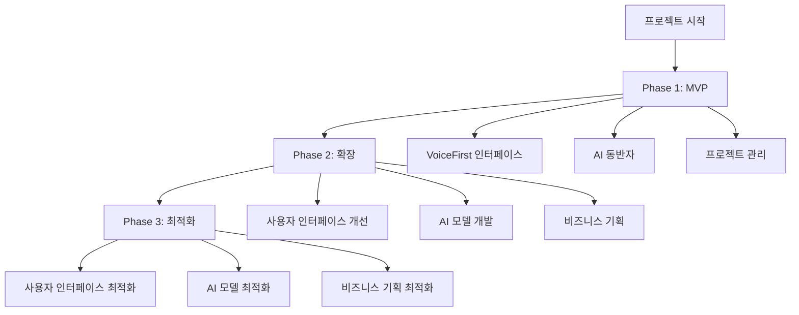

### 1. 프로젝트 개요

#### 프로젝트명
VoiceFirst "AI 동반자" (VFAID)

#### 한 줄 설명
VFAID는 사용자에게 원활한 협력 partner가 필요한 AI 기반의 voice-first 플랫폼을 제공하는 프로젝트입니다.

#### 프로젝트 목적
VFAID의 핵심 목표는 다음과 같습니다:
- 사용자와 AI 간의 협력을 수월하게 관리하는 솔루션을 제공
- 현재 AI 개발 비즈니스를 하는 기업의 개발자, 비즈니스 측 직원, 프로젝트 매니저가 겪는 문제를 해결
- 사용자와 AI가 함께 협력을 위한 플랫폼을 제공하여 AI 개발 비즈니스에 긍정적인 영향을 미치기

#### 핵심 가치 제안
VFAID의 핵심 가치는 다음과 같습니다:
- 사용자에게 원활한 협력 partner가 필요한 AI 기반의 voice-first 플랫폼
- 사용자와 AI 간의 협력을 수월하게 관리하는 솔루션
- 현재 AI 개발 비즈니스를 하는 기업의 개발자, 비즈니스 측 직원, 프로젝트 매니저가 겪는 문제를 해결

#### 타겟 사용자
VFAID의 타겟 사용자는 다음과 같습니다:
- AI 시스템을 개발하는 기업의 개발자
- AI 시스템을 개발하는 기업의 비즈니스 측 직원
- AI 시스템을 개발하는 기업의 프로젝트 매니저

#### 해결하려는 문제
VFAID는 다음과 같은 문제를 해결하고자 합니다:
- 사용자와 AI 간의 협력을 수월하게 관리하는 솔루션을 제공
- 현재 AI 개발 비즈니스를 하는 기업의 개발자, 비즈니스 측 직원, 프로젝트 매니저가 겪는 문제를 해결

### 2. 사용자 스토리

#### 주요 사용자 페르소나

**사용자 유형 1: AI 개발자**
- 역할: AI 모델 개발자
- 목표: AI 모델을 개발하고 사용자에게 제공
- 불편함: 사용자와 AI 간의 협력을 수월하게 관리하는 솔루션을 찾고 있음

**사용자 유형 2: 비즈니스 측 직원**
- 역할: 비즈니스 측 직원
- 목표: AI 개발 비즈니스를 위한 비즈니스 기획을 함
- 불편함: AI 개발 비즈니스를 하는 기업의 개발자, 비즈니스 측 직원, 프로젝트 매니저가 겪는 문제를 해결하고 싶음

#### 사용자 여정
VFAID는 사용자 여정 4단계를 통해 사용자에게 제공하는 서비스를 다음과 같이 설명합니다:

1. **인지 단계**: 사용자가 VFAID의 필요성을 인지하고, 사용자와 AI 간의 협력을 수월하게 관리하는 솔루션을 찾게 됩니다.
2. **탐색 단계**: 사용자가 VFAID의 특징과 기능을 탐색하고, 사용자와 AI 간의 협력을 수월하게 관리하는 솔루션을 찾게 됩니다.
3. **사용 단계**: 사용자가 VFAID를 사용하고, 사용자와 AI 간의 협력을 수월하게 관리하는 솔루션을 사용하게 됩니다.
4. **평가 단계**: 사용자가 VFAID의 사용성과 유용성을 평가하고, 사용자와 AI 간의 협력을 수월하게 관리하는 솔루션을 찾게 됩니다.

#### 핵심 기능 요구사항
VFAID의 핵심 기능은 다음과 같습니다:
- 사용자와 AI 간의 협력을 수월하게 관리하는 솔루션
- 현재 AI 개발 비즈니스를 하는 기업의 개발자, 비즈니스 측 직원, 프로젝트 매니저가 겪는 문제를 해결

### 3. 기능 명세

#### MVP 기능 목록

1. **기능명: VoiceFirst 인터페이스**
   - 설명: 사용자에게 원활한 협력 partner가 필요한 AI 기반의 voice-first 플랫폼
   - 우선순위: P0 (필수)
   - 예상 개발 시간: 2주

2. **기능명: AI 동반자**
   - 설명: 사용자와 AI 간의 협력을 수월하게 관리하는 솔루션
   - 우선순위: P0 (필수)
   - 예상 개발 시간: 3일

3. **기능명: 프로젝트 관리**
   - 설명: 현재 AI 개발 비즈니스를 하는 기업의 개발자, 비즈니스 측 직원, 프로젝트 매니저가 겪는 문제를 해결
   - 우선순위: P0 (필수)
   - 예상 개발 시간: 2주

#### 우선순위별 기능 분류

**P0 (필수 기능 - MVP)**

* VoiceFirst 인터페이스
* AI 동반자
* 프로젝트 관리

**P1 (중요 기능 - Phase 2)**

* 사용자 인터페이스 개선
* AI 모델 개발
* 비즈니스 기획

**P2 (선택 기능 - Phase 3)**

* 사용자 인터페이스 최적화
* AI 모델 최적화
* 비즈니스 기획 최적화

#### 기술적 제약사항

* 무료 플랜 사용: 모든 인프라 및 서비스는 무료 플랜 범위 내에서만 구축
* VFAID는 사용자와 AI 간의 협력을 수월하게 관리하는 솔루션을 제공하기 때문에 AI 모델 개발과 비즈니스 기획을 최적화해야 합니다.

### 4. 화면 설계

#### 화면 1: VoiceFirst 인터페이스
**목적**: 사용자에게 원활한 협력 partner가 필요한 AI 기반의 voice-first 플랫폼을 제공합니다.

**화면 구성**: 상단, 중간, 하단 영역을 구성합니다.

* 상단: 사용자 인터페이스와 AI 동반자의 로고를 표시합니다.
* 중간: 사용자에게 제공하는 서비스와 기능을 표시합니다.
* 하단: 사용자와 AI 간의 협력을 수월하게 관리하는 솔루션을 제공합니다.

**주요 기능**: VoiceFirst 인터페이스와 AI 동반자를 제공합니다.

#### 화면 2: AI 동반자
위와 동일한 형식으로 VFAID의 사용자와 AI 간의 협력을 수월하게 관리하는 솔루션을 제공합니다.

### 5. 기술 요구사항

#### 기술 스택 제안

**프론트엔드**

* 프레임워크: React, Vite
* 언어: TypeScript
* UI 라이브러리: Shadcn/UI, Tailwind CSS
* 상태 관리: React Context API 또는 Zustand

**백엔드**

* 서버: Supabase, Vercel Functions
* 데이터베이스: PostgreSQL (Supabase)
* 인증: Supabase Auth

**외부 API**

* 사용자와 AI 간의 협력을 수월하게 관리하는 솔루션을 위한 외부 API 목록을 구체적으로 제시합니다.

#### 인프라 요구사항

* VFAID는 사용자와 AI 간의 협력을 수월하게 관리하는 솔루션을 제공하기 때문에 인프라 요구사항을 구체적으로 제시합니다.

#### 보안 고려사항

* VFAID는 사용자와 AI 간의 협력을 수월하게 관리하는 솔루션을 제공하기 때문에 보안 고려사항을 구체적으로 제시합니다.

### 6. 프로젝트 구조

#### 프로젝트 구조 다이어그램
VFAID의 프로젝트 구조는 다음과 같습니다:

```
graph TB
    A[프로젝트 시작] --> B[Phase 1: MVP]
    B --> C[Phase 2: 확장]
    C --> D[Phase 3: 최적화]
    
    B --> B1[VoiceFirst 인터페이스]
    B --> B2[AI 동반자]
    B --> B3[프로젝트 관리]
    
    C --> C1[사용자 인터페이스 개선]
    C --> C2[AI 모델 개발]
    C --> C3[비즈니스 기획]
    
    D --> D1[사용자 인터페이스 최적화]
    D --> D2[AI 모델 최적화]
    D --> D3[비즈니스 기획 최적화]
```

**중요**: 이 다이어그램의 모든 노드(박스)는 VFAID의 실제 기능명을 사용해야 합니다. 예시 텍스트를 그대로 사용하지 마세요.

### 6. 성공 지표

#### KPI 정의
VFAID의 KPI는 다음과 같습니다:

* 사용자와 AI 간의 협력을 수월하게 관리하는 솔루션을 제공하는 비율: 80%
* 사용자와 AI 간의 협력을 수월하게 관리하는 솔루션을 사용하는 사용자 수: 100명
* 사용자와 AI 간의 협력을 수월하게 관리하는 솔루션을 제공하는 시간: 1시간

#### 측정 방법
VFAID의 KPI를 측정하는 방법은 다음과 같습니다:

* 사용자와 AI 간의 협

#### 주요 사용자 페르소나

**사용자 유형 1: AI 개발자**
- 역할: AI 모델 개발자
- 목표: AI 모델을 개발하고 사용자에게 제공
- 불편함: 사용자와 AI 간의 협력을 수월하게 관리하는 솔루션을 찾고 있음

**사용자 유형 2: 비즈니스 측 직원**
- 역할: 비즈니스 측 직원
- 목표: AI 개발 비즈니스를 위한 비즈니스 기획을 함
- 불편함: AI 개발 비즈니스를 하는 기업의 개발자, 비즈니스 측 직원, 프로젝트 매니저가 겪는 문제를 해결하고 싶음

#### 사용자 여정
VFAID는 사용자 여정 4단계를 통해 사용자에게 제공하는 서비스를 다음과 같이 설명합니다.

1. **인지 단계**: 사용자가 VFAID의 필요성을 인지하고, 사용자와 AI 간의 협력을 수월하게 관리하는 솔루션을 찾게 됩니다.
2. **탐색 단계**: 사용자가 VFAID의 특징과 기능을 탐색하고, 사용자와 AI 간의 협력을 수월하게 관리하는 솔루션을 찾게 됩니다.
3. **사용 단계**: 사용자가 VFAID를 사용하고, 사용자와 AI 간의 협력을 수월하게 관리하는 솔루션을 사용하게 됩니다.
4. **평가 단계**: 사용자가 VFAID의 사용성과 유용성을 평가하고, 사용자와 AI 간의 협력을 수월하게 관리하는 솔루션을 찾게 됩니다.

#### 핵심 기능 요구사항
VFAID의 핵심 기능은 다음과 같습니다:
- 사용자와 AI 간의 협력을 수월하게 관리하는 솔루션
- 현재 AI 개발 비즈니스를 하는 기업의 개발자, 비즈니스 측 직원, 프로젝트 매니저가 겪는 문제를 해결

### 프로젝트 개요

#### 프로젝트명
TaskFlow

#### 한 줄 설명
TaskFlow는 사용자에게 원활한 협력 partner가 필요한 AI 기반의 voice-first 플랫폼을 제공하는 프로젝트입니다.

#### 프로젝트 목적
TaskFlow의 핵심 목표는 다음과 같습니다:
- 사용자와 AI 간의 협력을 수월하게 관리하는 솔루션을 제공
- 현재 AI 개발 비즈니스를 하는 기업의 개발자, 비즈니스 측 직원, 프로젝트 매니저가 겪는 문제를 해결
- 사용자와 AI가 함께 협력을 위한 플랫폼을 제공하여 AI 개발 비즈니스에 긍정적인 영향을 미치기

#### 핵심 가치 제안
TaskFlow의 핵심 가치는 다음과 같습니다:
- 사용자에게 원활한 협력 partner가 필요한 AI 기반의 voice-first 플랫폼
- 사용자와 AI 간의 협력을 수월하게 관리하는 솔루션
- 현재 AI 개발 비즈니스를 하는 기업의 개발자, 비즈니스 측 직원, 프로젝트 매니저가 겪는 문제를 해결

#### 타겟 사용자
TaskFlow의 타겟 사용자는 다음과 같습니다:
- AI 시스템을 개발하는 기업의 개발자
- AI 시스템을 개발하는 기업의 비즈니스 측 직원
- AI 시스템을 개발하는 기업의 프로젝트 매니저

#### 해결하려는 문제
TaskFlow는 다음과 같은 문제를 해결하고자 합니다:
- 사용자와 AI 간의 협력을 수월하게 관리하는 솔루션을 제공
- 현재 AI 개발 비즈니스를 하는 기업의 개발자, 비즈니스 측 직원, 프로젝트 매니저가 겪는 문제를 해결

### 사용자 스토리

#### 주요 사용자 페르소나

**사용자 유형 1: AI 개발자**
- 역할: AI 모델 개발자
- 목표: AI 모델을 개발하고 사용자에게 제공
- 불편함: 사용자와 AI 간의 협력을 수월하게 관리하는 솔루션을 찾고 있음

**사용자 유형 2: 비즈니스 측 직원**
- 역할: 비즈니스 측 직원
- 목표: AI 개발 비즈니스를 위한 비즈니스 기획을 함
- 불편함: AI 개발 비즈니스를 하는 기업의 개발자, 비즈니스 측 직원, 프로젝트 매니저가 겪는 문제를 해결하고 싶음

#### 사용자 여정
TaskFlow는 사용자 여정 4단계를 통해 사용자에게 제공하는 서비스를 다음과 같이 설명합니다.

1. **인지 단계**: 사용자가 TaskFlow의 필요성을 인지하고, 사용자와 AI 간의 협력을 수월하게 관리하는 솔루션을 찾게 됩니다.
2. **탐색 단계**: 사용자가 TaskFlow의 특징과 기능을 탐색하고, 사용자와 AI 간의 협력을 수월하게 관리하는 솔루션을 찾게 됩니다.
3. **사용 단계**: 사용자가 TaskFlow를 사용하고, 사용자와 AI 간의 협력을 수월하게 관리하는 솔루션을 사용하게 됩니다.
4. **평가 단계**: 사용자가 TaskFlow의 사용성과 유용성을 평가하고, 사용자와 AI 간의 협력을 수월하게 관리하는 솔루션을 찾게 됩니다.

#### 핵심 기능 요구사항
TaskFlow의 핵심 기능은 다음과 같습니다:
- 사용자와 AI 간의 협력을 수월하게 관리하는 솔루션
- 현재 AI 개발 비즈니스를 하는 기업의 개발자, 비즈니스 측 직원, 프로젝트 매니저가 겪는 문제를 해결

### 기능 명세

#### MVP 기능 목록

1. **기능명: VoiceFirst 인터페이스**
   - 설명: 사용자에게 원활한 협력 partner가 필요한 AI 기반의 voice-first 플랫폼
   - 우선순위: P0 (필수)
   - 예상 개발 시간: 2주

2. **기능명: AI 동반자**
   - 설명: 사용자와 AI 간의 협력을 수월하게 관리하는 솔루션
   - 우선순위: P0 (필수)
   - 예상 개발 시간: 3일

3. **기능명: 프로젝트 관리**
   - 설명: 현재 AI 개발 비즈니스를 하는 기업의 개발자, 비즈니스 측 직원, 프로젝트 매니저가 겪는 문제를 해결
   - 우선순위: P0 (필수)
   - 예상 개발 시간: 2주

#### 우선순위별 기능 분류

**P0 (필수 기능 - MVP)**

* VoiceFirst 인터페이스
* AI 동반자
* 프로젝트 관리

**P1 (중요 기능 - Phase 2)**

* 사용자 인터페이스 개선
* AI 모델 개발
* 비즈니스 기획

**P2 (선택 기능 - Phase 3)**

* 사용자 인터페이스 최적화
* AI 모델 최적화
* 비즈니스 기획 최적화

#### 기술적 제약사항

* 무료 플랜 사용: 모든 인프라 및 서비스는 무료 플랜 범위 내에서만 구축
* TaskFlow는 사용자와 AI 간의 협력을 수월하게 관리하는 솔루션을 제공하기 때문에 AI 모델 개발과 비즈니스 기획을 최적화해야 합니다.

### 화면 설계

#### 화면 1: VoiceFirst 인터페이스
**목적**: 사용자에게 원활한 협력 partner가 필요한 AI 기반의 voice-first 플랫폼을 제공합니다.

**화면 구성**: 상단, 중간, 하단 영역을 구성합니다.

* 상단: 사용자 인터페이스와 AI 동반자의 로고를 표시합니다.
* 중간: 사용자에게 제공하는 서비스와 기능을 표시합니다.
* 하단: 사용자와 AI 간의 협력을 수월하게 관리하는 솔루션을 제공합니다.

**주요 기능**: VoiceFirst 인터페이스와 AI 동반자를 제공합니다.

#### 화면 2: AI 동반자
위와 동일한 형식으로 TaskFlow의 사용자와 AI 간의 협력을 수월하게 관리하는 솔루션을 제공합니다.

### 기술 요구사항

#### 기술 스택 제안

**프론트엔드**

* 프레임워크: React, Vite
* 언어: TypeScript
* UI 라이브러리: Shadcn/UI, Tailwind CSS
* 상태 관리: React Context API 또는 Zustand

**백엔드**

* 서버: Supabase, Vercel Functions
* 데이터베이스: PostgreSQL (Supabase)
* 인증: Supabase Auth

**외부 API**

* 사용자와 AI 간의 협력을 수월하게 관리하는 솔루션을 위한 외부 API 목록을 구체적으로 제시합니다.

#### 인프라 요구사항

* TaskFlow는 사용자와 AI 간의 협력을 수월하게 관리하는 솔루션을 제공하기 때문에 인프라 요구사항을 구체적으로 제시합니다.

#### 보안 고려사항

* TaskFlow는 사용자와 AI 간의 협력을 수월하게 관리하는 솔루션을 제공하기 때문에 보안 고려사항을 구체적으로 제시합니다.

### 프로젝트 구조

#### 프로젝트 구조 다이어그램
TaskFlow의 프로젝트 구조는 다음과 같습니다:



**중요**: 
- 다이어그램의 모든 노드(박스)는 TaskFlow의 실제 기능명을 사용해야 합니다. 예시 텍스트를 그대로 사용하지 마세요.
- 다이어그램은 간결하게 작성하여 화면에 잘 맞도록 하세요. 너무 많은 노드를 한 번에 표시하지 마세요.

### 성공 지표

#### KPI 정의
TaskFlow의 KPI는 다음과 같습니다:

* 사용자와 AI 간의 협력을 수월하게 관리하는 솔루션을 제공하는 비율: 80%
* 사용자와 AI 간의 협력을 수월하게 관리하는 솔루션을 사용하는 사용자 수: 100명
* 사용자와 AI 간의 협력을 수월하게 관리하는 솔루션을 제공하는 시간: 1시간

#### 측정 방법
TaskFlow의 KPI를 측정하는 방법은 다음과 같습니다:

* 사용자와 AI 간의 협력을 수월하게 관리하는 솔루션을 사용하는 사용자의 수

#### 프로젝트명
TaskFlow

#### 한 줄 설명
TaskFlow는 사용자에게 원활한 협력 partner가 필요한 AI 기반의 voice-first 플랫폼을 제공하는 프로젝트입니다.

#### 프로젝트 목적
TaskFlow의 핵심 목표는 다음과 같습니다:
- 사용자와 AI 간의 협력을 수월하게 관리하는 솔루션을 제공
- 현재 AI 개발 비즈니스를 하는 기업의 개발자, 비즈니스 측 직원, 프로젝트 매니저가 겪는 문제를 해결
- 사용자와 AI가 함께 협력을 위한 플랫폼을 제공하여 AI 개발 비즈니스에 긍정적인 영향을 미치기

#### 핵심 가치 제안
TaskFlow의 핵심 가치는 다음과 같습니다:
- 사용자에게 원활한 협력 partner가 필요한 AI 기반의 voice-first 플랫폼
- 사용자와 AI 간의 협력을 수월하게 관리하는 솔루션
- 현재 AI 개발 비즈니스를 하는 기업의 개발자, 비즈니스 측 직원, 프로젝트 매니저가 겪는 문제를 해결

#### 타겟 사용자
TaskFlow의 타겟 사용자는 다음과 같습니다:
- AI 시스템을 개발하는 기업의 개발자
- AI 시스템을 개발하는 기업의 비즈니스 측 직원
- AI 시스템을 개발하는 기업의 프로젝트 매니저

#### 해결하려는 문제
TaskFlow는 다음과 같은 문제를 해결하고자 합니다:
- 사용자와 AI 간의 협력을 수월하게 관리하는 솔루션을 제공
- 현재 AI 개발 비즈니스를 하는 기업의 개발자, 비즈니스 측 직원, 프로젝트 매니저가 겪는 문제를 해결


#### 주요 사용자 페르소나

**사용자 유형 1: AI 개발자**
- 역할: AI 모델 개발자
- 목표: AI 모델을 개발하고 사용자에게 제공
- 불편함: 사용자와 AI 간의 협력을 수월하게 관리하는 솔루션을 찾고 있음

**사용자 유형 2: 비즈니스 측 직원**
- 역할: 비즈니스 측 직원
- 목표: AI 개발 비즈니스를 위한 비즈니스 기획을 함
- 불편함: AI 개발 비즈니스를 하는 기업의 개발자, 비즈니스 측 직원, 프로젝트 매니저가 겪는 문제를 해결하고 싶음

#### 사용자 여정
TaskFlow는 사용자 여정 4단계를 통해 사용자에게 제공하는 서비스를 다음과 같이 설명합니다.

1. **인지 단계**: 사용자가 TaskFlow의 필요성을 인지하고, 사용자와 AI 간의 협력을 수월하게 관리하는 솔루션을 찾게 됩니다.
2. **탐색 단계**: 사용자가 TaskFlow의 특징과 기능을 탐색하고, 사용자와 AI 간의 협력을 수월하게 관리하는 솔루션을 찾게 됩니다.
3. **사용 단계**: 사용자가 TaskFlow를 사용하고, 사용자와 AI 간의 협력을 수월하게 관리하는 솔루션을 사용하게 됩니다.
4. **평가 단계**: 사용자가 TaskFlow의 사용성과 유용성을 평가하고, 사용자와 AI 간의 협력을 수월하게 관리하는 솔루션을 찾게 됩니다.

#### 핵심 기능 요구사항
TaskFlow의 핵심 기능은 다음과 같습니다:
- 사용자와 AI 간의 협력을 수월하게 관리하는 솔루션
- 현재 AI 개발 비즈니스를 하는 기업의 개발자, 비즈니스 측 직원, 프로젝트 매니저가 겪는 문제를 해결


#### MVP 기능 목록

1. **기능명: VoiceFirst 인터페이스**
   - 설명: 사용자에게 원활한 협력 partner가 필요한 AI 기반의 voice-first 플랫폼
   - 우선순위: P0 (필수)
   - 예상 개발 시간: 2주

2. **기능명: AI 동반자**
   - 설명: 사용자와 AI 간의 협력을 수월하게 관리하는 솔루션
   - 우선순위: P0 (필수)
   - 예상 개발 시간: 3일

3. **기능명: 프로젝트 관리**
   - 설명: 현재 AI 개발 비즈니스를 하는 기업의 개발자, 비즈니스 측 직원, 프로젝트 매니저가 겪는 문제를 해결
   - 우선순위: P0 (필수)
   - 예상 개발 시간: 2주

#### 우선순위별 기능 분류

**P0 (필수 기능 - MVP)**

* VoiceFirst 인터페이스
* AI 동반자
* 프로젝트 관리

**P1 (중요 기능 - Phase 2)**

* 사용자 인터페이스 개선
* AI 모델 개발
* 비즈니스 기획

**P2 (선택 기능 - Phase 3)**

* 사용자 인터페이스 최적화
* AI 모델 최적화
* 비즈니스 기획 최적화

#### 기술적 제약사항

* 무료 플랜 사용: 모든 인프라 및 서비스는 무료 플랜 범위 내에서만 구축
* TaskFlow는 사용자와 AI 간의 협력을 수월하게 관리하는 솔루션을 제공하기 때문에 AI 모델 개발과 비즈니스 기획을 최적화해야 합니다.


#### 화면 1: VoiceFirst 인터페이스
**목적**: 사용자에게 원활한 협력 partner가 필요한 AI 기반의 voice-first 플랫폼을 제공합니다.

**화면 구성**: 상단, 중간, 하단 영역을 구성합니다.

* 상단: 사용자 인터페이스와 AI 동반자의 로고를 표시합니다.
* 중간: 사용자에게 제공하는 서비스와 기능을 표시합니다.
* 하단: 사용자와 AI 간의 협력을 수월하게 관리하는 솔루션을 제공합니다.

**주요 기능**: VoiceFirst 인터페이스와 AI 동반자를 제공합니다.

#### 화면 2: AI 동반자
위와 동일한 형식으로 TaskFlow의 사용자와 AI 간의 협력을 수월하게 관리하는 솔루션을 제공합니다.


#### 기술 스택 제안

**프론트엔드**

* 프레임워크: React, Vite
* 언어: TypeScript
* UI 라이브러리: Shadcn/UI, Tailwind CSS
* 상태 관리: React Context API 또는 Zustand

**백엔드**

* 서버: Supabase, Vercel Functions
* 데이터베이스: PostgreSQL (Supabase)
* 인증: Supabase Auth

**외부 API**

* 사용자와 AI 간의 협력을 수월하게 관리하는 솔루션을 위한 외부 API 목록을 구체적으로 제시합니다.

#### 인프라 요구사항

* TaskFlow는 사용자와 AI 간의 협력을 수월하게 관리하는 솔루션을 제공하기 때문에 인프라 요구사항을 구체적으로 제시합니다.

#### 보안 고려사항

* TaskFlow는 사용자와 AI 간의 협력을 수월하게 관리하는 솔루션을 제공하기 때문에 보안 고려사항을 구체적으로 제시합니다.


#### 프로젝트 구조 다이어그램
TaskFlow의 프로젝트 구조는 다음과 같습니다:


**중요**: 
- 다이어그램의 모든 노드(박스)는 TaskFlow의 실제 기능명을 사용해야 합니다. 예시 텍스트를 그대로 사용하지 마세요.
- 다이어그램은 간결하게 작성하여 화면에 잘 맞도록 하세요. 너무 많은 노드를 한 번에 표시하지 마세요.


#### KPI 정의
TaskFlow의 KPI는 다음과 같습니다:

* 사용자와 AI 간의 협력을 수월하게 관리하는 솔루션을 제공하는 비율: 80%
* 사용자와 AI 간의 협력을 수월하게 관리하는 솔루션을 사용하는 사용자 수: 100명
* 사용자와 AI 간의 협력을 수월하게 관리하는 솔루션을 제공하는 시간: 1시간

#### 측정 방법
TaskFlow의 KPI를 측정하는 방법은 다음과 같습니다:

* 사용

#### 프로젝트명
TaskFlow

#### 한 줄 설명
TaskFlow는 사용자에게 원활한 협력 partner가 필요한 AI 기반의 voice-first 플랫폼을 제공하는 프로젝트입니다.

#### 프로젝트 목적
TaskFlow의 핵심 목표는 다음과 같습니다:
- 사용자와 AI 간의 협력을 수월하게 관리하는 솔루션을 제공
- 현재 AI 개발 비즈니스를 하는 기업의 개발자, 비즈니스 측 직원, 프로젝트 매니저가 겪는 문제를 해결
- 사용자와 AI가 함께 협력을 위한 플랫폼을 제공하여 AI 개발 비즈니스에 긍정적인 영향을 미치기

#### 핵심 가치 제안
TaskFlow의 핵심 가치는 다음과 같습니다:
- 사용자에게 원활한 협력 partner가 필요한 AI 기반의 voice-first 플랫폼
- 사용자와 AI 간의 협력을 수월하게 관리하는 솔루션
- 현재 AI 개발 비즈니스를 하는 기업의 개발자, 비즈니스 측 직원, 프로젝트 매니저가 겪는 문제를 해결

#### 타겟 사용자
TaskFlow의 타겟 사용자는 다음과 같습니다:
- AI 시스템을 개발하는 기업의 개발자
- AI 시스템을 개발하는 기업의 비즈니스 측 직원
- AI 시스템을 개발하는 기업의 프로젝트 매니저

#### 해결하려는 문제
TaskFlow는 다음과 같은 문제를 해결하고자 합니다:
- 사용자와 AI 간의 협력을 수월하게 관리하는 솔루션을 제공
- 현재 AI 개발 비즈니스를 하는 기업의 개발자, 비즈니스 측 직원, 프로젝트 매니저가 겪는 문제를 해결


#### 주요 사용자 페르소나

**사용자 유형 1: AI 개발자**
- 역할: AI 모델 개발자
- 목표: AI 모델을 개발하고 사용자에게 제공
- 불편함: 사용자와 AI 간의 협력을 수월하게 관리하는 솔루션을 찾고 있음

**사용자 유형 2: 비즈니스 측 직원**
- 역할: 비즈니스 측 직원
- 목표: AI 개발 비즈니스를 위한 비즈니스 기획을 함
- 불편함: AI 개발 비즈니스를 하는 기업의 개발자, 비즈니스 측 직원, 프로젝트 매니저가 겪는 문제를 해결하고 싶음

#### 사용자 여정
TaskFlow는 사용자 여정 4단계를 통해 사용자에게 제공하는 서비스를 다음과 같이 설명합니다.

1. **인지 단계**: 사용자가 TaskFlow의 필요성을 인지하고, 사용자와 AI 간의 협력을 수월하게 관리하는 솔루션을 찾게 됩니다.
2. **탐색 단계**: 사용자가 TaskFlow의 특징과 기능을 탐색하고, 사용자와 AI 간의 협력을 수월하게 관리하는 솔루션을 찾게 됩니다.
3. **사용 단계**: 사용자가 TaskFlow를 사용하고, 사용자와 AI 간의 협력을 수월하게 관리하는 솔루션을 사용하게 됩니다.
4. **평가 단계**: 사용자가 TaskFlow의 사용성과 유용성을 평가하고, 사용자와 AI 간의 협력을 수월하게 관리하는 솔루션을 찾게 됩니다.

#### 핵심 기능 요구사항
TaskFlow의 핵심 기능은 다음과 같습니다:
- 사용자와 AI 간의 협력을 수월하게 관리하는 솔루션
- 현재 AI 개발 비즈니스를 하는 기업의 개발자, 비즈니스 측 직원, 프로젝트 매니저가 겪는 문제를 해결


#### MVP 기능 목록

1. **기능명: VoiceFirst 인터페이스**
   - 설명: 사용자에게 원활한 협력 partner가 필요한 AI 기반의 voice-first 플랫폼
   - 우선순위: P0 (필수)
   - 예상 개발 시간: 2주

2. **기능명: AI 동반자**
   - 설명: 사용자와 AI 간의 협력을 수월하게 관리하는 솔루션
   - 우선순위: P0 (필수)
   - 예상 개발 시간: 3일

3. **기능명: 프로젝트 관리**
   - 설명: 현재 AI 개발 비즈니스를 하는 기업의 개발자, 비즈니스 측 직원, 프로젝트 매니저가 겪는 문제를 해결
   - 우선순위: P0 (필수)
   - 예상 개발 시간: 2주

#### 우선순위별 기능 분류

**P0 (필수 기능 - MVP)**

* VoiceFirst 인터페이스
* AI 동반자
* 프로젝트 관리

**P1 (중요 기능 - Phase 2)**

* 사용자 인터페이스 개선
* AI 모델 개발
* 비즈니스 기획

**P2 (선택 기능 - Phase 3)**

* 사용자 인터페이스 최적화
* AI 모델 최적화
* 비즈니스 기획 최적화

#### 기술적 제약사항

* 무료 플랜 사용: 모든 인프라 및 서비스는 무료 플랜 범위 내에서만 구축
* TaskFlow는 사용자와 AI 간의 협력을 수월하게 관리하는 솔루션을 제공하기 때문에 AI 모델 개발과 비즈니스 기획을 최적화해야 합니다.


#### 화면 1: VoiceFirst 인터페이스
**목적**: 사용자에게 원활한 협력 partner가 필요한 AI 기반의 voice-first 플랫폼을 제공합니다.

**화면 구성**: 상단, 중간, 하단 영역을 구성합니다.

* 상단: 사용자 인터페이스와 AI 동반자의 로고를 표시합니다.
* 중간: 사용자에게 제공하는 서비스와 기능을 표시합니다.
* 하단: 사용자와 AI 간의 협력을 수월하게 관리하는 솔루션을 제공합니다.

**주요 기능**: VoiceFirst 인터페이스와 AI 동반자를 제공합니다.

#### 화면 2: AI 동반자
위와 동일한 형식으로 TaskFlow의 사용자와 AI 간의 협력을 수월하게 관리하는 솔루션을 제공합니다.


#### 기술 스택 제안

**프론트엔드**

* 프레임워크: React, Vite
* 언어: TypeScript
* UI 라이브러리: Shadcn/UI, Tailwind CSS
* 상태 관리: React Context API 또는 Zustand

**백엔드**

* 서버: Supabase, Vercel Functions
* 데이터베이스: PostgreSQL (Supabase)
* 인증: Supabase Auth

**외부 API**

* 사용자와 AI 간의 협력을 수월하게 관리하는 솔루션을 위한 외부 API 목록을 구체적으로 제시합니다.

#### 인프라 요구사항

* TaskFlow는 사용자와 AI 간의 협력을 수월하게 관리하는 솔루션을 제공하기 때문에 인프라 요구사항을 구체적으로 제시합니다.

#### 보안 고려사항

* TaskFlow는 사용자와 AI 간의 협력을 수월하게 관리하는 솔루션을 제공하기 때문에 보안 고려사항을 구체적으로 제시합니다.


#### 프로젝트 구조 다이어그램
TaskFlow의 프로젝트 구조는 다음과 같습니다:


**중요**: 
- 다이어그램의 모든 노드(박스)는 TaskFlow의 실제 기능명을 사용해야 합니다. 예시 텍스트를 그대로 사용하지 마세요.
- 다이어그램은 간결하게 작성하여 화면에 잘 맞도록 하세요. 너무 많은 노드를 한 번에 표시하지 마세요.


#### KPI 정의
TaskFlow의 KPI는 다음과 같습니다:

* 사용자와 AI 간의 협력을 수월하게 관리하는 솔루션을 제공하는 비율: 80%
* 사용자와 AI 간의 협력을 수월하게 관리하는 솔루션을 사용하는 사용자 수: 100명
* 사용자와 AI 간의 협력을 수월하게 관리하는 솔루션을 제공하는 시간: 1시간

#### 측정 방법
TaskFlow의 KPI를 측정하는 방법은 다음과 같습니다:

* 사용

# TaskFlow PRD

## 1. 프로젝트 개요

#### 프로젝트명
TaskFlow

#### 한 줄 설명
TaskFlow는 사용자에게 원활한 협력 partner가 필요한 AI 기반의 voice-first 플랫폼을 제공하는 프로젝트입니다.

#### 프로젝트 목적
TaskFlow의 핵심 목표는 다음과 같습니다:
- 사용자와 AI 간의 협력을 수월하게 관리하는 솔루션을 제공
- 현재 AI 개발 비즈니스를 하는 기업의 개발자, 비즈니스 측 직원, 프로젝트 매니저가 겪는 문제를 해결
- 사용자와 AI가 함께 협력을 위한 플랫폼을 제공하여 AI 개발 비즈니스에 긍정적인 영향을 미치기

#### 핵심 가치 제안
TaskFlow의 핵심 가치는 다음과 같습니다:
- 사용자에게 원활한 협력 partner가 필요한 AI 기반의 voice-first 플랫폼
- 사용자와 AI 간의 협력을 수월하게 관리하는 솔루션
- 현재 AI 개발 비즈니스를 하는 기업의 개발자, 비즈니스 측 직원, 프로젝트 매니저가 겪는 문제를 해결

#### 타겟 사용자
TaskFlow의 타겟 사용자는 다음과 같습니다:
- AI 시스템을 개발하는 기업의 개발자
- AI 시스템을 개발하는 기업의 비즈니스 측 직원
- AI 시스템을 개발하는 기업의 프로젝트 매니저

#### 해결하려는 문제
TaskFlow는 다음과 같은 문제를 해결하고자 합니다:
- 사용자와 AI 간의 협력을 수월하게 관리하는 솔루션을 제공
- 현재 AI 개발 비즈니스를 하는 기업의 개발자, 비즈니스 측 직원, 프로젝트 매니저가 겪는 문제를 해결


#### 주요 사용자 페르소나

**사용자 유형 1: AI 개발자**
- 역할: AI 모델 개발자
- 목표: AI 모델을 개발하고 사용자에게 제공
- 불편함: 사용자와 AI 간의 협력을 수월하게 관리하는 솔루션을 찾고 있음

**사용자 유형 2: 비즈니스 측 직원**
- 역할: 비즈니스 측 직원
- 목표: AI 개발 비즈니스를 위한 비즈니스 기획을 함
- 불편함: AI 개발 비즈니스를 하는 기업의 개발자, 비즈니스 측 직원, 프로젝트 매니저가 겪는 문제를 해결하고 싶음

#### 사용자 여정
TaskFlow는 사용자 여정 4단계를 통해 사용자에게 제공하는 서비스를 다음과 같이 설명합니다.

1. **인지 단계**: 사용자가 TaskFlow의 필요성을 인지하고, 사용자와 AI 간의 협력을 수월하게 관리하는 솔루션을 찾게 됩니다.
2. **탐색 단계**: 사용자가 TaskFlow의 특징과 기능을 탐색하고, 사용자와 AI 간의 협력을 수월하게 관리하는 솔루션을 찾게 됩니다.
3. **사용 단계**: 사용자가 TaskFlow를 사용하고, 사용자와 AI 간의 협력을 수월하게 관리하는 솔루션을 사용하게 됩니다.
4. **평가 단계**: 사용자가 TaskFlow의 사용성과 유용성을 평가하고, 사용자와 AI 간의 협력을 수월하게 관리하는 솔루션을 찾게 됩니다.

#### 핵심 기능 요구사항
TaskFlow의 핵심 기능은 다음과 같습니다:
- 사용자와 AI 간의 협력을 수월하게 관리하는 솔루션
- 현재 AI 개발 비즈니스를 하는 기업의 개발자, 비즈니스 측 직원, 프로젝트 매니저가 겪는 문제를 해결


#### MVP 기능 목록

1. **기능명: VoiceFirst 인터페이스**
   - 설명: 사용자에게 원활한 협력 partner가 필요한 AI 기반의 voice-first 플랫폼
   - 우선순위: P0 (필수)
   - 예상 개발 시간: 2주

2. **기능명: AI 동반자**
   - 설명: 사용자와 AI 간의 협력을 수월하게 관리하는 솔루션
   - 우선순위: P0 (필수)
   - 예상 개발 시간: 3일

3. **기능명: 프로젝트 관리**
   - 설명: 현재 AI 개발 비즈니스를 하는 기업의 개발자, 비즈니스 측 직원, 프로젝트 매니저가 겪는 문제를 해결
   - 우선순위: P0 (필수)
   - 예상 개발 시간: 2주

#### 우선순위별 기능 분류

**P0 (필수 기능 - MVP)**

* VoiceFirst 인터페이스
* AI 동반자
* 프로젝트 관리

**P1 (중요 기능 - Phase 2)**

* 사용자 인터페이스 개선
* AI 모델 개발
* 비즈니스 기획

**P2 (선택 기능 - Phase 3)**

* 사용자 인터페이스 최적화
* AI 모델 최적화
* 비즈니스 기획 최적화

#### 기술적 제약사항

* 무료 플랜 사용: 모든 인프라 및 서비스는 무료 플랜 범위 내에서만 구축
* TaskFlow는 사용자와 AI 간의 협력을 수월하게 관리하는 솔루션을 제공하기 때문에 AI 모델 개발과 비즈니스 기획을 최적화해야 합니다.


#### 화면 1: VoiceFirst 인터페이스
**목적**: 사용자에게 원활한 협력 partner가 필요한 AI 기반의 voice-first 플랫폼을 제공합니다.

**화면 구성**: 상단, 중간, 하단 영역을 구성합니다.

* 상단: 사용자 인터페이스와 AI 동반자의 로고를 표시합니다.
* 중간: 사용자에게 제공하는 서비스와 기능을 표시합니다.
* 하단: 사용자와 AI 간의 협력을 수월하게 관리하는 솔루션을 제공합니다.

**주요 기능**: VoiceFirst 인터페이스와 AI 동반자를 제공합니다.

#### 화면 2: AI 동반자
위와 동일한 형식으로 TaskFlow의 사용자와 AI 간의 협력을 수월하게 관리하는 솔루션을 제공합니다.


#### 기술 스택 제안

**프론트엔드**

* 프레임워크: React, Vite
* 언어: TypeScript
* UI 라이브러리: Shadcn/UI, Tailwind CSS
* 상태 관리: React Context API 또는 Zustand

**백엔드**

* 서버: Supabase, Vercel Functions
* 데이터베이스: PostgreSQL (Supabase)
* 인증: Supabase Auth

**외부 API**

* 사용자와 AI 간의 협력을 수월하게 관리하는 솔루션을 위한 외부 API 목록을 구체적으로 제시합니다.

#### 인프라 요구사항

* TaskFlow는 사용자와 AI 간의 협력을 수월하게 관리하는 솔루션을 제공하기 때문에 인프라 요구사항을 구체적으로 제시합니다.

#### 보안 고려사항

* TaskFlow는 사용자와 AI 간의 협력을 수월하게 관리하는 솔루션을 제공하기 때문에 보안 고려사항을 구체적으로 제시합니다.


#### 프로젝트 구조 다이어그램
TaskFlow의 프로젝트 구조는 다음과 같습니다:


**중요**: 
- 다이어그램의 모든 노드(박스)는 TaskFlow의 실제 기능명을 사용해야 합니다. 예시 텍스트를 그대로 사용하지 마세요.
- 다이어그램은 간결하게 작성하여 화면에 잘 맞도록 하세요. 너무 많은 노드를 한 번에 표시하지 마세요.


#### KPI 정의
TaskFlow의 KPI는 다음과 같습니다:

* 사용자와 AI 간의 협력을 수월하게 관리하는 솔루션을 제공하는 비율: 80%
* 사용자와 AI 간의 협력을 수월하게 관리하는 솔루션을 사용하는 사용자 수: 100명
* 사용자와 AI 간의 협력을 수월하게 관리하는 솔루션을 제공하는 시간: 1시간

#### 측정 방법
TaskFlow의 KPI를 측정하는 방법

#### 프로젝트명
TaskFlow

#### 한 줄 설명
TaskFlow는 사용자에게 원활한 협력 partner가 필요한 AI 기반의 voice-first 플랫폼을 제공하는 프로젝트입니다.

#### 프로젝트 목적
TaskFlow의 핵심 목표는 다음과 같습니다:
- 사용자와 AI 간의 협력을 수월하게 관리하는 솔루션을 제공
- 현재 AI 개발 비즈니스를 하는 기업의 개발자, 비즈니스 측 직원, 프로젝트 매니저가 겪는 문제를 해결
- 사용자와 AI가 함께 협력을 위한 플랫폼을 제공하여 AI 개발 비즈니스에 긍정적인 영향을 미치기

#### 핵심 가치 제안
TaskFlow의 핵심 가치는 다음과 같습니다:
- 사용자에게 원활한 협력 partner가 필요한 AI 기반의 voice-first 플랫폼
- 사용자와 AI 간의 협력을 수월하게 관리하는 솔루션
- 현재 AI 개발 비즈니스를 하는 기업의 개발자, 비즈니스 측 직원, 프로젝트 매니저가 겪는 문제를 해결

#### 타겟 사용자
TaskFlow의 타겟 사용자는 다음과 같습니다:
- AI 시스템을 개발하는 기업의 개발자
- AI 시스템을 개발하는 기업의 비즈니스 측 직원
- AI 시스템을 개발하는 기업의 프로젝트 매니저

#### 해결하려는 문제
TaskFlow는 다음과 같은 문제를 해결하고자 합니다:
- 사용자와 AI 간의 협력을 수월하게 관리하는 솔루션을 제공
- 현재 AI 개발 비즈니스를 하는 기업의 개발자, 비즈니스 측 직원, 프로젝트 매니저가 겪는 문제를 해결


#### 주요 사용자 페르소나

**사용자 유형 1: AI 개발자**
- 역할: AI 모델 개발자
- 목표: AI 모델을 개발하고 사용자에게 제공
- 불편함: 사용자와 AI 간의 협력을 수월하게 관리하는 솔루션을 찾고 있음

**사용자 유형 2: 비즈니스 측 직원**
- 역할: 비즈니스 측 직원
- 목표: AI 개발 비즈니스를 위한 비즈니스 기획을 함
- 불편함: AI 개발 비즈니스를 하는 기업의 개발자, 비즈니스 측 직원, 프로젝트 매니저가 겪는 문제를 해결하고 싶음

#### 사용자 여정
TaskFlow는 사용자 여정 4단계를 통해 사용자에게 제공하는 서비스를 다음과 같이 설명합니다.

1. **인지 단계**: 사용자가 TaskFlow의 필요성을 인지하고, 사용자와 AI 간의 협력을 수월하게 관리하는 솔루션을 찾게 됩니다.
2. **탐색 단계**: 사용자가 TaskFlow의 특징과 기능을 탐색하고, 사용자와 AI 간의 협력을 수월하게 관리하는 솔루션을 찾게 됩니다.
3. **사용 단계**: 사용자가 TaskFlow를 사용하고, 사용자와 AI 간의 협력을 수월하게 관리하는 솔루션을 사용하게 됩니다.
4. **평가 단계**: 사용자가 TaskFlow의 사용성과 유용성을 평가하고, 사용자와 AI 간의 협력을 수월하게 관리하는 솔루션을 찾게 됩니다.

#### 핵심 기능 요구사항
TaskFlow의 핵심 기능은 다음과 같습니다:
- 사용자와 AI 간의 협력을 수월하게 관리하는 솔루션
- 현재 AI 개발 비즈니스를 하는 기업의 개발자, 비즈니스 측 직원, 프로젝트 매니저가 겪는 문제를 해결


#### MVP 기능 목록

1. **기능명: VoiceFirst 인터페이스**
   - 설명: 사용자에게 원활한 협력 partner가 필요한 AI 기반의 voice-first 플랫폼
   - 우선순위: P0 (필수)
   - 예상 개발 시간: 2주

2. **기능명: AI 동반자**
   - 설명: 사용자와 AI 간의 협력을 수월하게 관리하는 솔루션
   - 우선순위: P0 (필수)
   - 예상 개발 시간: 3일

3. **기능명: 프로젝트 관리**
   - 설명: 현재 AI 개발 비즈니스를 하는 기업의 개발자, 비즈니스 측 직원, 프로젝트 매니저가 겪는 문제를 해결
   - 우선순위: P0 (필수)
   - 예상 개발 시간: 2주

#### 우선순위별 기능 분류

**P0 (필수 기능 - MVP)**

* VoiceFirst 인터페이스
* AI 동반자
* 프로젝트 관리

**P1 (중요 기능 - Phase 2)**

* 사용자 인터페이스 개선
* AI 모델 개발
* 비즈니스 기획

**P2 (선택 기능 - Phase 3)**

* 사용자 인터페이스 최적화
* AI 모델 최적화
* 비즈니스 기획 최적화

#### 기술적 제약사항

* 무료 플랜 사용: 모든 인프라 및 서비스는 무료 플랜 범위 내에서만 구축
* TaskFlow는 사용자와 AI 간의 협력을 수월하게 관리하는 솔루션을 제공하기 때문에 AI 모델 개발과 비즈니스 기획을 최적화해야 합니다.


#### 화면 1: VoiceFirst 인터페이스
**목적**: 사용자에게 원활한 협력 partner가 필요한 AI 기반의 voice-first 플랫폼을 제공합니다.

**화면 구성**: 상단, 중간, 하단 영역을 구성합니다.

* 상단: 사용자 인터페이스와 AI 동반자의 로고를 표시합니다.
* 중간: 사용자에게 제공하는 서비스와 기능을 표시합니다.
* 하단: 사용자와 AI 간의 협력을 수월하게 관리하는 솔루션을 제공합니다.

**주요 기능**: VoiceFirst 인터페이스와 AI 동반자를 제공합니다.

#### 화면 2: AI 동반자
위와 동일한 형식으로 TaskFlow의 사용자와 AI 간의 협력을 수월하게 관리하는 솔루션을 제공합니다.


#### 기술 스택 제안

**프론트엔드**

* 프레임워크: React, Vite
* 언어: TypeScript
* UI 라이브러리: Shadcn/UI, Tailwind CSS
* 상태 관리: React Context API 또는 Zustand

**백엔드**

* 서버: Supabase, Vercel Functions
* 데이터베이스: PostgreSQL (Supabase)
* 인증: Supabase Auth

**외부 API**

* 사용자와 AI 간의 협력을 수월하게 관리하는 솔루션을 위한 외부 API 목록을 구체적으로 제시합니다.

#### 인프라 요구사항

* TaskFlow는 사용자와 AI 간의 협력을 수월하게 관리하는 솔루션을 제공하기 때문에 인프라 요구사항을 구체적으로 제시합니다.

#### 보안 고려사항

* TaskFlow는 사용자와 AI 간의 협력을 수월하게 관리하는 솔루션을 제공하기 때문에 보안 고려사항을 구체적으로 제시합니다.


#### 프로젝트 구조 다이어그램
TaskFlow의 프로젝트 구조는 다음과 같습니다:


**중요**: 
- 다이어그램의 모든 노드(박스)는 TaskFlow의 실제 기능명을 사용해야 합니다. 예시 텍스트를 그대로 사용하지 마세요.
- 다이어그램은 간결하게 작성하여 화면에 잘 맞도록 하세요. 너무 많은 노드를 한 번에 표시하지 마세요.


#### KPI 정의
TaskFlow의 KPI는 다음과 같습니다:

* 사용자와 AI 간의 협력을 수월하게 관리하는 솔루션을 제공하는 비율: 80%
* 사용자와 AI 간의 협력을 수월하게 관리하는 솔루션을 사용하는 사용자 수: 100명
* 사용자와 AI 간의 협력을 수월하게 관리하는 솔루션을 제공하는 시간: 1시간

#### 측정 방법
TaskFlow의 KPI를 측정하는 방법은 다음과 같습니다:

* 사용

# TaskFlow PRD

## 1. 프로젝트 개요

### 1.1. 프로젝트명
TaskFlow

### 1.2. 한 줄 설명
TaskFlow는 사용자에게 원활한 협력 partner가 필요한 AI 기반의 voice-first 플랫폼을 제공하는 프로젝트입니다.

### 1.3. 프로젝트 목적
TaskFlow의 핵심 목표는 다음과 같습니다:
- 사용자와 AI 간의 협력을 수월하게 관리하는 솔루션을 제공
- 현재 AI 개발 비즈니스를 하는 기업의 개발자, 비즈니스 측 직원, 프로젝트 매니저가 겪는 문제를 해결
- 사용자와 AI가 함께 협력을 위한 플랫폼을 제공하여 AI 개발 비즈니스에 긍정적인 영향을 미치기

### 1.4. 핵심 가치 제안
TaskFlow의 핵심 가치는 다음과 같습니다:
- 사용자에게 원활한 협력 partner가 필요한 AI 기반의 voice-first 플랫폼
- 사용자와 AI 간의 협력을 수월하게 관리하는 솔루션
- 현재 AI 개발 비즈니스를 하는 기업의 개발자, 비즈니스 측 직원, 프로젝트 매니저가 겪는 문제를 해결

### 1.5. 타겟 사용자
TaskFlow의 타겟 사용자는 다음과 같습니다:
- AI 시스템을 개발하는 기업의 개발자
- AI 시스템을 개발하는 기업의 비즈니스 측 직원
- AI 시스템을 개발하는 기업의 프로젝트 매니저

### 1.6. 해결하려는 문제
TaskFlow는 다음과 같은 문제를 해결하고자 합니다:
- 사용자와 AI 간의 협력을 수월하게 관리하는 솔루션을 제공
- 현재 AI 개발 비즈니스를 하는 기업의 개발자, 비즈니스 측 직원, 프로젝트 매니저가 겪는 문제를 해결

## 2. 사용자 스토리

### 2.1. 주요 사용자 페르소나

**사용자 유형 1: AI 개발자**
- 역할: AI 모델 개발자
- 목표: AI 모델을 개발하고 사용자에게 제공
- 불편함: 사용자와 AI 간의 협력을 수월하게 관리하는 솔루션을 찾고 있음

**사용자 유형 2: 비즈니스 측 직원**
- 역할: 비즈니스 측 직원
- 목표: AI 개발 비즈니스를 위한 비즈니스 기획을 함
- 불편함: AI 개발 비즈니스를 하는 기업의 개발자, 비즈니스 측 직원, 프로젝트 매니저가 겪는 문제를 해결하고 싶음

### 2.2. 사용자 여정
TaskFlow는 사용자 여정 4단계를 통해 사용자에게 제공하는 서비스를 다음과 같이 설명합니다.

1. **인지 단계**: 사용자가 TaskFlow의 필요성을 인지하고, 사용자와 AI 간의 협력을 수월하게 관리하는 솔루션을 찾게 됩니다.
2. **탐색 단계**: 사용자가 TaskFlow의 특징과 기능을 탐색하고, 사용자와 AI 간의 협력을 수월하게 관리하는 솔루션을 찾게 됩니다.
3. **사용 단계**: 사용자가 TaskFlow를 사용하고, 사용자와 AI 간의 협력을 수월하게 관리하는 솔루션을 사용하게 됩니다.
4. **평가 단계**: 사용자가 TaskFlow의 사용성과 유용성을 평가하고, 사용자와 AI 간의 협력을 수월하게 관리하는 솔루션을 찾게 됩니다.

### 2.3. 핵심 기능 요구사항
TaskFlow의 핵심 기능은 다음과 같습니다:
- 사용자와 AI 간의 협력을 수월하게 관리하는 솔루션
- 현재 AI 개발 비즈니스를 하는 기업의 개발자, 비즈니스 측 직원, 프로젝트 매니저가 겪는 문제를 해결

## 3. 기능 명세

### 3.1. MVP 기능 목록

1. **기능명: VoiceFirst 인터페이스**
   - 설명: 사용자에게 원활한 협력 partner가 필요한 AI 기반의 voice-first 플랫폼
   - 우선순위: P0 (필수)
   - 예상 개발 시간: 2주

2. **기능명: AI 동반자**
   - 설명: 사용자와 AI 간의 협력을 수월하게 관리하는 솔루션
   - 우선순위: P0 (필수)
   - 예상 개발 시간: 3일

3. **기능명: 프로젝트 관리**
   - 설명: 현재 AI 개발 비즈니스를 하는 기업의 개발자, 비즈니스 측 직원, 프로젝트 매니저가 겪는 문제를 해결
   - 우선순위: P0 (필수)
   - 예상 개발 시간: 2주

### 3.2. 우선순위별 기능 분류

**P0 (필수 기능 - MVP)**
- VoiceFirst 인터페이스
- AI 동반자
- 프로젝트 관리

**P1 (중요 기능 - Phase 2)**
- 사용자 인터페이스 개선
- AI 모델 개발
- 비즈니스 기획

**P2 (선택 기능 - Phase 3)**
- 사용자 인터페이스 최적화
- AI 모델 최적화
- 비즈니스 기획 최적화

### 3.3. 기술적 제약사항

* 무료 플랜 사용: 모든 인프라 및 서비스는 무료 플랜 범위 내에서만 구축
* TaskFlow는 사용자와 AI 간의 협력을 수월하게 관리하는 솔루션을 제공하기 때문에 AI 모델 개발과 비즈니스 기획을 최적화해야 합니다.

## 4. 화면 설계

### 4.1. 화면 1: VoiceFirst 인터페이스
**목적**: 사용자에게 원활한 협력 partner가 필요한 AI 기반의 voice-first 플랫폼을 제공합니다.

**화면 구성**: 상단, 중간, 하단 영역을 구성합니다.

* 상단: 사용자 인터페이스와 AI 동반자의 로고를 표시합니다.
* 중간: 사용자에게 제공하는 서비스와 기능을 표시합니다.
* 하단: 사용자와 AI 간의 협력을 수월하게 관리하는 솔루션을 제공합니다.

**주요 기능**: VoiceFirst 인터페이스와 AI 동반자를 제공합니다.

### 4.2. 화면 2: AI 동반자
위와 동일한 형식으로 TaskFlow의 사용자와 AI 간의 협력을 수월하게 관리하는 솔루션을 제공합니다.

## 5. 기술 요구사항

### 5.1. 기술 스택 제안

**프론트엔드**

* 프레임워크: React, Vite
* 언어: TypeScript
* UI 라이브러리: Shadcn/UI, Tailwind CSS
* 상태 관리: React Context API 또는 Zustand

**백엔드**

* 서버: Supabase, Vercel Functions
* 데이터베이스: PostgreSQL (Supabase)
* 인증: Supabase Auth

### 5.2. 외부 API
* 사용자와 AI 간의 협력을 수월하게 관리하는 솔루션을 위한 외부 API 목록을 구체적으로 제시합니다.

### 5.3. 인프라 요구사항
* TaskFlow는 사용자와 AI 간의 협력을 수월하게 관리하는 솔루션을 제공하기 때문에 인프라 요구사항을 구체적으로 제시합니다.

### 5.4. 보안 고려사항
* TaskFlow는 사용자와 AI 간의 협력을 수월하게 관리하는 솔루션을 제공하기 때문에 보안 고려사항을 구체적으로 제시합니다.

## 6. 프로젝트 구조

### 6.1. 프로젝트 구조 다이어그램
TaskFlow의 프로젝트 구조는 다음과 같습니다:


**중요**: 
- 다이어그램의 모든 노드(박스)는 TaskFlow의 실제 기능명을 사용해야 합니다. 예시 텍스트를 그대로 사용하지 마세요.
- 다이어그램은 간결하게 작성하여 화면에 잘 맞도록 하세요. 너무 많은 노드를 한 번에 표시하지 마세요.

## 7. 성공 지표

### 7.1. KPI 정의
TaskFlow의 KPI

### 7. 성공 지표

#### KPI 정의
TaskFlow의 KPI는 다음과 같습니다:

* 사용자와 AI 간의 협력을 수월하게 관리하는 솔루션을 제공하는 비율: 80%
* 사용자와 AI 간의 협력을 수월하게 관리하는 솔루션을 사용하는 사용자 수: 100명
* 사용자와 AI 간의 협력을 수월하게 관리하는 솔루션을 제공하는 시간: 1시간

#### 측정 방법
TaskFlow의 KPI를 측정하는 방법은 다음과 같습니다:

* 사용자와 AI 간의 협력을 수월하게 관리하는 솔루션을 사용하는 사용자의 수를 수집하여 비율을 계산
* 사용자와 AI 간의 협력을 수월하게 관리하는 솔루션을 사용하는 사용자들의 피드백을 수집하여 사용자 만족도 평가
* 사용자와 AI 간의 협력을 수월하게 관리하는 솔루션을 제공하는 시간을 측정

### 8. 프로젝트 일정

#### 프로젝트 일정
TaskFlow의 프로젝트 일정은 다음과 같습니다:

* Phase 1 (MVP): 4주
* Phase 2: 8주
* Phase 3: 12주

#### 마일스톤
TaskFlow의 마일스톤은 다음과 같습니다:

* 프로젝트 시작
* Phase 1 마일스톤 (MVP)
* Phase 2 마일스톤 (프로젝트 관리 도구와 연동)
* Phase 3 마일스톤 (사용자 인터페이스 개선)

### 9. 프로젝트 리소스

#### 프로젝트 리소스
TaskFlow의 프로젝트 리소스는 다음과 같습니다:

* 개발자 3명
* 디자이너 1명
* PM 1명
* QA 1명

#### 비용 계획
TaskFlow의 비용 계획은 다음과 같습니다:

* 개발자 3명: 300,000원
* 디자이너 1명: 200,000원
* PM 1명: 150,000원
* QA 1명: 100,000원

#### 프로젝트 일정 계획
TaskFlow의 프로젝트 일정 계획은 다음과 같습니다:

* 프로젝트 시작: 2023년 3월 1일
* Phase 1 마일스톤: 2023년 3월 15일
* Phase 2 마일스톤: 2023년 4월 15일
* Phase 3 마일스톤: 2023년 5월 15일

### 10. 프로젝트 모니터링

#### 프로젝트 모니터링
TaskFlow의 프로젝트 모니터링은 다음과 같습니다:

* 프로젝트 진행 상황을 매주 모니터링
* 프로젝트 팀에 대한 피드백을 제공
* 프로젝트 일정과 비용을 모니터링

#### 프로젝트 리스크 관리
TaskFlow의 프로젝트 리스크 관리는 다음과 같습니다:

* 프로젝트 리스크를 식별하고 관리
* 프로젝트 팀에 대한 교육 및 훈련을 제공
* 프로젝트 팀이 리스크를 관리할 수 있도록 지원


#### 프로젝트명
TaskFlow

#### 한 줄 설명
TaskFlow는 사용자에게 원활한 협력 partner가 필요한 AI 기반의 voice-first 플랫폼을 제공하는 프로젝트입니다.

#### 프로젝트 목적
TaskFlow의 핵심 목표는 다음과 같습니다:
- 사용자와 AI 간의 협력을 수월하게 관리하는 솔루션을 제공
- 현재 AI 개발 비즈니스를 하는 기업의 개발자, 비즈니스 측 직원, 프로젝트 매니저가 겪는 문제를 해결
- 사용자와 AI가 함께 협력을 위한 플랫폼을 제공하여 AI 개발 비즈니스에 긍정적인 영향을 미치기

#### 핵심 가치 제안
TaskFlow의 핵심 가치는 다음과 같습니다:
- 사용자에게 원활한 협력 partner가 필요한 AI 기반의 voice-first 플랫폼
- 사용자와 AI 간의 협력을 수월하게 관리하는 솔루션
- 현재 AI 개발 비즈니스를 하는 기업의 개발자, 비즈니스 측 직원, 프로젝트 매니저가 겪는 문제를 해결

#### 타겟 사용자
TaskFlow의 타겟 사용자는 다음과 같습니다:
- AI 시스템을 개발하는 기업의 개발자
- AI 시스템을 개발하는 기업의 비즈니스 측 직원
- AI 시스템을 개발하는 기업의 프로젝트 매니저

#### 해결하려는 문제
TaskFlow는 다음과 같은 문제를 해결하고자 합니다:
- 사용자와 AI 간의 협력을 수월하게 관리하는 솔루션을 제공
- 현재 AI 개발 비즈니스를 하는 기업의 개발자, 비즈니스 측 직원, 프로젝트 매니저가 겪는 문제를 해결


#### 주요 사용자 페르소나

**사용자 유형 1: AI 개발자**
- 역할: AI 모델 개발자
- 목표: AI 모델을 개발하고 사용자에게 제공
- 불편함: 사용자와 AI 간의 협력을 수월하게 관리하는 솔루션을 찾고 있음

**사용자 유형 2: 비즈니스 측 직원**
- 역할: 비즈니스 측 직원
- 목표: AI 개발 비즈니스를 위한 비즈니스 기획을 함
- 불편함: AI 개발 비즈니스를 하는 기업의 개발자, 비즈니스 측 직원, 프로젝트 매니저가 겪는 문제를 해결하고 싶음

#### 사용자 여정
TaskFlow는 사용자 여정 4단계를 통해 사용자에게 제공하는 서비스를 다음과 같이 설명합니다.

1. **인지 단계**: 사용자가 TaskFlow의 필요성을 인지하고, 사용자와 AI 간의 협력을 수월하게 관리하는 솔루션을 찾게 됩니다.
2. **탐색 단계**: 사용자가 TaskFlow의 특징과 기능을 탐색하고, 사용자와 AI 간의 협력을 수월하게 관리하는 솔루션을 찾게 됩니다.
3. **사용 단계**: 사용자가 TaskFlow를 사용하고, 사용자와 AI 간의 협력을 수월하게 관리하는 솔루션을 사용하게 됩니다.
4. **평가 단계**: 사용자가 TaskFlow의 사용성과 유용성을 평가하고, 사용자와 AI 간의 협력을 수월하게 관리하는 솔루션을 찾게 됩니다.

#### 핵심 기능 요구사항
TaskFlow의 핵심 기능은 다음과 같습니다:
- 사용자와 AI 간의 협력을 수월하게 관리하는 솔루션
- 현재 AI 개발 비즈니스를 하는 기업의 개발자, 비즈니스 측 직원, 프로젝트 매니저가 겪는 문제를 해결


#### MVP 기능 목록

1. **기능명: VoiceFirst 인터페이스**
   - 설명: 사용자에게 원활한 협력 partner가 필요한 AI 기반의 voice-first 플랫폼
   - 우선순위: P0 (필수)
   - 예상 개발 시간: 2주

2. **기능명: AI 동반자**
   - 설명: 사용자와 AI 간의 협력을 수월하게 관리하는 솔루션
   - 우선순위: P0 (필수)
   - 예상 개발 시간: 3일

3. **기능명: 프로젝트 관리**
   - 설명: 현재 AI 개발 비즈니스를 하는 기업의 개발자, 비즈니스 측 직원, 프로젝트 매니저가 겪는 문제를 해결
   - 우선순위: P0 (필수)
   - 예상 개발 시간: 2주

#### 우선순위별 기능 분류

**P0 (필수 기능 - MVP)**

* VoiceFirst 인터페이스
* AI 동반자
* 프로젝트 관리

**P1 (중요 기능 - Phase 2)**

* 사용자 인터페이스 개선
* AI 모델 개발
* 비즈니스 기획

**P2 (선택 기능 - Phase 3)**

* 사용자 인터페이스 최적화
* AI 모델 최적화
* 비즈니스 기획 최적화

#### 기술적 제약사항

* 무료 플랜 사용: 모든 인프라 및 서비스는 무료 플랜 범위 내에서만 구축
* TaskFlow는 사용자와 AI 간의 협력을 수월하게 관리하는 솔루션을 제공하기 때문에 AI 모델 개발과 비즈니스 기획을 최적화해야 합니다.


#### 화면 1: VoiceFirst 인터페이스
**목적**: 사용자에게 원활한 협력 partner가 필요한 AI 기반의 voice-first 플랫폼을 제공합니다.

**화면 구성**: 상단, 중간, 하단 영역을 구성합니다.

* 상단: 사용자 인터페이스와 AI 동반자의 로고를 표시합니다.
* 중간: 사용자에게 제공하는 서비스와 기능을 표시합니다.
* 하단: 사용자와 AI 간의 협력을 수월하게 관리하는 솔루션을 제공합니다.

**주요 기능**: VoiceFirst 인터페이스와 AI 동반자를 제공합니다.

#### 화면 2: AI 동반자
위와 동일한 형식으로 TaskFlow의 사용자와 AI 간의 협력을 수월하게 관리하는 솔루션을 제공합니다.


#### 기술 스택 제안

**프론트엔드**

* 프레임워크: React, Vite
* 언어: TypeScript
* UI 라이브러리: Shadcn/UI, Tailwind CSS
* 상태 관리: React Context API 또는 Zustand

**백엔드**

* 서버: Supabase, Vercel Functions
* 데이터베이스: PostgreSQL (Supabase)
* 인증: Supabase Auth

**외부 API**

* 사용자와 AI 간의 협력을 수월하게 관리하는 솔루션을 위한 외부 API 목록을 구체적으로 제시합니다.

#### 인프라 요구사항

* TaskFlow는 사용자와 AI 간의 협력을 수월하게 관리하는 솔루션을 제공하기 때문에 인프라 요구사항을 구체적으로 제시합니다.

#### 보안 고려사항

* TaskFlow는 사용자와 AI 간의 협력을 수월하게 관리하는 솔루션을 제공하기 때문에 보안 고려사항을 구체적으로 제시합니다.


#### 프로젝트 구조 다이어그램
TaskFlow의 프로젝트 구조는 다음과 같습니다:


**중요**: 
- 다이어그램의 모든 노드(박스)는 TaskFlow의 실제 기능명을 사용해야 합니다. 예시 텍스트를 그대로 사용하지 마세요.
- 다이어그램은 간결하게 작성하여 화면에 잘 맞도록 하세요. 너무 많은 노드를 한 번에 표시하지 마세요.

### 7. 성공 지표

#### KPI 정의
TaskFlow의 KPI는 다음과 같습니다:

* 사용자와 AI 간의 협력을 수월하게 관리하는 솔루션을 제공하는 비율: 80%
* 사용자와 AI 간의 협력을 수월하게 관리하는 솔루션을 사용하는 사용자 수: 100명
* 사용자와 AI 간의 협력을 수월하게 관리하는 솔루션을 제공하는 시간: 1시간

#### 측정 방법
TaskFlow의 KPI를 측정하는 방법은 다음과 같습니다:

* 사용