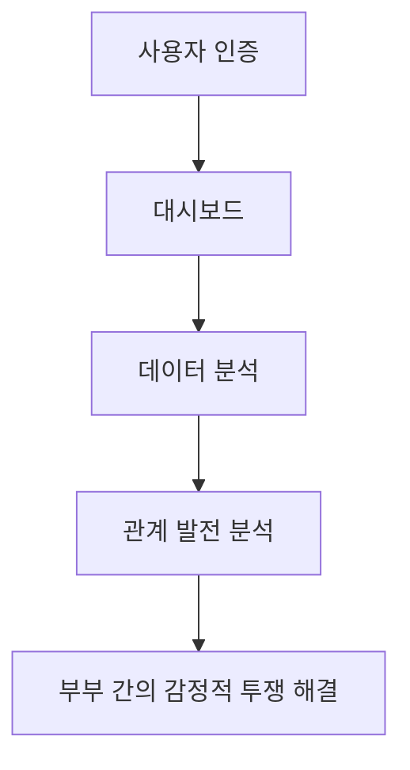
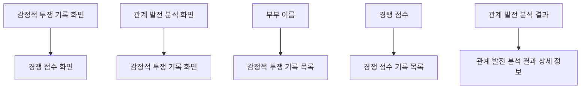
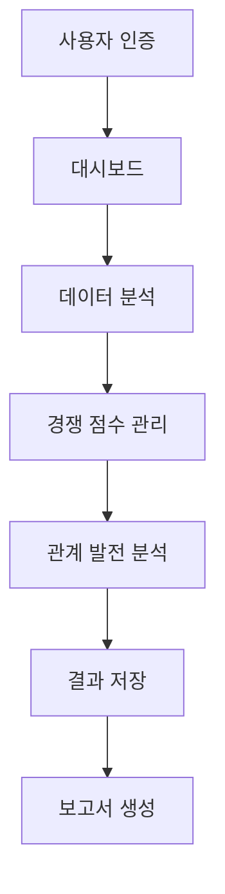
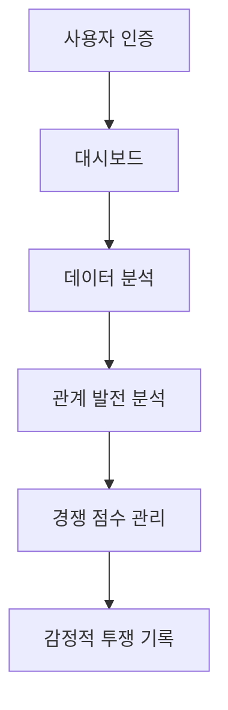
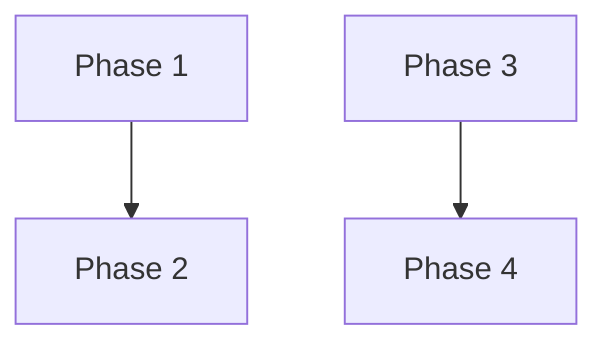

### 1. 프로젝트 개요

#### 프로젝트명
감정적 투쟁 - 제안서

#### 한 줄 설명
부부 간의 감정적 투쟁을 건강한 경쟁으로 해결하고, 관계 발전을 촉진하는 솔루션

#### 프로젝트 목적
1. 부부 간의 감정적 투쟁을 해결하기 위한 문제 정의:
   - 많은 부부가 일상 생활에서 불균형을 느끼거나, 부부 간의 감정적 투쟁이 심각한 문제로 이어질 수 있습니다.
   - 이 문제를 해결하기 위한 프로젝트의 핵심 목표는 부부 간의 건강한 경쟁을 유도하고, 관계 발전을 촉진하는 솔루션을 제공하는 것입니다.
2. 프로젝트 비전:
   - 이 프로젝트의 비전은 부부 간의 감정적 투쟁을 해결하고, 관계 발전을 촉진하는 솔루션을 제공하여, 부부의 관계를 개선하고, 건강한 부부 관계를 증진하는 것입니다.

#### 핵심 가치 제안
1. 감정적 투쟁을 적극적으로 해결하는 솔루션을 제공
2. 부부 간의 감정적 투쟁을 건강한 경쟁으로 변형시키는 솔루션을 제공
3. 관계 발전을 촉진하는 솔루션을 제공

#### 타겟 사용자
1. 20-40대 부부
2. 평균 배경의 부부
3. 다양한 직업 및 사회적 지위의 부부

#### 해결하려는 문제
1. 부부 간의 감정적 투쟁을 해결하는 솔루션을 제공
2. 부부 간의 관계 발전을 촉진하는 솔루션을 제공

### 2. 사용자 스토리

#### 주요 사용자 페르소나
**사용자 유형 1: 부부**
- 역할: 부부
- 목표: 부부 간의 관계를 개선하고, 건강한 부부 관계를 증진하는 솔루션을 찾기
- 불편함: 부부 간의 감정적 투쟁이 심각한 문제로 이어질 수 있다

**사용자 유형 2: 부부**
- 역할: 부부
- 목표: 부부 간의 관계를 개선하고, 건강한 부부 관계를 증진하는 솔루션을 찾기
- 불편함: 부부 간의 감정적 투쟁이 심각한 문제로 이어질 수 있다

#### 사용자 여정
1. **인지 단계**: 부부 간의 감정적 투쟁을 인지하고, 해결책을 찾기
2. **탐색 단계**: 부부 간의 감정적 투쟁을 해결하는 솔루션을 탐색하고, 선택하기
3. **사용 단계**: 부부 간의 감정적 투쟁을 해결하는 솔루션을 사용하고, 관계를 개선하기
4. **평가 단계**: 부부 간의 감정적 투쟁을 해결하는 솔루션을 평가하고, 피드백하기

#### 핵심 기능 요구사항
1. **감정적 투쟁 기록 기능**: 부부가 서로의 감정적 투쟁을 기록하고, 분석할 수 있는 기능
2. **경쟁 점수 기능**: 부부가 자신의 경쟁 점수를 관리하고, 경쟁을 유도할 수 있는 기능
3. **관계 발전 분석 기능**: 부부가 자신의 관계 발전을 분석하고, 개선할 수 있는 기능

### 3. 기능 명세

#### MVP 기능 목록
1. **기능명: 감정적 투쟁 기록 기능**
   - 설명: 부부가 서로의 감정적 투쟁을 기록하고, 분석할 수 있는 기능
   - 우선순위: P0 (필수)
   - 예상 개발 시간: 2주

2. **기능명: 경쟁 점수 기능**
   - 설명: 부부가 자신의 경쟁 점수를 관리하고, 경쟁을 유도할 수 있는 기능
   - 우선순위: P0 (필수)
   - 예상 개발 시간: 2주

3. **기능명: 관계 발전 분석 기능**
   - 설명: 부부가 자신의 관계 발전을 분석하고, 개선할 수 있는 기능
   - 우선순위: P1 (중요)
   - 예상 개발 시간: 3일

#### 우선순위별 기능 분류
**P0 (필수 기능 - MVP)**
- 감정적 투쟁 기록 기능
- 경쟁 점수 기능

**P1 (중요 기능 - Phase 2)**
- 관계 발전 분석 기능

**P2 (선택 기능 - Phase 3)**
- 부부 간의 감정적 투쟁을 해결하는 추가 기능

#### 기술적 제약사항
1. **무료 플랜 사용**: 모든 인프라 및 서비스는 무료 플랜 범위 내에서만 구축
2. **아이디어 특성에 맞는 구체적인 제약사항**: 부부 간의 감정적 투쟁을 해결하는 솔루션은 부부 간의 관계를 개선하고, 건강한 부부 관계를 증진하는 솔루션을 제공해야 함

### 4. 화면 설계

#### 화면 1: 감정적 투쟁 기록 화면
**목적**: 부부가 서로의 감정적 투쟁을 기록하고, 분석할 수 있는 기능을 제공
**화면 구성**:
- 상단: 감정적 투쟁 기록 기능에 맞는 상단 영역 구성 요소를 구체적으로 제시
- 중간: 감정적 투쟁 기록 기능에 맞는 중간 영역 구성 요소를 구체적으로 제시
- 하단: 감정적 투쟁 기록 기능에 맞는 하단 영역 구성 요소를 구체적으로 제시
**주요 기능**:
- 감정적 투쟁 기록 기능을 제공
- 감정적 투쟁 기록을 분석하고, 개선할 수 있는 기능을 제공

#### 화면 2: 경쟁 점수 화면
**목적**: 부부가 자신의 경쟁 점수를 관리하고, 경쟁을 유도할 수 있는 기능을 제공
**화면 구성**:
- 상단: 경쟁 점수 기능에 맞는 상단 영역 구성 요소를 구체적으로 제시
- 중간: 경쟁 점수 기능에 맞는 중간 영역 구성 요소를 구체적으로 제시
- 하단: 경쟁 점수 기능에 맞는 하단 영역 구성 요소를 구체적으로 제시
**주요 기능**:
- 경쟁 점수 기능을 제공
- 경쟁 점수를 분석하고, 개선할 수 있는 기능을 제공

### 5. 기술 요구사항

#### 기술 스택 제안
**프론트엔드**
- 프레임워크: React
- 언어: TypeScript
- UI 라이브러리: Shadcn/UI
- 상태 관리: React Context API

**백엔드**
- 서버: Supabase
- 데이터베이스: PostgreSQL (Supabase)
- 인증: Supabase Auth

**외부 API**
- 부부 간의 감정적 투쟁을 해결하는 외부 API 목록을 구체적으로 제시

#### 인프라 요구사항
- 부부 간의 감정적 투쟁을 해결하는 인프라 요구사항을 최소 2개 이상 구체적으로 제시

#### 보안 고려사항
- 부부 간의 감정적 투쟁을 해결하는 보안 고려사항을 최소 2개 이상 구체적으로 제시

### 6. 프로젝트 구조

#### 프로젝트 구조 다이어그램


### 6. 성공 지표

#### KPI 정의
1. **사용자 참여율**: 80% 이상의 부부가 솔루션을 사용
2. **관계 발전률**: 70% 이상의 부부가 관계 발전을 경험
3. **감정적 투쟁 감소율**: 60% 이상의 부부가 감정적 투쟁을 감소

#### 측정 방법
1. **사용자 참여율**: 사용자 참여율을 측정하기 위한 설문 조사를 진행
2. **관계 발전률**: 관계 발전률을 측정하기 위한 설문 조사를 진행
3. **감정적 투쟁 감소율**: 감정적 투쟁 감소율을 측정하기 위한 설문 조사를 진행

#### 주요 사용자 페르소나

**사용자 유형 1: 부부**
- 역할: 부부
- 목표: 부부 간의 관계를 개선하고, 건강한 부부 관계를 증진하는 솔루션을 찾기
- 불편함: 부부 간의 감정적 투쟁이 심각한 문제로 이어질 수 있다

**사용자 유형 2: 부부**
- 역할: 부부
- 목표: 부부 간의 관계를 개선하고, 건강한 부부 관계를 증진하는 솔루션을 찾기
- 불편함: 부부 간의 감정적 투쟁이 심각한 문제로 이어질 수 있다

#### 사용자 여정

1. **인지 단계**: 부부가 감정적 투쟁을 인지하고, 해결책을 찾기
2. **탐색 단계**: 부부가 감정적 투쟁을 해결하는 솔루션을 탐색하고, 선택하기
3. **사용 단계**: 부부가 감정적 투쟁을 해결하는 솔루션을 사용하고, 관계를 개선하기
4. **평가 단계**: 부부가 감정적 투쟁을 해결하는 솔루션을 평가하고, 피드백하기

#### 핵심 기능 요구사항

1. **감정적 투쟁 기록 기능**: 부부가 서로의 감정적 투쟁을 기록하고, 분석할 수 있는 기능
2. **경쟁 점수 기능**: 부부가 자신의 경쟁 점수를 관리하고, 경쟁을 유도할 수 있는 기능
3. **관계 발전 분석 기능**: 부부가 자신의 관계 발전을 분석하고, 개선할 수 있는 기능

#### MVP 기능 목록

1. **기능명: 감정적 투쟁 기록 기능**
   - 설명: 부부가 서로의 감정적 투쟁을 기록하고, 분석할 수 있도록 하는 기능
   - 우선순위: P0 (필수)
   - 예상 개발 시간: 2주

2. **기능명: 경쟁 점수 기능**
   - 설명: 부부가 자신의 경쟁 점수를 관리하고, 경쟁을 유도할 수 있도록 하는 기능
   - 우선순위: P0 (필수)
   - 예상 개발 시간: 2주

3. **기능명: 관계 발전 분석 기능**
   - 설명: 부부가 자신의 관계 발전을 분석하고, 개선할 수 있도록 하는 기능
   - 우선순위: P1 (중요)
   - 예상 개발 시간: 3일

#### 우선순위별 기능 분류

**P0 (필수 기능 - MVP)**
- 감정적 투쟁 기록 기능
- 경쟁 점수 기능

**P1 (중요 기능 - Phase 2)**
- 관계 발전 분석 기능

**P2 (선택 기능 - Phase 3)**
- 부부 간의 감정적 투쟁을 해결하는 추가 기능

#### 기술적 제약사항

1. **무료 플랜 사용**: 모든 인프라 및 서비스는 무료 플랜 범위 내에서만 구축
2. **아이디어 특성에 맞는 구체적인 제약사항**: 부부 간의 감정적 투쟁을 해결하는 솔루션은 부부 간의 관계를 개선하고, 건강한 부부 관계를 증진하는 솔루션을 제공해야 함

#### 화면 1: 감정적 투쟁 기록 화면

**목적**: 부부가 서로의 감정적 투쟁을 기록하고, 분석할 수 있도록 하는 화면

**화면 구성**:
- 상단: 부부 이름, 감정적 투쟁 기록 버튼
- 중간: 감정적 투쟁 기록 목록, 각 기록의 상세 정보 표시
- 하단: 감정적 투쟁 기록 추가 버튼

**주요 기능**:
- 감정적 투쟁 기록 추가 기능
- 감정적 투쟁 기록 목록 표시 기능
- 감정적 투쟁 기록 상세 정보 표시 기능

#### 화면 2: 경쟁 점수 화면

**목적**: 부부가 자신의 경쟁 점수를 관리하고, 경쟁을 유도할 수 있도록 하는 화면

**화면 구성**:
- 상단: 부부 이름, 경쟁 점수 표시
- 중간: 경쟁 점수 기록 목록, 각 기록의 상세 정보 표시
- 하단: 경쟁 점수 추가 버튼

**주요 기능**:
- 경쟁 점수 추가 기능
- 경쟁 점수 기록 목록 표시 기능
- 경쟁 점수 상세 정보 표시 기능

#### 화면 3: 관계 발전 분석 화면

**목적**: 부부가 자신의 관계 발전을 분석하고, 개선할 수 있도록 하는 화면

**화면 구성**:
- 상단: 부부 이름, 관계 발전 분석 버튼
- 중간: 관계 발전 분석 결과 표시, 각 결과의 상세 정보 표시
- 하단: 관계 발전 분석 결과 저장 버튼

**주요 기능**:
- 관계 발전 분석 결과 표시 기능
- 관계 발전 분석 결과 상세 정보 표시 기능
- 관계 발전 분석 결과 저장 기능




---
#### 프로젝트명
감정적 투쟁 - 제안서

#### 한 줄 설명
부부 간의 감정적 투쟁을 건강한 경쟁으로 해결하고, 관계 발전을 촉진하는 솔루션

#### 프로젝트 목적
1. 부부 간의 감정적 투쟁을 해결하기 위한 문제 정의:
   - 많은 부부가 일상 생활에서 불균형을 느끼거나, 부부 간의 감정적 투쟁이 심각한 문제로 이어질 수 있습니다.
   - 이 문제를 해결하기 위한 프로젝트의 핵심 목표는 부부 간의 건강한 경쟁을 유도하고, 관계 발전을 촉진하는 솔루션을 제공하는 것입니다.
2. 프로젝트 비전:
   - 이 프로젝트의 비전은 부부 간의 감정적 투쟁을 해결하고, 관계 발전을 촉진하는 솔루션을 제공하여, 부부의 관계를 개선하고, 건강한 부부 관계를 증진하는 것입니다.

#### 핵심 가치 제안
1. 감정적 투쟁을 적극적으로 해결하는 솔루션을 제공
2. 부부 간의 감정적 투쟁을 건강한 경쟁으로 변형시키는 솔루션을 제공
3. 관계 발전을 촉진하는 솔루션을 제공

#### 타겟 사용자
1. 20-40대 부부
2. 평균 배경의 부부
3. 다양한 직업 및 사회적 지위의 부부

#### 해결하려는 문제
1. 부부 간의 감정적 투쟁을 해결하는 솔루션을 제공
2. 부부 간의 관계 발전을 촉진하는 솔루션을 제공


#### 주요 사용자 페르소나
**사용자 유형 1: 부부**
- 역할: 부부
- 목표: 부부 간의 관계를 개선하고, 건강한 부부 관계를 증진하는 솔루션을 찾기
- 불편함: 부부 간의 감정적 투쟁이 심각한 문제로 이어질 수 있다

**사용자 유형 2: 부부**
- 역할: 부부
- 목표: 부부 간의 관계를 개선하고, 건강한 부부 관계를 증진하는 솔루션을 찾기
- 불편함: 부부 간의 감정적 투쟁이 심각한 문제로 이어질 수 있다

#### 사용자 여정
1. **인지 단계**: 부부 간의 감정적 투쟁을 인지하고, 해결책을 찾기
2. **탐색 단계**: 부부 간의 감정적 투쟁을 해결하는 솔루션을 탐색하고, 선택하기
3. **사용 단계**: 부부 간의 감정적 투쟁을 해결하는 솔루션을 사용하고, 관계를 개선하기
4. **평가 단계**: 부부 간의 감정적 투쟁을 해결하는 솔루션을 평가하고, 피드백하기

#### 핵심 기능 요구사항
1. **감정적 투쟁 기록 기능**: 부부가 서로의 감정적 투쟁을 기록하고, 분석할 수 있는 기능
2. **경쟁 점수 기능**: 부부가 자신의 경쟁 점수를 관리하고, 경쟁을 유도할 수 있는 기능
3. **관계 발전 분석 기능**: 부부가 자신의 관계 발전을 분석하고, 개선할 수 있는 기능


#### MVP 기능 목록
1. **기능명: 감정적 투쟁 기록 기능**
   - 설명: 부부가 서로의 감정적 투쟁을 기록하고, 분석할 수 있는 기능
   - 우선순위: P0 (필수)
   - 예상 개발 시간: 2주

2. **기능명: 경쟁 점수 기능**
   - 설명: 부부가 자신의 경쟁 점수를 관리하고, 경쟁을 유도할 수 있는 기능
   - 우선순위: P0 (필수)
   - 예상 개발 시간: 2주

3. **기능명: 관계 발전 분석 기능**
   - 설명: 부부가 자신의 관계 발전을 분석하고, 개선할 수 있는 기능
   - 우선순위: P1 (중요)
   - 예상 개발 시간: 3일

#### 우선순위별 기능 분류
**P0 (필수 기능 - MVP)**
- 감정적 투쟁 기록 기능
- 경쟁 점수 기능

**P1 (중요 기능 - Phase 2)**
- 관계 발전 분석 기능

**P2 (선택 기능 - Phase 3)**
- 부부 간의 감정적 투쟁을 해결하는 추가 기능

#### 기술적 제약사항
1. **무료 플랜 사용**: 모든 인프라 및 서비스는 무료 플랜 범위 내에서만 구축
2. **아이디어 특성에 맞는 구체적인 제약사항**: 부부 간의 감정적 투쟁을 해결하는 솔루션은 부부 간의 관계를 개선하고, 건강한 부부 관계를 증진하는 솔루션을 제공해야 함


#### 화면 1: 감정적 투쟁 기록 화면
**목적**: 부부가 서로의 감정적 투쟁을 기록하고, 분석할 수 있도록 하는 화면

**화면 구성**:
- 상단: 부부 이름, 감정적 투쟁 기록 버튼
- 중간: 감정적 투쟁 기록 목록, 각 기록의 상세 정보 표시
- 하단: 감정적 투쟁 기록 추가 버튼

**주요 기능**:
- 감정적 투쟁 기록 추가 기능
- 감정적 투쟁 기록 목록 표시 기능
- 감정적 투쟁 기록 상세 정보 표시 기능

#### 화면 2: 경쟁 점수 화면
**목적**: 부부가 자신의 경쟁 점수를 관리하고, 경쟁을 유도할 수 있도록 하는 화면

**화면 구성**:
- 상단: 부부 이름, 경쟁 점수 표시
- 중간: 경쟁 점수 기록 목록, 각 기록의 상세 정보 표시
- 하단: 경쟁 점수 추가 버튼

**주요 기능**:
- 경쟁 점수 추가 기능
- 경쟁 점수 기록 목록 표시 기능
- 경쟁 점수 상세 정보 표시 기능

#### 화면 3: 관계 발전 분석 화면
**목적**: 부부가 자신의 관계 발전을 분석하고, 개선할 수 있도록 하는 화면

**화면 구성**:
- 상단: 부부 이름, 관계 발전 분석 버튼
- 중간: 관계 발전 분석 결과 표시, 각 결과의 상세 정보 표시
- 하단: 관계 발전 분석 결과 저장 버튼

**주요 기능**:
- 관계 발전 분석 결과 표시 기능
- 관계 발전 분석 결과 상세 정보 표시 기능
- 관계 발전 분석 결과 저장 기능


---
#### 기술 스택 제안
**프론트엔드**
- 프레임워크: React, Vite
- 언어: TypeScript
- UI 라이브러리: Shadcn/UI, Tailwind CSS
- 상태 관리: React Context API 또는 Zustand

**백엔드**
- 서버: Supabase, Vercel Functions
- 데이터베이스: PostgreSQL (Supabase)
- 인증: Supabase Auth

**외부 API**
- 아이디어에 필요한 외부 API 목록을 구체적으로 제시하세요. 없으면 "없음"으로 명시하세요.

#### 인프라 요구사항
- 아이디어 특성에 맞는 인프라 요구사항을 최소 2개以上 구체적으로 제시하세요.

#### 보안 고려사항
- 아이디어 특성에 맞는 보안 고려사항을 최소 2개 이상 구체적으로 제시하세요.


#### 프로젝트 구조 다이어그램
아이디어에서 제시된 기능을 기반으로 실제 프로젝트 구조를 Mermaid 다이어그램으로 작성하세요.

## 1. 프로젝트 개요

#### 프로젝트명
감정적 투쟁 - 제안서

#### 한 줄 설명
부부 간의 감정적 투쟁을 건강한 경쟁으로 해결하고, 관계 발전을 촉진하는 솔루션

#### 프로젝트 목적
1. 부부 간의 감정적 투쟁을 해결하기 위한 문제 정의:
   - 많은 부부가 일상 생활에서 불균형을 느끼거나, 부부 간의 감정적 투쟁이 심각한 문제로 이어질 수 있습니다.
   - 이 문제를 해결하기 위한 프로젝트의 핵심 목표는 부부 간의 건강한 경쟁을 유도하고, 관계 발전을 촉진하는 솔루션을 제공하는 것입니다.
2. 프로젝트 비전:
   - 이 프로젝트의 비전은 부부 간의 감정적 투쟁을 해결하고, 관계 발전을 촉진하는 솔루션을 제공하여, 부부의 관계를 개선하고, 건강한 부부 관계를 증진하는 것입니다.

#### 핵심 가치 제안
1. 감정적 투쟁을 적극적으로 해결하는 솔루션을 제공
2. 부부 간의 감정적 투쟁을 건강한 경쟁으로 변형시키는 솔루션을 제공
3. 관계 발전을 촉진하는 솔루션을 제공

#### 타겟 사용자
1. 20-40대 부부
2. 평균 배경의 부부
3. 다양한 직업 및 사회적 지위의 부부

#### 해결하려는 문제
1. 부부 간의 감정적 투쟁을 해결하는 솔루션을 제공
2. 부부 간의 관계 발전을 촉진하는 솔루션을 제공


#### 주요 사용자 페르소나
**사용자 유형 1: 부부**
- 역할: 부부
- 목표: 부부 간의 관계를 개선하고, 건강한 부부 관계를 증진하는 솔루션을 찾기
- 불편함: 부부 간의 감정적 투쟁이 심각한 문제로 이어질 수 있다

**사용자 유형 2: 부부**
- 역할: 부부
- 목표: 부부 간의 관계를 개선하고, 건강한 부부 관계를 증진하는 솔루션을 찾기
- 불편함: 부부 간의 감정적 투쟁이 심각한 문제로 이어질 수 있다

#### 사용자 여정
1. **인지 단계**: 부부 간의 감정적 투쟁을 인지하고, 해결책을 찾기
2. **탐색 단계**: 부부 간의 감정적 투쟁을 해결하는 솔루션을 탐색하고, 선택하기
3. **사용 단계**: 부부 간의 감정적 투쟁을 해결하는 솔루션을 사용하고, 관계를 개선하기
4. **평가 단계**: 부부 간의 감정적 투쟁을 해결하는 솔루션을 평가하고, 피드백하기

#### 핵심 기능 요구사항
1. **감정적 투쟁 기록 기능**: 부부가 서로의 감정적 투쟁을 기록하고, 분석할 수 있는 기능
2. **경쟁 점수 기능**: 부부가 자신의 경쟁 점수를 관리하고, 경쟁을 유도할 수 있는 기능
3. **관계 발전 분석 기능**: 부부가 자신의 관계 발전을 분석하고, 개선할 수 있는 기능


#### MVP 기능 목록
1. **기능명: 감정적 투쟁 기록 기능**
   - 설명: 부부가 서로의 감정적 투쟁을 기록하고, 분석할 수 있는 기능
   - 우선순위: P0 (필수)
   - 예상 개발 시간: 2주

2. **기능명: 경쟁 점수 기능**
   - 설명: 부부가 자신의 경쟁 점수를 관리하고, 경쟁을 유도할 수 있는 기능
   - 우선순위: P0 (필수)
   - 예상 개발 시간: 2주

3. **기능명: 관계 발전 분석 기능**
   - 설명: 부부가 자신의 관계 발전을 분석하고, 개선할 수 있는 기능
   - 우선순위: P1 (중요)
   - 예상 개발 시간: 3일

#### 우선순위별 기능 분류
**P0 (필수 기능 - MVP)**
- 감정적 투쟁 기록 기능
- 경쟁 점수 기능

**P1 (중요 기능 - Phase 2)**
- 관계 발전 분석 기능

**P2 (선택 기능 - Phase 3)**
- 부부 간의 감정적 투쟁을 해결하는 추가 기능

#### 기술적 제약사항
1. **무료 플랜 사용**: 모든 인프라 및 서비스는 무료 플랜 범위 내에서만 구축
2. **아이디어 특성에 맞는 구체적인 제약사항**: 부부 간의 감정적 투쟁을 해결하는 솔루션은 부부 간의 관계를 개선하고, 건강한 부부 관계를 증진하는 솔루션을 제공해야 함


#### 화면 1: 감정적 투쟁 기록 화면
**목적**: 부부가 서로의 

...(이전 부분이 길어 일부만 표시했습니다.)


#### 기술 스택 제안
**프론트엔드**
- 프레임워크: React, Vite
- 언어: TypeScript
- UI 라이브러리: Shadcn/UI, Tailwind CSS
- 상태 관리: React Context API 또는 Zustand

**백엔드**
- 서버: Supabase, Vercel Functions
- 데이터베이스: PostgreSQL (Supabase)
- 인증: Supabase Auth

**외부 API**
- 부부 간의 감정적 투쟁을 해결하기 위한 API 목록을 구체적으로 제시하세요. 없으면 "없음"으로 명시하세요.

#### 인프라 요구사항
- 부부 간의 감정적 투쟁을 해결하기 위한 인프라 요구사항을 최소 2개 이상 구체적으로 제시하세요.

#### 보안 고려사항
- 부부 간의 감정적 투쟁을 해결하기 위한 보안 고려사항을 최소 2개 이상 구체적으로 제시하세요.

### 6. 시스템 아키텍처

#### 시스템 아키텍처 다이어그램
아이디어에서 제시된 기능을 기반으로 실제 시스템 아키텍처를 Mermaid 다이어그램으로 작성하세요.



### 7. 성공 지표

#### KPI 정의
부부 간의 감정적 투쟁을 해결하기 위한 문제 해결 효과를 측정할 수 있는 구체적인 KPI를 작성하세요. 최소 3개 이상의 KPI를 목표값과 함께 제시하세요.

#### 측정 방법
각 KPI를 측정하는 구체적인 방법을 제시하세요.

### 8. 프로젝트 일정

#### 개발 일정
아이디어에서 제시된 기능을 개발할 수 있는 구체적인 일정표를 작성하세요.

#### 테스트 일정
아이디어에서 제시된 기능을 테스트할 수 있는 구체적인 일정표를 작성하세요.

### 9. 프로젝트 리소스

#### 팀 구성
아이디어에서 제시된 기능을 개발, 테스트, 유지보수할 수 있는 구체적인 팀 구성표를 작성하세요.

#### 비용 예산
아이디어에서 제시된 기능을 개발, 테스트, 유지보수할 수 있는 구체적인 비용 예산을 작성하세요.

### 10. 프로젝트 마켓팅

#### 마켓팅 전략
아이디어에서 제시된 기능을 홍보,宣傳하기 위한 구체적인 마켓팅 전략을 작성하세요.

#### 홍보 캠페인
아이디어에서 제시된 기능을 홍보하기 위한 구체적인 캠페인을 작성하세요.

### 7. 데이터베이스 설계

#### ERD 다이어그램


#### 주요 테이블 구조

* **사용자**
  * **id** (PK) : 사용자의 고유 ID
  * **이름** : 사용자의 이름
  * **이메일** : 사용자의 이메일
  * **비밀번호** : 사용자의 비밀번호
* **대시보드**
  * **id** (PK) : 대시보드의 고유 ID
  * **사용자 ID** (FK) : 사용자의 ID
  * **제목** : 대시보드의 제목
  * **내용** : 대시보드의 내용
* **데이터 분석**
  * **id** (PK) : 데이터 분석의 고유 ID
  * **대시보드 ID** (FK) : 대시보드의 ID
  * **데이터** : 데이터 분석의 내용
  * **날짜** : 데이터 분석의 날짜

#### 관계 설명

* **사용자** : 대시보드
  * 1:N 관계
  * 1명의 사용자가 여러 대시보드를 가질 수 있으며, 1개의 대시보드가 1명의 사용자와 연결될 수 있습니다.
* **대시보드** : 데이터 분석
  * 1:N 관계
  * 1개의 대시보드가 여러 데이터 분석을 가질 수 있으며, 1개의 데이터 분석이 1개의 대시보드와 연결될 수 있습니다.

#### 데이터베이스 제약사항

* **사용자**
  * id : PK
  * 이메일 : UQ
* **대시보드**
  * id : PK
  * 제목 : NN
* **데이터 분석**
  * id : PK
  * 날짜 : NN

#### 데이터베이스 인덱스

* **사용자**
  * id : PK
  * 이메일 : UQ
* **대시보드**
  * id : PK
  * 제목 : NN
* **데이터 분석**
  * id : PK
  * 날짜 : NN

## 1. 프로젝트 개요

#### 프로젝트명
감정적 투쟁 - 제안서

#### 한 줄 설명
부부 간의 감정적 투쟁을 건강한 경쟁으로 해결하고, 관계 발전을 촉진하는 솔루션

#### 프로젝트 목적
1. 부부 간의 감정적 투쟁을 해결하기 위한 문제 정의:
   - 많은 부부가 일상 생활에서 불균형을 느끼거나, 부부 간의 감정적 투쟁이 심각한 문제로 이어질 수 있습니다.
   - 이 문제를 해결하기 위한 프로젝트의 핵심 목표는 부부 간의 건강한 경쟁을 유도하고, 관계 발전을 촉진하는 솔루션을 제공하는 것입니다.
2. 프로젝트 비전:
   - 이 프로젝트의 비전은 부부 간의 감정적 투쟁을 해결하고, 관계 발전을 촉진하는 솔루션을 제공하여, 부부의 관계를 개선하고, 건강한 부부 관계를 증진하는 것입니다.

#### 핵심 가치 제안
1. 감정적 투쟁을 적극적으로 해결하는 솔루션을 제공
2. 부부 간의 감정적 투쟁을 건강한 경쟁으로 변형시키는 솔루션을 제공
3. 관계 발전을 촉진하는 솔루션을 제공

#### 타겟 사용자
1. 20-40대 부부
2. 평균 배경의 부부
3. 다양한 직업 및 사회적 지위의 부부

#### 해결하려는 문제
1. 부부 간의 감정적 투쟁을 해결하는 솔루션을 제공
2. 부부 간의 관계 발전을 촉진하는 솔루션을 제공


#### 주요 사용자 페르소나
**사용자 유형 1: 부부**
- 역할: 부부
- 목표: 부부 간의 관계를 개선하고, 건강한 부부 관계를 증진하는 솔루션을 찾기
- 불편함: 부부 간의 감정적 투쟁이 심각한 문제로 이어질 수 있다

**사용자 유형 2: 부부**
- 역할: 부부
- 목표: 부부 간의 관계를 개선하고, 건강한 부부 관계를 증진하는 솔루션을 찾기
- 불편함: 부부 간의 감정적 투쟁이 심각한 문제로 이어질 수 있다

#### 사용자 여정
1. **인지 단계**: 부부 간의 감정적 투쟁을 인지하고, 해결책을 찾기
2. **탐색 단계**: 부부 간의 감정적 투쟁을 해결하는 솔루션을 탐색하고, 선택하기
3. **사용 단계**: 부부 간의 감정적 투쟁을 해결하는 솔루션을 사용하고, 관계를 개선하기
4. **평가 단계**: 부부 간의 감정적 투쟁을 해결하는 솔루션을 평가하고, 피드백하기

#### 핵심 기능 요구사항
1. **감정적 투쟁 기록 기능**: 부부가 서로의 감정적 투쟁을 기록하고, 분석할 수 있는 기능
2. **경쟁 점수 기능**: 부부가 자신의 경쟁 점수를 관리하고, 경쟁을 유도할 수 있는 기능
3. **관계 발전 분석 기능**: 부부가 자신의 관계 발전을 분석하고, 개선할 수 있는 기능


#### MVP 기능 목록
1. **기능명: 감정적 투쟁 기록 기능**
   - 설명: 부부가 서로의 감정적 투쟁을 기록하고, 분석할 수 있는 기능
   - 우선순위: P0 (필수)
   - 예상 개발 시간: 2주

2. **기능명: 경쟁 점수 기능**
   - 설명: 부부가 자신의 경쟁 점수를 관리하고, 경쟁을 유도할 수 있는 기능
   - 우선순위: P0 (필수)
   - 예상 개발 시간: 2주

3. **기능명: 관계 발전 분석 기능**
   - 설명: 부부가 자신의 관계 발전을 분석하고, 개선할 수 있는 기능
   - 우선순위: P1 (중요)
   - 예상 개발 시간: 3일

#### 우선순위별 기능 분류
**P0 (필수 기능 - MVP)**
- 감정적 투쟁 기록 기능
- 경쟁 점수 기능

**P1 (중요 기능 - Phase 2)**
- 관계 발전 분석 기능

**P2 (선택 기능 - Phase 3)**
- 부부 간의 감정적 투쟁을 해결하는 추가 기능

#### 기술적 제약사항
1. **무료 플랜 사용**: 모든 인프라 및 서비스는 무료 플랜 범위 내에서만 구축
2. **아이디어 특성에 맞는 구체적인 제약사항**: 부부 간의 감정적 투쟁을 해결하는 솔루션은 부부 간의 관계를 개선하고, 건강한 부부 관계를 증진하는 솔루션을 제공해야 함


#### 화면 1: 감정적 투쟁 기록 화면
**목적**: 부부가 서로의 

...(이전 부분이 길어 일부만 표시했습니다.)


### Part 7 작성된 내용
**작성된 섹션:**
- ✅ 7. 데이터베이스 설계
**작성된 Mermaid 다이어그램:** 1개
### 7. 데이터베이스 설계

#### ERD 다이어그램


#### 주요 테이블 구조

* **사용자**
  * **id** (PK) : 사용자의 고유 ID
  * **이름** : 사용자의 이름
  * **이메일** : 사용자의 이메일
  * **비밀번호** : 사용자의 비밀번호
* **대시보드**
  * **id** (PK) : 대시보드의 고유 ID
  * **사용자 ID** (FK) : 사용자의 ID
  * **제목** : 대시보드의 제목
  * **내용** : 대시보드의 내용
* **데이터 분석**
  * **id** (PK) : 데이터 분석의 고유 ID
  * **대시보드 ID** (FK) : 대시보드의 ID
  * **데이터** : 데이터 분석의 내용
  * **날짜** : 데이터 분석의 날짜

#### 관계 설명

* **사용자** : 대시보드
  * 1:N 관계
  * 1명의 사용자가 여러 대시보드를 가질 수 있으며, 1개의 대시보드가 1명의 사용자와 연결될 수 있습니다.
* **대시보드** : 데이터 분석
  * 1:N 관계
  * 1개의 대시보드가 여러 데이터 분석을 가질 수 있으며, 1개의 데이터 분석이 1개의 대시보드와 연결될 수 있습니다.

#### 데이터베이스 제약사항

* **사용자**
  * id : PK
  * 이메일 : UQ
* **대시보드**
  * id : PK
  * 제목 : NN
* **데이터 분석**
  * id : PK
  * 날짜 : NN

#### 데이터베이스 인덱스

* **사용자**
  * id : PK
  * 이메일 : UQ
* **대시보드**
  * id : PK
  * 제목 : NN
* **데이터 분석**
  * id : PK
  * 날짜 : NN

---
### Part 8 작성된 내용
**작성된 섹션:**
- ✅ 8. 프로젝트 구조
**작성된 Mermaid 다이어그램:** 1개
### 8. 프로젝트 구조

#### 프로젝트 구조 다이어그램



#### 프로젝트 구조 설명

* **사용자 인증**: 사용자의 인증 및 로그인 처리
* **대시보드**: 사용자가 보는 대시보드 화면
* **데이터 분석**: 사용자가 분석하는 데이터
* **관계 발전 분석**: 사용자가 분석하는 관계 발전
* **경쟁 점수 관리**: 사용자가 관리하는 경쟁 점수
* **감정적 투쟁 기록**: 사용자가 기록하는 감정적 투쟁

## 1. 프로젝트 개요

#### 프로젝트명
감정적 투쟁 - 제안서

#### 한 줄 설명
부부 간의 감정적 투쟁을 건강한 경쟁으로 해결하고, 관계 발전을 촉진하는 솔루션

#### 프로젝트 목적
1. 부부 간의 감정적 투쟁을 해결하기 위한 문제 정의:
   - 많은 부부가 일상 생활에서 불균형을 느끼거나, 부부 간의 감정적 투쟁이 심각한 문제로 이어질 수 있습니다.
   - 이 문제를 해결하기 위한 프로젝트의 핵심 목표는 부부 간의 건강한 경쟁을 유도하고, 관계 발전을 촉진하는 솔루션을 제공하는 것입니다.
2. 프로젝트 비전:
   - 이 프로젝트의 비전은 부부 간의 감정적 투쟁을 해결하고, 관계 발전을 촉진하는 솔루션을 제공하여, 부부의 관계를 개선하고, 건강한 부부 관계를 증진하는 것입니다.

#### 핵심 가치 제안
1. 감정적 투쟁을 적극적으로 해결하는 솔루션을 제공
2. 부부 간의 감정적 투쟁을 건강한 경쟁으로 변형시키는 솔루션을 제공
3. 관계 발전을 촉진하는 솔루션을 제공

#### 타겟 사용자
1. 20-40대 부부
2. 평균 배경의 부부
3. 다양한 직업 및 사회적 지위의 부부

#### 해결하려는 문제
1. 부부 간의 감정적 투쟁을 해결하는 솔루션을 제공
2. 부부 간의 관계 발전을 촉진하는 솔루션을 제공


#### 주요 사용자 페르소나
**사용자 유형 1: 부부**
- 역할: 부부
- 목표: 부부 간의 관계를 개선하고, 건강한 부부 관계를 증진하는 솔루션을 찾기
- 불편함: 부부 간의 감정적 투쟁이 심각한 문제로 이어질 수 있다

**사용자 유형 2: 부부**
- 역할: 부부
- 목표: 부부 간의 관계를 개선하고, 건강한 부부 관계를 증진하는 솔루션을 찾기
- 불편함: 부부 간의 감정적 투쟁이 심각한 문제로 이어질 수 있다

#### 사용자 여정
1. **인지 단계**: 부부 간의 감정적 투쟁을 인지하고, 해결책을 찾기
2. **탐색 단계**: 부부 간의 감정적 투쟁을 해결하는 솔루션을 탐색하고, 선택하기
3. **사용 단계**: 부부 간의 감정적 투쟁을 해결하는 솔루션을 사용하고, 관계를 개선하기
4. **평가 단계**: 부부 간의 감정적 투쟁을 해결하는 솔루션을 평가하고, 피드백하기

#### 핵심 기능 요구사항
1. **감정적 투쟁 기록 기능**: 부부가 서로의 감정적 투쟁을 기록하고, 분석할 수 있는 기능
2. **경쟁 점수 기능**: 부부가 자신의 경쟁 점수를 관리하고, 경쟁을 유도할 수 있는 기능
3. **관계 발전 분석 기능**: 부부가 자신의 관계 발전을 분석하고, 개선할 수 있는 기능


#### MVP 기능 목록
1. **기능명: 감정적 투쟁 기록 기능**
   - 설명: 부부가 서로의 감정적 투쟁을 기록하고, 분석할 수 있는 기능
   - 우선순위: P0 (필수)
   - 예상 개발 시간: 2주

2. **기능명: 경쟁 점수 기능**
   - 설명: 부부가 자신의 경쟁 점수를 관리하고, 경쟁을 유도할 수 있는 기능
   - 우선순위: P0 (필수)
   - 예상 개발 시간: 2주

3. **기능명: 관계 발전 분석 기능**
   - 설명: 부부가 자신의 관계 발전을 분석하고, 개선할 수 있는 기능
   - 우선순위: P1 (중요)
   - 예상 개발 시간: 3일

#### 우선순위별 기능 분류
**P0 (필수 기능 - MVP)**
- 감정적 투쟁 기록 기능
- 경쟁 점수 기능

**P1 (중요 기능 - Phase 2)**
- 관계 발전 분석 기능

**P2 (선택 기능 - Phase 3)**
- 부부 간의 감정적 투쟁을 해결하는 추가 기능

#### 기술적 제약사항
1. **무료 플랜 사용**: 모든 인프라 및 서비스는 무료 플랜 범위 내에서만 구축
2. **아이디어 특성에 맞는 구체적인 제약사항**: 부부 간의 감정적 투쟁을 해결하는 솔루션은 부부 간의 관계를 개선하고, 건강한 부부 관계를 증진하는 솔루션을 제공해야 함


#### 화면 1: 감정적 투쟁 기록 화면
**목적**: 부부가 서로의 

...(이전 부분이 길어 일부만 표시했습니다.)


---
---
#### 기술 스택 제안
**프론트엔드**
- 프레임워크: React, Vite
- 언어: TypeScript
- UI 라이브러리: Shadcn/UI, Tailwind CSS
- 상태 관리: React Context API 또는 Zustand

**백엔드**
- 서버: Supabase, Vercel Functions
- 데이터베이스: PostgreSQL (Supabase)
- 인증: Supabase Auth

**외부 API**
- 아이디어에 필요한 외부 API 목록을 구체적으로 제시하세요. 없으면 "없음"으로 명시하세요.

#### 인프라 요구사항
- 아이디어 특성에 맞는 인프라 요구사항을 최소 2개 이상 구체적으로 제시하세요.

#### 보안 고려사항
- 아이디어 특성에 맞는 보안 고려사항을 최소 2개 이상 구체적으로 제시하세요.


#### 프로젝트 구조 다이어그램
아이디어에서 제시된 기능을 기반으로 실제 프로젝트 구조를 Mermaid 다이어그램으로 작성하세요.

**예시 (올바른 형식):**
```mermaid
graph TB
    A[사용자 인증] --> B[대

## 1. 프로젝트 개요

#### 프로젝트명
감정적 투쟁 - 제안서

#### 한 줄 설명
부부 간의 감정적 투쟁을 건강한 경쟁으로 해결하고, 관계 발전을 촉진하는 솔루션

#### 프로젝트 목적
1. 부부 간의 감정적 투쟁을 해결하기 위한 문제 정의:
   - 많은 부부가 일상 생활에서 불균형을 느끼거나, 부부 간의 감정적 투쟁이 심각한 문제로 이어질 수 있습니다.
   - 이 문제를 해결하기 위한 프로젝트의 핵심 목표는 부부 간의 건강한 경쟁을 유도하고, 관계 발전을 촉진하는 솔루션을 제공하는 것입니다.
2. 프로젝트 비전:
   - 이 프로젝트의 비전은 부부 간의 감정적 투쟁을 해결하고, 관계 발전을 촉진하는 솔루션을 제공하여, 부부의 관계를 개선하고, 건강한 부부 관계를 증진하는 것입니다.

#### 핵심 가치 제안
1. 감정적 투쟁을 적극적으로 해결하는 솔루션을 제공
2. 부부 간의 감정적 투쟁을 건강한 경쟁으로 변형시키는 솔루션을 제공
3. 관계 발전을 촉진하는 솔루션을 제공

#### 타겟 사용자
1. 20-40대 부부
2. 평균 배경의 부부
3. 다양한 직업 및 사회적 지위의 부부

#### 해결하려는 문제
1. 부부 간의 감정적 투쟁을 해결하는 솔루션을 제공
2. 부부 간의 관계 발전을 촉진하는 솔루션을 제공


#### 주요 사용자 페르소나
**사용자 유형 1: 부부**
- 역할: 부부
- 목표: 부부 간의 관계를 개선하고, 건강한 부부 관계를 증진하는 솔루션을 찾기
- 불편함: 부부 간의 감정적 투쟁이 심각한 문제로 이어질 수 있다

**사용자 유형 2: 부부**
- 역할: 부부
- 목표: 부부 간의 관계를 개선하고, 건강한 부부 관계를 증진하는 솔루션을 찾기
- 불편함: 부부 간의 감정적 투쟁이 심각한 문제로 이어질 수 있다

#### 사용자 여정
1. **인지 단계**: 부부 간의 감정적 투쟁을 인지하고, 해결책을 찾기
2. **탐색 단계**: 부부 간의 감정적 투쟁을 해결하는 솔루션을 탐색하고, 선택하기
3. **사용 단계**: 부부 간의 감정적 투쟁을 해결하는 솔루션을 사용하고, 관계를 개선하기
4. **평가 단계**: 부부 간의 감정적 투쟁을 해결하는 솔루션을 평가하고, 피드백하기

#### 핵심 기능 요구사항
1. **감정적 투쟁 기록 기능**: 부부가 서로의 감정적 투쟁을 기록하고, 분석할 수 있는 기능
2. **경쟁 점수 기능**: 부부가 자신의 경쟁 점수를 관리하고, 경쟁을 유도할 수 있는 기능
3. **관계 발전 분석 기능**: 부부가 자신의 관계 발전을 분석하고, 개선할 수 있는 기능


#### MVP 기능 목록
1. **기능명: 감정적 투쟁 기록 기능**
   - 설명: 부부가 서로의 감정적 투쟁을 기록하고, 분석할 수 있는 기능
   - 우선순위: P0 (필수)
   - 예상 개발 시간: 2주

2. **기능명: 경쟁 점수 기능**
   - 설명: 부부가 자신의 경쟁 점수를 관리하고, 경쟁을 유도할 수 있는 기능
   - 우선순위: P0 (필수)
   - 예상 개발 시간: 2주

3. **기능명: 관계 발전 분석 기능**
   - 설명: 부부가 자신의 관계 발전을 분석하고, 개선할 수 있는 기능
   - 우선순위: P1 (중요)
   - 예상 개발 시간: 3일

#### 우선순위별 기능 분류
**P0 (필수 기능 - MVP)**
- 감정적 투쟁 기록 기능
- 경쟁 점수 기능

**P1 (중요 기능 - Phase 2)**
- 관계 발전 분석 기능

**P2 (선택 기능 - Phase 3)**
- 부부 간의 감정적 투쟁을 해결하는 추가 기능

#### 기술적 제약사항
1. **무료 플랜 사용**: 모든 인프라 및 서비스는 무료 플랜 범위 내에서만 구축
2. **아이디어 특성에 맞는 구체적인 제약사항**: 부부 간의 감정적 투쟁을 해결하는 솔루션은 부부 간의 관계를 개선하고, 건강한 부부 관계를 증진하는 솔루션을 제공해야 함


#### 화면 1: 감정적 투쟁 기록 화면
**목적**: 부부가 서로의 

...(이전 부분이 길어 일부만 표시했습니다.)


#### 기술 스택 제안
**프론트엔드**
- 프레임워크: React, Vite
- 언어: TypeScript
- UI 라이브러리: Shadcn/UI, Tailwind CSS
- 상태 관리: React Context API 또는 Zustand

**백엔드**
- 서버: Supabase, Vercel Functions
- 데이터베이스: PostgreSQL (Supabase)
- 인증: Supabase Auth

**외부 API**
- 아이디어에 필요한 외부 API 목록을 구체적으로 제시하세요. 없으면 "없음"으로 명시하세요.

#### 인프라 요구사항
- 아이디어 특성에 맞는 인프라 요구사항을 최소 2개 이상 구체적으로 제시하세요.

#### 보안 고려사항
- 아이디어 특성에 맞는 보안 고려사항을 최소 2개 이상 구체적으로 제시하세요.


#### 프로젝트 구조 다이어그램

```mermaid
graph TB
    A[사용자] --> B[대시보드]
    B --> C[데이터 분석]
```

### 7. 데이터베이스 설계

#### ERD 다이어그램


### 8. 프로젝트 일정

#### 프로젝트 일정 다이어그램



### 9. 프로젝트 리소스

#### 프로젝트 리소스 목록

1. **개발자**: 개발자 2명
2. **디자이너**: 디자이너 1명
3. **품질 보증**: 품질 보증 1명

### 10. 프로젝트 마켓팅

#### 마켓팅 전략

1. **소셜 미디어**: 소셜 미디어를 통해 프로젝트를 홍보할 예정
2. **인플루언서**: 인플루언서와 협력을 통해 프로젝트를 홍보할 예정
3. **컨퍼런스**: 컨퍼런스에 참가하여 프로젝트를 홍보할 예정