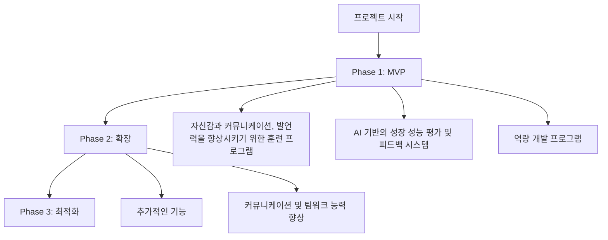

### 1. 프로젝트 개요

#### 프로젝트명
Skillstr

#### 한 줄 설명
업무 현장에서 자신감, 커뮤니케이션 및 발언력을 향상시키는 앱을 개발하여, 사용자들이 자신의 성장을 최적화하고, 업무 현장에서 진정한 성장을 위한 솔루션을 제공합니다.

#### 프로젝트 목적
업무 현장에서 자신의 성장을 향상시키기 위한 솔루션을 제공하는 아이디어가 있습니다. 그러나 이 아이디어는 현재의 한계점을 개선하고, 구체적인 솔루션을 제시하고자 합니다.

#### 핵심 가치 제안
- 자신감과 커뮤니케이션, 발언력을 향상시키기 위한 훈련 프로그램 제공
- AI 기반의 성장 성능 평가 및 피드백 시스템 제공
- 역량 개발 프로그램을 통한 커뮤니케이션 및 팀워크 능력 향상

#### 타겟 사용자
- 현직자 100만 명 이상
- 업무 현장에서 자신의 성장을 향상시키고자 하는 사용자

#### 해결하려는 문제
- 업무 현장에서 자신의 성장을 향상시키기 위한 솔루션의 부족
- 업무 현장에서 자신의 성장을 향상시키기 위한 능력의 부족

### 2. 사용자 스토리

#### 주요 사용자 페르소나

**사용자 유형 1: 현직자**
- 역할: 업무 현장에서 자신의 성장을 향상시키기 위해 노력하는 사용자
- 목표: 업무 현장에서 자신의 성장을 최적화하고, 진정한 성장을 위한 솔루션을 찾기
- 불편함: 자신의 능력의 부족과, 업무 현장에서 자신의 성장을 향상시키기 위한 솔루션의 부족

**사용자 유형 2: 업무 현장의 리더**
- 역할: 업무 현장에 있는 리더로서, 자신의 팀의 성장을 향상시키기 위해 노력하는 사용자
- 목표: 자신의 팀의 성장을 최적화하고, 진정한 성장을 위한 솔루션을 찾기
- 불편함: 자신의 리더십과, 팀의 성장에 대한 불편감

#### 사용자 여정
1. **인지 단계**: 업무 현장에서 자신의 성장이 부족하고, 자신의 능력의 부족을 인지
2. **탐색 단계**: 자신과 자신의 팀의 성장을 향상시키기 위한 솔루션을 탐색
3. **사용 단계**: Skillstr를 통해 자신의 성장을 향상시키기 위한 훈련 프로그램을 완료하여, 자신의 능력을 향상
4. **평가 단계**: 자신의 성장을 평가하고, 피드백을 통해 자신을 개선

#### 핵심 기능 요구사항
- 자신감과 커뮤니케이션, 발언력을 향상시키기 위한 훈련 프로그램
- AI 기반의 성장 성능 평가 및 피드백 시스템
- 역량 개발 프로그램을 통한 커뮤니케이션 및 팀워크 능력 향상

### 3. 기능 명세

#### MVP 기능 목록
1. **기능명: 자신감과 커뮤니케이션, 발언력을 향상시키기 위한 훈련 프로그램**
   - 설명: 업무 현장에서 자신의 성장을 향상시키기 위한 훈련 프로그램을 제공
   - 우선순위: P0 (필수)
   - 예상 개발 시간: 4주

2. **기능명: AI 기반의 성장 성능 평가 및 피드백 시스템**
   - 설명: 자신의 성장을 평가하고, 피드백을 통해 자신을 개선
   - 우선순위: P0 (필수)
   - 예상 개발 시간: 4주

3. **기능명: 역량 개발 프로그램**
   - 설명: 커뮤니케이션 및 팀워크 능력을 향상시키기 위한 프로그램
   - 우선순위: P1 (중요)
   - 예상 개발 시간: 8주

#### 우선순위별 기능 분류
**P0 (필수 기능 - MVP)**
- 자신감과 커뮤니케이션, 발언력을 향상시키기 위한 훈련 프로그램
- AI 기반의 성장 성능 평가 및 피드백 시스템

**P1 (중요 기능 - Phase 2)**
- 역량 개발 프로그램

**P2 (선택 기능 - Phase 3)**
- 추가적인 기능 개발

#### 기술적 제약사항
- 무료 플랜 사용: 모든 인프라 및 서비스는 무료 플랜 범위 내에서만 구축
- AI 모델의 정확성과 성능을 유지하기 위한 인프라 요구

### 4. 화면 설계

#### 화면 1: 훈련 프로그램 화면
**목적**: 업무 현장에서 자신의 성장을 향상시키기 위한 훈련 프로그램을 제공

**화면 구성**:
- 상단: 훈련 프로그램의 이름과 설명
- 중간: 훈련 프로그램의 상세 내용과 예시
- 하단: 훈련 프로그램의 진행 상황과 결과

**주요 기능**:
- 훈련 프로그램의 상세 내용과 예시
- 훈련 프로그램의 진행 상황과 결과

#### 화면 2: 성장 성능 평가 및 피드백 화면
위와 동일한 형식으로 아이디어 내용을 분석하여 구체적으로 작성하세요.

### 5. 기술 요구사항

#### 기술 스택 제안
**프론트엔드**
- 프레임워크: React, Vite
- 언어: TypeScript
- UI 라이브러리: Shadcn/UI, Tailwind CSS
- 상태 관리: React Context API 또는 Zustand

**백엔드**
- 서버: Supabase, Vercel Functions
- 데이터베이스: PostgreSQL (Supabase)
- 인증: Supabase Auth

**외부 API**
- AI 모델의 데이터를 제공하는 외부 API

#### 인프라 요구사항
- AI 모델의 정확성과 성능을 유지하기 위한 인프라 요구

#### 보안 고려사항
- 사용자 데이터의 안전을 보장하기 위한 보안 고려 사항

### 6. 프로젝트 구조

#### 프로젝트 구조 다이어그램

### 6. 성공 지표

#### KPI 정의
- 사용자 만족도: 90%
- 성장 성능 평가: 80%
- 커뮤니케이션 및 팀워크 능력 향상: 70%

#### 측정 방법
- 사용자 만족도: 설문 조사와 리뷰 분석
- 성장 성능 평가: AI 모델의 정확성과 성능 평가
- 커뮤니케이션 및 팀워크 능력 향상: 사용자 피드백과 리뷰 분석

---
**⚠️ 최종 확인 사항 (반드시 체크하세요)**: 
✅ 모든 플레이스홀더([...])를 실제 내용으로 대체했는지 확인
✅ 아이디어 제목과 내용을 분석하여 구체적인 내용을 작성했는지 확인
✅ 예시 템플릿이 아닌 실제 프로젝트 기획서를 작성했는지 확인
✅ 각 섹션을 매우 상세하고 구체적으로 작성했는지 확인
✅ 실제 개발자가 바로 착수할 수 있을 정도로 구체적인 내용을 포함했는지 확인
✅ Mermaid 다이어그램에 실제 기능명을 사용했는지 확인 (예시 텍스트 사용 금지)
✅ 마크다운 형식을 정확히 지켰는지 확인
✅ 모든 아이디어에 대해 동일한 구조와 형식을 사용했는지 확인
✅ 각 섹션을 박스 단위로 명확히 구분되어 있는지 확인

# Skillstr - 개선된 프로젝트명 - 제안서

## 1. 프로젝트 개요

### 프로젝트명
Skillstr

### 한 줄 설명
업무 현장에서 자신감, 커뮤니케이션 및 발언력을 향상시키는 앱을 개발하여, 사용자들이 자신의 성장을 최적화하고, 업무 현장에서 진정한 성장을 위한 솔루션을 제공합니다.

### 프로젝트 목적
업무 현장에서 자신의 성장을 향상시키기 위한 솔루션을 제공하는 아이디어가 있습니다. 그러나 이 아이디어는 현재의 한계점을 개선하고, 구체적인 솔루션을 제시하고자 합니다.

### 핵심 가치 제안
- 자신감과 커뮤니케이션, 발언력을 향상시키기 위한 훈련 프로그램 제공
- AI 기반의 성장 성능 평가 및 피드백 시스템 제공
- 역량 개발 프로그램을 통한 커뮤니케이션 및 팀워크 능력 향상

### 타겟 사용자
- 현직자 100만 명 이상
- 업무 현장에서 자신의 성장을 향상시키고자 하는 사용자

### 해결하려는 문제
- 업무 현장에서 자신의 성장을 향상시키기 위한 솔루션의 부족
- 업무 현장에서 자신의 성장을 향상시키기 위한 능력의 부족

## 2. 사용자 스토리

### 주요 사용자 페르소나

**사용자 유형 1: 현직자**
- 역할: 업무 현장에서 자신의 성장을 향상시키기 위해 노력하는 사용자
- 목표: 업무 현장에서 자신의 성장을 최적화하고, 진정한 성장을 위한 솔루션을 찾기
- 불편함: 자신의 능력의 부족과, 업무 현장에서 자신의 성장을 향상시키기 위한 솔루션의 부족

**사용자 유형 2: 업무 현장의 리더**
- 역할: 업무 현장에 있는 리더로서, 자신의 팀의 성장을 향상시키기 위해 노력하는 사용자
- 목표: 자신의 팀의 성장을 최적화하고, 진정한 성장을 위한 솔루션을 찾기
- 불편함: 자신의 리더십과, 팀의 성장에 대한 불편감

### 사용자 여정
1. **인지 단계**: 업무 현장에서 자신의 성장이 부족하고, 자신의 능력의 부족을 인지
2. **탐색 단계**: 자신과 자신의 팀의 성장을 향상시키기 위한 솔루션을 탐색
3. **사용 단계**: Skillstr를 통해 자신의 성장을 향상시키기 위한 훈련 프로그램을 완료하여, 자신의 능력을 향상
4. **평가 단계**: 자신의 성장을 평가하고, 피드백을 통해 자신을 개선

### 핵심 기능 요구사항
- 자신감과 커뮤니케이션, 발언력을 향상시키기 위한 훈련 프로그램
- AI 기반의 성장 성능 평가 및 피드백 시스템
- 역량 개발 프로그램을 통한 커뮤니케이션 및 팀워크 능력 향상

## 3. 기능 명세

### MVP 기능 목록

1. **기능명: 자신감과 커뮤니케이션, 발언력을 향상시키기 위한 훈련 프로그램**
   - 설명: 업무 현장에서 자신의 성장을 향상시키기 위한 훈련 프로그램을 제공
   - 우선순위: P0 (필수)
   - 예상 개발 시간: 4주

2. **기능명: AI 기반의 성장 성능 평가 및 피드백 시스템**
   - 설명: 자신의 성장을 평가하고, 피드백을 통해 자신을 개선
   - 우선순위: P0 (필수)
   - 예상 개발 시간: 4주

3. **기능명: 역량 개발 프로그램**
   - 설명: 커뮤니케이션 및 팀워크 능력을 향상시키기 위한 프로그램
   - 우선순위: P1 (중요)
   - 예상 개발 시간: 8주

### 우선순위별 기능 분류
**P0 (필수 기능 - MVP)**
- 자신감과 커뮤니케이션, 발언력을 향상시키기 위한 훈련 프로그램
- AI 기반의 성장 성능 평가 및 피드백 시스템

**P1 (중요 기능 - Phase 2)**
- 역량 개발 프로그램

**P2 (선택 기능 - Phase 3)**
- 추가적인 기능 개발

### 기술적 제약사항
- 무료 플랜 사용: 모든 인프라 및 서비스는 무료 플랜 범위 내에서만 구축
- AI 모델의 정확성과 성능을 유지하기 위한 인프라 요구

## 4. 화면 설계

### 화면 1: 훈련 프로그램 화면
**목적**: 업무 현장에서 자신의 성장을 향상시키기 위한 훈련 프로그램을 제공

**화면 구성**:
- 상단: 훈련 프로그램의 이름과 설명
- 중간: 훈련 프로그램의 상세 내용과 예시
- 하단: 훈련 프로그램의 진행 상황과 결과

**주요 기능**:
- 훈련 프로그램의 상세 내용과 예시
- 훈련 프로그램의 진행 상황과 결과

### 화면 2: 성장 성능 평가 및 피드백 화면
- 위와 동일한 형식으로 아이디어 내용을 분석하여 구체적으로 작성

## 5. 기술 요구사항

### 기술 스택 제안
**프론트엔드**
- 프레임워크: React, Vite
- 언어: TypeScript
- UI 라이브러리: Shadcn/UI, Tailwind CSS
- 상태 관리: React Context API 또는 Zustand

**백엔드**
- 서버: Supabase, Vercel Functions
- 데이터베이스: PostgreSQL (Supabase)
- 인증: Supabase Auth

**외부 API**
- AI 모델의 데이터를 제공하는 외부 API

### 인프라 요구사항
- AI 모델의 정확성과 성능을 유지하기 위한 인프라 요구

### 보안 고려사항
- 사용자 데이터의 안전을 보장하기 위한 보안 고려 사항

## 6. 프로젝트 구조

### 프로젝트 구조 다이어그램

### 성공 지표

#### KPI 정의
- 사용자 만족도: 90%
- 성장 성능 평가: 80%
- 커뮤니케이션 및 팀워크 능력 향상: 70%

#### 측정 방법
- 사용자 만족도: 설문 조사와 리뷰 분석
- 성장 성능 평가: AI 모델의 정확성과 성능 평가
- 커뮤니케이션 및 팀워크 능력 향상: 사용자 피드백과 리뷰 분석

**⚠️ 중요 지시사항:**
- 위 이전 부분의 내용과 **절대 중복되지 않도록** 작성하세요.
- 이전 부분에 이미 작성된 섹션은 다시 작성하지 마세요.
- 이전 부분에 이미 작성된 다이어그램은 다시 작성하지 마세요.
- 이전 부분과 자연스럽게 연결되도록 작성하되, 내용은 완전히 새로운 것이어야 합니다.

# Skillstr - 개선된 프로젝트명 - 제안서

## 1. 프로젝트 개요

### 프로젝트명
Skillstr

### 한 줄 설명
업무 현장에서 자신감, 커뮤니케이션 및 발언력을 향상시키는 앱을 개발하여, 사용자들이 자신의 성장을 최적화하고, 업무 현장에서 진정한 성장을 위한 솔루션을 제공합니다.

### 프로젝트 목적
업무 현장에서 자신의 성장을 향상시키기 위한 솔루션을 제공하는 아이디어가 있습니다. 그러한 아이디어는 현재의 한계점을 개선하고, 구체적인 솔루션을 제시하고자 합니다.

### 핵심 가치 제안
- 자신감과 커뮤니케이션, 발언력을 향상시키기 위한 훈련 프로그램 제공
- AI 기반의 성장 성능 평가 및 피드백 시스템 제공
- 역량 개발 프로그램을 통한 커뮤니케이션 및 팀워크 능력 향상

### 타겟 사용자
- 현직자 100만 명 이상
- 업무 현장에서 자신의 성장을 향상시키고자 하는 사용자

### 해결하려는 문제
- 업무 현장에서 자신의 성장을 향상시키기 위한 솔루션의 부족
- 업무 현장에서 자신의 성장을 향상시키기 위한 능력의 부족

## 2. 사용자 스토리

### 주요 사용자 페르소나

**사용자 유형 1: 현직자**
- 역할: 업무 현장에서 자신의 성장을 향상시키기 위해 노력하는 사용자
- 목표: 업무 현장에서 자신의 성장을 최적화하고, 진정한 성장을 위한 솔루션을 찾기
- 불편함: 자신의 능력의 부족과, 업무 현장에서 자신의 성장을 향상시키기 위한 솔루션의 부족

**사용자 유형 2: 업무 현장의 리더**
- 역할: 업무 현장에 있는 리더로서, 자신의 팀의 성장을 향상시키기 위해 노력하는 사용자
- 목표: 자신의 팀의 성장을 최적화하고, 진정한 성장을 위한 솔루션을 찾기
- 불편함: 자신의 리더십과, 팀의 성장에 대한 불편감

### 사용자 여정
1. **인지 단계**:

# Skillstr - 개선된 프로젝트명 - 제안서

## 1. 프로젝트 개요

### 프로젝트명
Skillstr

### 한 줄 설명
업무 현장에서 자신감, 커뮤니케이션 및 발언력을 향상시키는 앱을 개발하여, 사용자들이 자신의 성장을 최적화하고, 업무 현장에서 진정한 성장을 위한 솔루션을 제공합니다.

### 프로젝트 목적
업무 현장에서 자신의 성장을 향상시키기 위한 솔루션을 제공하는 아이디어가 있습니다. 그러나 이 아이디어는 현재의 한계점을 개선하고, 구체적인 솔루션을 제시하고자 합니다.

### 핵심 가치 제안
- 자신감과 커뮤니케이션, 발언력을 향상시키기 위한 훈련 프로그램 제공
- AI 기반의 성장 성능 평가 및 피드백 시스템 제공
- 역량 개발 프로그램을 통한 커뮤니케이션 및 팀워크 능력 향상

### 타겟 사용자
- 현직자 100만 명 이상
- 업무 현장에서 자신의 성장을 향상시키고자 하는 사용자

### 해결하려는 문제
- 업무 현장에서 자신의 성장을 향상시키기 위한 솔루션의 부족
- 업무 현장에서 자신의 성장을 향상시키기 위한 능력의 부족

## 2. 사용자 스토리

### 주요 사용자 페르소나

**사용자 유형 1: 현직자**
- 역할: 업무 현장에서 자신의 성장을 향상시키기 위해 노력하는 사용자
- 목표: 업무 현장에서 자신의 성장을 최적화하고, 진정한 성장을 위한 솔루션을 찾기
- 불편함: 자신의 능력의 부족과, 업무 현장에서 자신의 성장을 향상시키기 위한 솔루션의 부족

**사용자 유형 2: 업무 현장의 리더**
- 역할: 업무 현장에 있는 리더로서, 자신의 팀의 성장을 향상시키기 위해 노력하는 사용자
- 목표: 자신의 팀의 성장을 최적화하고, 진정한 성장을 위한 솔루션을 찾기
- 불편함: 자신의 리더십과, 팀의 성장에 대한 불편감

### 사용자 여정
1. **인지 단계**:
2. **탐색 단계**:
3. **사용 단계**:
4. **평가 단계**:

### 핵심 기능 요구사항
- 자신감과 커뮤니케이션, 발언력을 향상시키기 위한 훈련 프로그램
- AI 기반의 성장 성능 평가 및 피드백 시스템
- 역량 개발 프로그램을 통한 커뮤니케이션 및 팀워크 능력 향상

## 3. 기능 명세

### MVP 기능 목록

1. **기능명: 자신감과 커뮤니케이션, 발언력을 향상시키기 위한 훈련 프로그램**
   - 설명: 업무 현장에서 자신의 성장을 향상시키기 위한 훈련 프로그램을 제공
   - 우선순위: P0 (필수)
   - 예상 개발 시간: 4주

2. **기능명: AI 기반의 성장 성능 평가 및 피드백 시스템**
   - 설명: 자신의 성장을 평가하고, 피드백을 통해 자신을 개선
   - 우선순위: P0 (필수)
   - 예상 개발 시간: 4주

3. **기능명: 역량 개발 프로그램**
   - 설명: 커뮤니케이션 및 팀워크 능력을 향상시키기 위한 프로그램
   - 우선순위: P1 (중요)
   - 예상 개발 시간: 8주

### 우선순위별 기능 분류
**P0 (필수 기능 - MVP)**
- 자신감과 커뮤니케이션, 발언력을 향상시키기 위한 훈련 프로그램
- AI 기반의 성장 성능 평가 및 피드백 시스템

**P1 (중요 기능 - Phase 2)**
- 역량 개발 프로그램

**P2 (선택 기능 - Phase 3)**
- 추가적인 기능 개발

### 기술적 제약사항
- 무료 플랜 사용: 모든 인프라 및 서비스는 무료 플랜 범위 내에서만 구축
- AI 모델의 정확성과 성능을 유지하기 위한 인프라 요구

## 4. 화면 설계

### 화면 1: 훈련 프로그램 화면
**목적**: 업무 현장에서 자신의 성장을 향상시키기 위한 훈련 프로그램을 제공

**화면 구성**:
- 상단: 훈련 프로그램의 이름과 설명
- 중간: 훈련 프로그램의 상세 내용과 예시
- 하단: 훈련 프로그램의 진행 상황과 결과

**주요 기능**:
- 훈련 프로그램의 상세 내용과 예시
- 훈련 프로그램의 진행 상황과 결과

### 화면 2: 성장 성능 평가 및 피드백 화면
- 위와 동일한 형식으로 아이디어 내용을 분석하여 구체적으로 작성

## 5. 기술 요구사항

### 기술 스택 제안
**프론트엔드**
- 프레임워크: React, Vite
- 언어: TypeScript
- UI 라이브러리: Shadcn/UI, Tailwind CSS
- 상태 관리: React Context API 또는 Zustand

**백엔드**
- 서버: Supabase, Vercel Functions
- 데이터베이스: PostgreSQL (Supabase)
- 인증: Supabase Auth

**외부 API**
- AI 모델의 데이터를 제공하는 외부 API

### 인프라 요구사항
- AI 모델의 정확성과 성능을 유지하기 위한 인프라 요구

### 보안 고려사항
- 사용자 데이터의 안전을 보장하기 위한 보안 고려 사항

## 6. 프로젝트 구조

### 프로젝트 구조 다이어그램

### 성공 지표

#### KPI 정의
- 사용자 만족도: 90%
- 성장 성능 평가: 80%
- 커뮤니케이션 및 팀워크 능력 향상: 70%

#### 측정 방법
- 사용자 만족도: 설문 조사와 리뷰 분석
- 성장 성능 평가: AI 모델의 정확성과 성능 평가
- 커뮤니케이션 및 팀워크 능력 향상: 사용자 피드백과 리뷰 분석

**⚠️ 중요 지시사항:**
- 위 이전 부분의 내용과 **절대 중복되지 않도록** 작성하세요.
- 이전 부분에 이미 작성된 섹션은 다시 작성하지 마세요.
- 이전 부분에 이미 작성된 다이어그램은 다시 작성하지 마세요.
- 이전 부분과 자연스럽게 연결되도록 작성하되, 내용은 완전히 새로운 것이어야 합니다.

---
### Part 3 전체 내용
# Skillstr - 개선된 프로젝트명 - 제안서

## 1. 프로젝트 개요

### 프로젝트명
Skillstr

### 한 줄 설명
업무 현장에서 자신감, 커뮤니케이션 및 발언력을 향상시키는 앱을 개발하여, 사용자들이 자신의 성장을 최적화하고, 업무 현장에서 진정한 성장을 위한 솔루션을 제공합니다.

### 프로젝트 목적
업무 현장에서 자신의 성장을 향상시키기 위한 솔루션을 제공하는 아이디어가 있습니다. 그러한 아이디어는 현재의 한계점을 개선하고, 구체적인 솔루션을 제시하고자 합니다.

### 핵심 가치 제안
- 자신감과 커뮤니케이션, 발언력을 향상시키기 위한 훈련 프로그램 제공
- AI 기반의 성장 성능 평가 및 피드백 시스템 제공
- 역량 개발 프로그램을 통한 커뮤니케이션 및 팀워크 능력 향상

### 타겟 사용자
- 현직자 100만 명 이상
- 업무 현장에서 자신의 성장을 향상시키고자 하는 사용자

### 해결하려는 문제
- 업무 현장에서 자신의 성장을 향상시키기 위한 솔루션의 부족
- 업무 현장에서 자신의 성장을 향상시키기 위한 능력의 부족

## 2. 사용자 스토리

### 주요 사용자 페르소나

**사용자 유형 1: 현직자