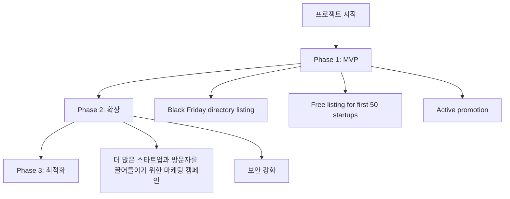

### 1. 프로젝트 개요

#### 프로젝트명
BigBlackFriday

#### 한 줄 설명
BigBlackFriday는 초보자와 중소 규모의 스타트업들이 Black Friday 홍보에 도움을 주는 서비스입니다.

#### 프로젝트 목적
Black Friday 홍보에 어려움을 겪는 스타트업들을 위해 Black Friday directory listing 서비스를 제공하고, 활발한 홍보를 통해 더 많은 방문자와 수익을 가져오는 서비스를 제공합니다. 이 서비스를 통해 스타트업들이 Black Friday 홍보에 도움을 받을 수 있고, 더 많은 방문자와 수익을 가져올 수 있습니다.

#### 핵심 가치 제안
- Black Friday directory listing: 스타트업의 Black Friday deals을 한 곳에 모아 기존 솔루션들의 복잡함을 없애고, 초보자와 중소 규모의 스타트업들이 쉽게 참여할 수 있도록 함.
- Free listing for first 50 startups: 초보자와 중소 규모의 스타트업들이 무료로 등록할 수 있도록 함.
- Active promotion: 스타트업의 Black Friday deals을 활발하게 홍보하여 더 많은 방문자와 수익을 가져오게 함.

#### 타겟 사용자
- 초보자 스타트업 대표
- 중소 규모의 스타트업 대표

#### 해결하려는 문제
- Black Friday 홍보에 어려움을 겪는 스타트업의 인적 및 물적 자원 낭비
- Black Friday 홍보를 위한 비용과 시간의 낭비
- 기존 솔루션들의 복잡함으로 인해 스타트업들이 홍보에 어려움을 겪는 것

### 2. 사용자 스토리

#### 주요 사용자 페르소나

**스페이스런치 대표**
- 역할: 스타트업 대표
- 목표: Black Friday 홍보에 도움을 받기 위해 서비스를 사용
- 불편함: Black Friday 홍보에 어려움을 겪고, 비용과 시간을 낭비

**신인 스타트업 대표**
- 역할: 초보자 스타트업 대표
- 목표: Black Friday 홍보에 도움을 받기 위해 서비스를 사용
- 불편함: 스타트업이 새로운 것에 어려움을 겪고, 홍보에 어려움을 겪고, 비용과 시간을 낭비

#### 사용자 여정

1. **인지 단계**: 스타트업이 Black Friday 홍보에 어려움을 겪고, 홍보를 위해 서비스를 찾는 단계
2. **탐색 단계**: 스타트업이 서비스를 찾고, 기능과 가격을 비교하는 단계
3. **사용 단계**: 스타트업이 서비스를 사용하고, Black Friday deals을 등록하고, 홍보하는 단계
4. **평가 단계**: 스타트업이 서비스의 효과를 평가하고, 홍보 결과를 확인하는 단계

#### 핵심 기능 요구사항
- Black Friday directory listing: 스타트업의 Black Friday deals을 한 곳에 모아 기존 솔루션들의 복잡함을 없애고, 초보자와 중소 규모의 스타트업들이 쉽게 참여할 수 있도록 함.
- Free listing for first 50 startups: 초보자와 중소 규모의 스타트업들이 무료로 등록할 수 있도록 함.
- Active promotion: 스타트업의 Black Friday deals을 활발하게 홍보하여 더 많은 방문자와 수익을 가져오게 함.

### 3. 기능 명세

#### MVP 기능 목록

1. **기능명: Black Friday directory listing**
   - 설명: 스타트업의 Black Friday deals을 한 곳에 모아 기존 솔루션들의 복잡함을 없애고, 초보자와 중소 규모의 스타트업들이 쉽게 참여할 수 있도록 함.
   - 우선순위: P0 (필수)
   - 예상 개발 시간: 4주

2. **기능명: Free listing for first 50 startups**
   - 설명: 초보자와 중소 규모의 스타트업들이 무료로 등록할 수 있도록 함.
   - 우선순위: P0 (필수)
   - 예상 개발 시간: 2주

3. **기능명: Active promotion**
   - 설명: 스타트업의 Black Friday deals을 활발하게 홍보하여 더 많은 방문자와 수익을 가져오게 함.
   - 우선순위: P1 (중요)
   - 예상 개발 시간: 8주

#### 우선순위별 기능 분류

**P0 (필수 기능 - MVP)**
- Black Friday directory listing
- Free listing for first 50 startups

**P1 (중요 기능 - Phase 2)**
- Active promotion

**P2 (선택 기능 - Phase 3)**
- 더 많은 스타트업과 방문자를 끌어들이기 위한 마케팅 캠페인

#### 기술적 제약사항
- 무료 플랜 사용: 모든 인프라 및 서비스는 무료 플랜 범위 내에서만 구축
- 아이디어 특성에 맞는 구체적인 제약사항: 스타트업의 Black Friday deals을 한 곳에 모아 기존 솔루션들의 복잡함을 없애고, 초보자와 중소 규모의 스타트업들이 쉽게 참여할 수 있도록 함.

### 4. 화면 설계

#### 화면 1: Black Friday directory listing
**목적**: 스타트업의 Black Friday deals을 한 곳에 모아 기존 솔루션들의 복잡함을 없애고, 초보자와 중소 규모의 스타트업들이 쉽게 참여할 수 있도록 함.

**화면 구성**:
- 상단: 스타트업의 이름과 Black Friday deals을 표시하는 영역
- 중간: Black Friday deals의 목록을 표시하는 영역
- 하단: 더 많은 방문자와 수익을 가져오기 위한 마케팅 캠페인을 표시하는 영역

**주요 기능**:
- Black Friday deals을 등록하고, 홍보하는 기능
- 초보자와 중소 규모의 스타트업들이 무료로 등록할 수 있는 기능

#### 화면 2: Active promotion
**목적**: 스타트업의 Black Friday deals을 활발하게 홍보하여 더 많은 방문자와 수익을 가져오게 함.

**화면 구성**:
- 상단: 스타트업의 이름과 Black Friday deals을 표시하는 영역
- 중간: 스타트업의 Black Friday deals을 홍보하는 영역
- 하단: 더 많은 방문자와 수익을 가져오기 위한 마케팅 캠페인을 표시하는 영역

**주요 기능**:
- 스타트업의 Black Friday deals을 활발하게 홍보하는 기능
- 초보자와 중소 규모의 스타트업들이 무료로 등록할 수 있는 기능

### 5. 기술 요구사항

#### 기술 스택 제안
**프론트엔드**
- 프레임워크: React
- 언어: JavaScript
- UI 라이브러리: Material-UI
- 상태 관리: Redux

**백엔드**
- 서버: Node.js
- 데이터베이스: MongoDB
- 인증: OAuth

**외부 API**
- None

#### 인프라 요구사항
- AWS S3를 사용하여 파일 업로드를 처리
- AWS CloudFront를 사용하여 CDN을 구축

#### 보안 고려사항
- HTTPS를 사용하여 보안을 강화
- OAuth를 사용하여 인증을 강화

### 6. 프로젝트 구조

#### 프로젝트 구조 다이어그램

### 7. 성공 지표

#### KPI 정의
- 사용자 수: 1000명
- 방문자 수: 5000명
- 수익: 1000달러

#### 측정 방법
- 사용자 수: 사용자 가입 및 로그인 횟수
- 방문자